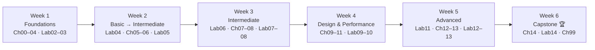

# แผนการเรียน 6 สัปดาห์ / 6-Week Learning Roadmap

🌐 ภาษาไทยก่อน · English below

**รูปแบบ:** วันละประมาณ 1 ชั่วโมง · 5 วันต่อสัปดาห์ · 6 สัปดาห์ · **รวมประมาณ 30 ชั่วโมง**

เริ่มวันไหนก็ได้ — แผนนี้นับเป็น **Week 1–6** และ **Day 1–30** ไม่ผูกกับวันที่ในปฏิทิน วันอ่านบทเรียนกับวันทำ Lab สลับกัน ถ้าตามไม่ทันให้ข้าม *Stretch goal* ได้ แต่อย่าข้าม Lab

## แผน (ภาษาไทย)

| Week | Day | บทเรียน / Lab | เวลา | ผลลัพธ์ที่ควรได้ |
|:---:|:---:|---|:---:|---|
| 1 | 1 | [บท 00](docs/th/00-toc.md) + [บท 01 ภาพรวม BI](docs/th/01-bi-landscape.md) | 60 นาที | ตาราง "งานแบบไหนใช้เครื่องมือไหน" ของทีมคุณ |
| 1 | 2 | [บท 02 เริ่มต้นใช้งาน](docs/th/02-getting-started.md) + [Lab 02](labs/lab02-getting-started/README.md) | 60 นาที | รายงานแรกที่มี scorecard, time series, table |
| 1 | 3 | [บท 03 Data Source และ Connector](docs/th/03-data-sources.md) | 60 นาที | โน้ตสรุป connector |
| 1 | 4 | [Lab 03](labs/lab03-data-sources/README.md) | 60 นาที | Data source 3 แบบ (Sheets, CSV, BigQuery) ที่แก้ field type แล้ว |
| 1 | 5 | [บท 04 Chart และ Table](docs/th/04-charts-tables.md) | 60 นาที | Cheat sheet การเลือก chart |
| 2 | 6 | [Lab 04](labs/lab04-charts-tables/README.md) | 60 นาที | หน้า sales overview จัด format พร้อม theme |
| 2 | 7 | [บท 05 Filter และ Control](docs/th/05-filters-controls.md) | 60 นาที | โน้ตเรื่อง filter scope |
| 2 | 8 | [Lab 05](labs/lab05-filters-controls/README.md) | 60 นาที | หน้า interactive ที่มี control 4 ตัว + cross-filtering |
| 2 | 9 | [บท 06 Calculated Field](docs/th/06-calculated-fields.md) §1–4 | 60 นาที | สูตรใช้งานได้ 5 สูตร |
| 2 | 10 | [บท 06](docs/th/06-calculated-fields.md) §5–8 (CASE, REGEXP) | 60 นาที | Field ของ `hr_headcount` ที่ clean แล้ว |
| 3 | 11 | [Lab 06](labs/lab06-calculated-fields/README.md) | 60 นาที | คลัง calculated field 10 ตัว |
| 3 | 12 | [บท 07 Data Blending](docs/th/07-blending.md) | 60 นาที | โน้ตการเลือก join type |
| 3 | 13 | [Lab 07](labs/lab07-blending/README.md) | 60 นาที | Blend Sales × Customers × Products + Blend Marketing ROI |
| 3 | 14 | [บท 08 Parameter](docs/th/08-parameters.md) | 60 นาที | รายการ use case ของ parameter |
| 3 | 15 | [Lab 08](labs/lab08-parameters/README.md) | 60 นาที | What-if target simulator + BigQuery parameterised query |
| 4 | 16 | [บท 09 การออกแบบ Dashboard](docs/th/09-dashboard-design.md) | 60 นาที | Critique dashboard ที่มีอยู่ |
| 4 | 17 | [Lab 09](labs/lab09-dashboard-design/README.md) | 60 นาที | หน้า executive ที่ออกแบบใหม่ |
| 4 | 18 | [บท 10 Performance และ BigQuery](docs/th/10-performance.md) | 60 นาที | Performance checklist |
| 4 | 19 | [Lab 10](labs/lab10-performance/README.md) | 60 นาที | ตารางเทียบ extract vs live |
| 4 | 20 | [บท 11 การแชร์และ Looker Studio Pro](docs/th/11-sharing-pro.md) | 60 นาที | แผนการควบคุมสิทธิ์ |
| 5 | 21 | [Lab 11](labs/lab11-sharing-pro/README.md) | 60 นาที | Scheduled delivery + รายงานแบบ embed |
| 5 | 22 | [บท 12 Community Visualization](docs/th/12-community-viz.md) | 60 นาที | Shortlist community viz ที่จะใช้ |
| 5 | 23 | [Lab 12](labs/lab12-community-viz/README.md) | 60 นาที | รายงานที่ใช้ community viz + theme JSON ของตัวเอง |
| 5 | 24 | [บท 13 ภาพรวม Looker](docs/th/13-looker-overview.md) | 60 นาที | Memo แนะนำ Looker vs Looker Studio |
| 5 | 25 | [Lab 13](labs/lab13-looker-overview/README.md) | 60 นาที | LookML view + explore บนกระดาษ (หรือ trial) |
| 6 | 26 | [บท 14 Capstone](docs/th/14-capstone.md) — วางแผน + data model | 60 นาที | Requirement + wireframe |
| 6 | 27 | [Lab 14](labs/lab14-capstone/README.md) — หน้า 1 Executive | 60 นาที | หน้า executive summary |
| 6 | 28 | Lab 14 — หน้า 2 Marketing | 60 นาที | หน้า marketing funnel & ROI |
| 6 | 29 | Lab 14 — หน้า 3 Customers & Products + เก็บงาน | 60 นาที | Dashboard 3 หน้าสมบูรณ์ |
| 6 | 30 | [บท 99 เผยแพร่ขึ้น GitHub](docs/th/99-publish-to-github.md) + retrospective | 60 นาที | Repo ผลงานเผยแพร่แล้ว ติด tag v1.0.0 |

**รวม: 30 session × 60 นาที = 30 ชั่วโมง**

## ภาพรวมเส้นทาง



## Checklist รายสัปดาห์ (พิมพ์แปะโต๊ะได้)

```
WEEK 1                  WEEK 2                  WEEK 3
[ ] Day 1  Ch00 + Ch01  [ ] Day 6   Lab04       [ ] Day 11  Lab06
[ ] Day 2  Ch02 + Lab02 [ ] Day 7   Ch05        [ ] Day 12  Ch07
[ ] Day 3  Ch03         [ ] Day 8   Lab05       [ ] Day 13  Lab07
[ ] Day 4  Lab03        [ ] Day 9   Ch06 §1–4   [ ] Day 14  Ch08
[ ] Day 5  Ch04         [ ] Day 10  Ch06 §5–8   [ ] Day 15  Lab08

WEEK 4                  WEEK 5                  WEEK 6
[ ] Day 16  Ch09        [ ] Day 21  Lab11       [ ] Day 26  Ch14 plan
[ ] Day 17  Lab09       [ ] Day 22  Ch12        [ ] Day 27  Lab14 p.1
[ ] Day 18  Ch10        [ ] Day 23  Lab12       [ ] Day 28  Lab14 p.2
[ ] Day 19  Lab10       [ ] Day 24  Ch13        [ ] Day 29  Lab14 p.3
[ ] Day 20  Ch11        [ ] Day 25  Lab13       [ ] Day 30  Ch99 publish 🎉
```

## เคล็ดลับให้เรียนต่อเนื่อง

- ล็อกเวลาเดิมทุกวัน (เช่น 07:30–08:30 ก่อนเริ่มงาน) — ความสม่ำเสมอชนะความหักโหม
- สร้าง "learning report" ใน Looker Studio ไว้ 1 ไฟล์ แล้วเพิ่มหน้าใหม่ทุกครั้งที่จบ Lab — จบ Week 6 มันจะกลายเป็น portfolio ของคุณ
- ทุกวันสุดท้ายของสัปดาห์ ใช้ 10 นาทีจด 3 สิ่งที่ได้เรียนรู้ และ 1 คำถามที่ยังค้าง

---

## English

**Format:** ~1 hour/day · 5 days/week · 6 weeks · **≈ 30 hours total**

Start any day you like — the plan is numbered **Week 1–6** and **Day 1–30** and is not tied to calendar dates. Reading days cover a chapter; lab days are hands-on in Looker Studio. If you fall behind, skip a *Stretch goal*, not a lab.

## Plan (English)

| Week | Day | Chapter / Lab | Duration | Deliverable |
|:---:|:---:|---|:---:|---|
| 1 | 1 | [Ch 00](docs/en/00-toc.md) + [Ch 01 BI Landscape](docs/en/01-bi-landscape.md) | 60 min | Filled-in "which tool for which job" matrix for your team |
| 1 | 2 | [Ch 02 Getting Started](docs/en/02-getting-started.md) + [Lab 02](labs/lab02-getting-started/README.md) | 60 min | First report with scorecard, time series, table |
| 1 | 3 | [Ch 03 Data Sources & Connectors](docs/en/03-data-sources.md) | 60 min | Connector cheat-sheet notes |
| 1 | 4 | [Lab 03](labs/lab03-data-sources/README.md) | 60 min | 3 data sources (Sheets, CSV, BigQuery) with fixed field types |
| 1 | 5 | [Ch 04 Charts & Tables](docs/en/04-charts-tables.md) | 60 min | Chart-choice cheat sheet |
| 2 | 6 | [Lab 04](labs/lab04-charts-tables/README.md) | 60 min | Formatted sales overview page with theme |
| 2 | 7 | [Ch 05 Filters & Controls](docs/en/05-filters-controls.md) | 60 min | Notes on filter scope |
| 2 | 8 | [Lab 05](labs/lab05-filters-controls/README.md) | 60 min | Interactive page with 4 controls + cross-filtering |
| 2 | 9 | [Ch 06 Calculated Fields](docs/en/06-calculated-fields.md) §1–4 | 60 min | 5 working formulas |
| 2 | 10 | [Ch 06](docs/en/06-calculated-fields.md) §5–8 (CASE, REGEXP) | 60 min | Cleaned `hr_headcount` fields |
| 3 | 11 | [Lab 06](labs/lab06-calculated-fields/README.md) | 60 min | Calculated-field library (10 fields) |
| 3 | 12 | [Ch 07 Data Blending](docs/en/07-blending.md) | 60 min | Join-type decision notes |
| 3 | 13 | [Lab 07](labs/lab07-blending/README.md) | 60 min | Sales × Customers × Products blend + Marketing ROI blend |
| 3 | 14 | [Ch 08 Parameters](docs/en/08-parameters.md) | 60 min | Parameter use-case list |
| 3 | 15 | [Lab 08](labs/lab08-parameters/README.md) | 60 min | What-if target simulator + BigQuery parameterised query |
| 4 | 16 | [Ch 09 Dashboard Design](docs/en/09-dashboard-design.md) | 60 min | Redesign critique of an existing dashboard |
| 4 | 17 | [Lab 09](labs/lab09-dashboard-design/README.md) | 60 min | Redesigned executive page |
| 4 | 18 | [Ch 10 Performance & BigQuery](docs/en/10-performance.md) | 60 min | Performance checklist |
| 4 | 19 | [Lab 10](labs/lab10-performance/README.md) | 60 min | Extract vs live benchmark table |
| 4 | 20 | [Ch 11 Sharing, Scheduling, Pro](docs/en/11-sharing-pro.md) | 60 min | Access-control plan |
| 5 | 21 | [Lab 11](labs/lab11-sharing-pro/README.md) | 60 min | Scheduled delivery + embedded report |
| 5 | 22 | [Ch 12 Community Visualizations](docs/en/12-community-viz.md) | 60 min | Shortlist of community viz to use |
| 5 | 23 | [Lab 12](labs/lab12-community-viz/README.md) | 60 min | Report using a community viz + custom theme JSON |
| 5 | 24 | [Ch 13 Looker Overview](docs/en/13-looker-overview.md) | 60 min | Looker vs Looker Studio recommendation memo |
| 5 | 25 | [Lab 13](labs/lab13-looker-overview/README.md) | 60 min | LookML view + explore on paper (or trial) |
| 6 | 26 | [Ch 14 Capstone](docs/en/14-capstone.md) — plan & data model | 60 min | Requirements + wireframe |
| 6 | 27 | [Lab 14](labs/lab14-capstone/README.md) — Page 1 Executive | 60 min | Executive summary page |
| 6 | 28 | Lab 14 — Page 2 Marketing | 60 min | Marketing funnel & ROI page |
| 6 | 29 | Lab 14 — Page 3 Customers & Products + polish | 60 min | Complete 3-page dashboard |
| 6 | 30 | [Ch 99 Publish to GitHub](docs/en/99-publish-to-github.md) + retrospective | 60 min | Portfolio repo published, v1.0.0 tagged |

**Total: 30 sessions × 60 min = 30 hours.**

## Tips for staying on track

- Block the same hour every day (e.g., 07:30–08:30 before work). Consistency beats intensity.
- Keep one "learning report" in Looker Studio and add a page per lab — by week 6 it becomes your portfolio.
- End-of-week ritual: 10 minutes to write 3 things you learned and 1 question you still have.

---
<sub>Made by **The Narit Lab** · [MIT License](LICENSE) · [กลับสารบัญ](docs/th/00-toc.md) · [Back to TOC](docs/en/00-toc.md)</sub>
