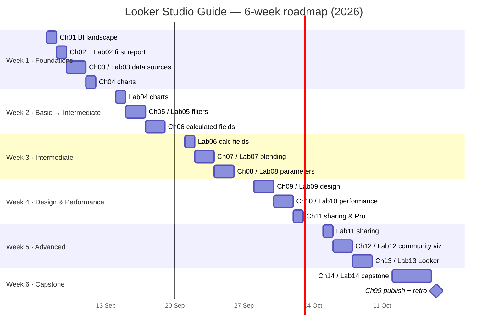

# 6-Week Learning Roadmap / แผนการเรียน 6 สัปดาห์

🌐 English first · ภาษาไทยด้านล่าง

**Format:** ~1 hour/day · 5 days/week (Mon–Fri) · 6 weeks · **≈ 30 hours total**
**Start:** Monday **7 September 2026** · **Finish:** Friday **16 October 2026**

Reading days cover a chapter; lab days are hands-on in Looker Studio. If you fall behind, skip a *Stretch goal*, not a lab.

## Plan

| Week | Day | Date | Chapter / Lab | Duration | Deliverable |
|:---:|:---:|---|---|:---:|---|
| 1 | 1 | Mon 7 Sep 2026 | [Ch 00](docs/en/00-toc.md) + [Ch 01 BI Landscape](docs/en/01-bi-landscape.md) | 60 min | Filled-in "which tool for which job" matrix for your team |
| 1 | 2 | Tue 8 Sep 2026 | [Ch 02 Getting Started](docs/en/02-getting-started.md) + [Lab 02](labs/lab02-getting-started/README.md) | 60 min | First report with scorecard, time series, table |
| 1 | 3 | Wed 9 Sep 2026 | [Ch 03 Data Sources & Connectors](docs/en/03-data-sources.md) | 60 min | Connector cheat-sheet notes |
| 1 | 4 | Thu 10 Sep 2026 | [Lab 03](labs/lab03-data-sources/README.md) | 60 min | 3 data sources (Sheets, CSV, BigQuery) with fixed field types |
| 1 | 5 | Fri 11 Sep 2026 | [Ch 04 Charts & Tables](docs/en/04-charts-tables.md) | 60 min | Chart-choice cheat sheet |
| 2 | 6 | Mon 14 Sep 2026 | [Lab 04](labs/lab04-charts-tables/README.md) | 60 min | Formatted sales overview page with theme |
| 2 | 7 | Tue 15 Sep 2026 | [Ch 05 Filters & Controls](docs/en/05-filters-controls.md) | 60 min | Notes on filter scope |
| 2 | 8 | Wed 16 Sep 2026 | [Lab 05](labs/lab05-filters-controls/README.md) | 60 min | Interactive page with 4 controls + cross-filtering |
| 2 | 9 | Thu 17 Sep 2026 | [Ch 06 Calculated Fields](docs/en/06-calculated-fields.md) §1–4 | 60 min | 5 working formulas |
| 2 | 10 | Fri 18 Sep 2026 | [Ch 06](docs/en/06-calculated-fields.md) §5–8 (CASE, REGEXP) | 60 min | Cleaned `hr_headcount` fields |
| 3 | 11 | Mon 21 Sep 2026 | [Lab 06](labs/lab06-calculated-fields/README.md) | 60 min | Calculated-field library (10 fields) |
| 3 | 12 | Tue 22 Sep 2026 | [Ch 07 Data Blending](docs/en/07-blending.md) | 60 min | Join-type decision notes |
| 3 | 13 | Wed 23 Sep 2026 | [Lab 07](labs/lab07-blending/README.md) | 60 min | Sales × Customers × Products blend + Marketing ROI blend |
| 3 | 14 | Thu 24 Sep 2026 | [Ch 08 Parameters](docs/en/08-parameters.md) | 60 min | Parameter use-case list |
| 3 | 15 | Fri 25 Sep 2026 | [Lab 08](labs/lab08-parameters/README.md) | 60 min | What-if target simulator + BigQuery parameterised query |
| 4 | 16 | Mon 28 Sep 2026 | [Ch 09 Dashboard Design](docs/en/09-dashboard-design.md) | 60 min | Redesign critique of an existing dashboard |
| 4 | 17 | Tue 29 Sep 2026 | [Lab 09](labs/lab09-dashboard-design/README.md) | 60 min | Redesigned executive page |
| 4 | 18 | Wed 30 Sep 2026 | [Ch 10 Performance & BigQuery](docs/en/10-performance.md) | 60 min | Performance checklist |
| 4 | 19 | Thu 1 Oct 2026 | [Lab 10](labs/lab10-performance/README.md) | 60 min | Extract vs live benchmark table |
| 4 | 20 | Fri 2 Oct 2026 | [Ch 11 Sharing, Scheduling, Pro](docs/en/11-sharing-pro.md) | 60 min | Access-control plan |
| 5 | 21 | Mon 5 Oct 2026 | [Lab 11](labs/lab11-sharing-pro/README.md) | 60 min | Scheduled delivery + embedded report |
| 5 | 22 | Tue 6 Oct 2026 | [Ch 12 Community Visualizations](docs/en/12-community-viz.md) | 60 min | Shortlist of community viz to use |
| 5 | 23 | Wed 7 Oct 2026 | [Lab 12](labs/lab12-community-viz/README.md) | 60 min | Report using a community viz + custom theme JSON |
| 5 | 24 | Thu 8 Oct 2026 | [Ch 13 Looker Overview](docs/en/13-looker-overview.md) | 60 min | Looker vs Looker Studio recommendation memo |
| 5 | 25 | Fri 9 Oct 2026 | [Lab 13](labs/lab13-looker-overview/README.md) | 60 min | LookML view + explore on paper (or trial) |
| 6 | 26 | Mon 12 Oct 2026 | [Ch 14 Capstone](docs/en/14-capstone.md) — plan & data model | 60 min | Requirements + wireframe |
| 6 | 27 | Tue 13 Oct 2026 | [Lab 14](labs/lab14-capstone/README.md) — Page 1 Executive | 60 min | Executive summary page |
| 6 | 28 | Wed 14 Oct 2026 | Lab 14 — Page 2 Marketing | 60 min | Marketing funnel & ROI page |
| 6 | 29 | Thu 15 Oct 2026 | Lab 14 — Page 3 Customers & Products + polish | 60 min | Complete 3-page dashboard |
| 6 | 30 | Fri 16 Oct 2026 | [Ch 99 Publish to GitHub](docs/en/99-publish-to-github.md) + retrospective | 60 min | Portfolio repo published, v1.0.0 tagged |

**Total: 30 sessions × 60 min = 30 hours.**

## Gantt



## Printable weekly checklist

```
WEEK 1  (7–11 Sep)      WEEK 2  (14–18 Sep)     WEEK 3  (21–25 Sep)
[ ] Mon  Ch00 + Ch01    [ ] Mon  Lab04          [ ] Mon  Lab06
[ ] Tue  Ch02 + Lab02   [ ] Tue  Ch05           [ ] Tue  Ch07
[ ] Wed  Ch03           [ ] Wed  Lab05          [ ] Wed  Lab07
[ ] Thu  Lab03          [ ] Thu  Ch06 §1–4      [ ] Thu  Ch08
[ ] Fri  Ch04           [ ] Fri  Ch06 §5–8      [ ] Fri  Lab08

WEEK 4  (28 Sep–2 Oct)  WEEK 5  (5–9 Oct)       WEEK 6  (12–16 Oct)
[ ] Mon  Ch09           [ ] Mon  Lab11          [ ] Mon  Ch14 plan
[ ] Tue  Lab09          [ ] Tue  Ch12           [ ] Tue  Lab14 p.1
[ ] Wed  Ch10           [ ] Wed  Lab12          [ ] Wed  Lab14 p.2
[ ] Thu  Lab10          [ ] Thu  Ch13           [ ] Thu  Lab14 p.3
[ ] Fri  Ch11           [ ] Fri  Lab13          [ ] Fri  Ch99 publish 🎉
```

## Tips for staying on track

- Block the same hour every day (e.g., 07:30–08:30 before work). Consistency beats intensity.
- Keep one "learning report" in Looker Studio and add a page per lab — by week 6 it becomes your portfolio.
- Weekly Friday ritual: 10 minutes to write 3 things you learned and 1 question you still have.

---

## ภาษาไทย

**รูปแบบ:** วันละประมาณ 1 ชั่วโมง · จันทร์–ศุกร์ · 6 สัปดาห์ · **รวมประมาณ 30 ชั่วโมง**
**เริ่ม:** จันทร์ที่ **7 กันยายน 2569 (2026)** · **จบ:** ศุกร์ที่ **16 ตุลาคม 2569**

วันอ่านบทเรียนกับวันทำ Lab สลับกัน ถ้าตามไม่ทันให้ข้าม *Stretch goal* ได้ แต่อย่าข้าม Lab

| สัปดาห์ | วันที่ | บทเรียน / Lab | ผลลัพธ์ที่ควรได้ |
|:---:|---|---|---|
| 1 | จ 7 – ศ 11 ก.ย. | [บท 00](docs/th/00-toc.md) [01](docs/th/01-bi-landscape.md) [02](docs/th/02-getting-started.md) + Lab02 · [03](docs/th/03-data-sources.md) + Lab03 · [04](docs/th/04-charts-tables.md) | รายงานแรก + เชื่อมต่อ Sheets / CSV / BigQuery ได้ |
| 2 | จ 14 – ศ 18 ก.ย. | Lab04 · [05](docs/th/05-filters-controls.md) + Lab05 · [06](docs/th/06-calculated-fields.md) (2 วัน) | หน้ารายงานที่มี Filter/Control ครบ และเขียนสูตรได้ |
| 3 | จ 21 – ศ 25 ก.ย. | Lab06 · [07](docs/th/07-blending.md) + Lab07 · [08](docs/th/08-parameters.md) + Lab08 | Blend หลายตาราง + รายงานแบบ what-if ด้วย Parameter |
| 4 | จ 28 ก.ย. – ศ 2 ต.ค. | [09](docs/th/09-dashboard-design.md) + Lab09 · [10](docs/th/10-performance.md) + Lab10 · [11](docs/th/11-sharing-pro.md) | Dashboard ที่ออกแบบใหม่ เร็วขึ้น และวางแผนสิทธิ์การเข้าถึงได้ |
| 5 | จ 5 – ศ 9 ต.ค. | Lab11 · [12](docs/th/12-community-viz.md) + Lab12 · [13](docs/th/13-looker-overview.md) + Lab13 | Scheduled delivery, embed, community viz และเข้าใจ Looker |
| 6 | จ 12 – ศ 16 ต.ค. | [14 Capstone](docs/th/14-capstone.md) + Lab14 (4 วัน) · [99 Publish](docs/th/99-publish-to-github.md) | Dashboard 3 หน้าสมบูรณ์ และ repo ผลงานบน GitHub |

รายละเอียดรายวัน (วันที่ ระยะเวลา และ deliverable) ดูจากตารางภาษาอังกฤษด้านบน ซึ่งใช้ตารางเดียวกัน

**เคล็ดลับ** — ล็อกเวลาเดิมทุกวัน (เช่น 07:30–08:30 ก่อนเริ่มงาน) ทำต่อเนื่องสำคัญกว่าทำหนัก · สร้างรายงาน "สมุดฝึก" ไว้ 1 รายงานแล้วเพิ่มหน้าใหม่ทุก Lab พอถึงสัปดาห์ที่ 6 จะกลายเป็น portfolio · ทุกวันศุกร์ใช้ 10 นาทีจดสิ่งที่เรียนรู้ 3 ข้อและคำถามที่ยังค้าง 1 ข้อ

---
Made by **The Narit Lab** · MIT License
