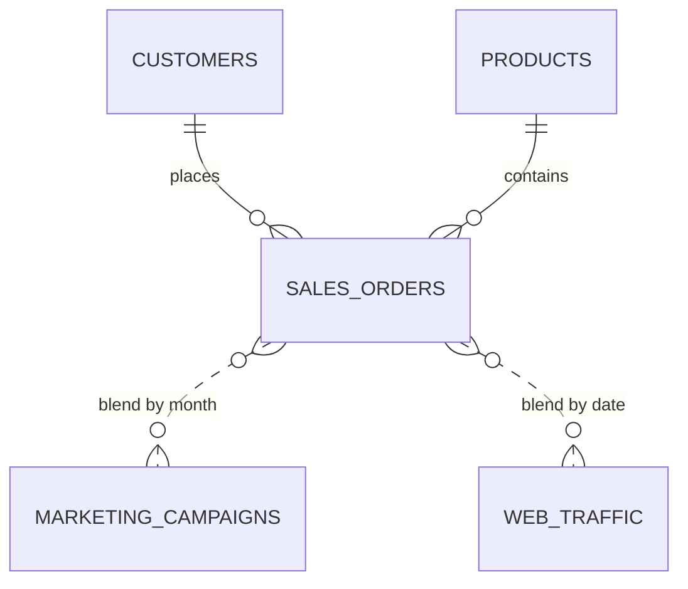

# Datasets / ชุดข้อมูล

🌐 This file is bilingual — English first, ภาษาไทยด้านล่าง

> [!WARNING]
> **ข้อมูลทั้งหมดเป็นข้อมูลสมมติ (Mock-up / Synthetic data) สร้างขึ้นแบบสุ่มด้วยโปรแกรม เพื่อใช้ประกอบการเรียนรู้เท่านั้น** ไม่ใช่ข้อมูลจริงของบุคคล บริษัท หรือธุรกรรมใด ๆ ชื่อ ตัวเลข และเหตุการณ์ทั้งหมดถูกสุ่มขึ้น หากไปพ้องกับข้อมูลจริงถือเป็นความบังเอิญ — ห้ามนำไปใช้อ้างอิงเชิงธุรกิจหรือการวิเคราะห์จริง
>
> **All data in this folder is synthetic (mock-up), randomly generated by a script for learning purposes only.** It contains no real people, companies or transactions. Any resemblance to real data is coincidental — do not use it for real business analysis or reporting.

Every file is generated deterministically by [`generate_datasets.py`](generate_datasets.py) (seed `20260907`), so anyone can reproduce the exact same data. Licensed under MIT by The Narit Lab.

| File | Rows | Size | Used in chapters |
|---|---:|---:|---|
| `sales_orders.csv` | 19,637 | 2.2 MB | 02, 04, 05, 06, 07, 08, 09, 10, 14 |
| `customers.csv` | 2,000 | 142 KB | 03, 07, 14 |
| `products.csv` | 60 | 5 KB | 03, 07, 14 |
| `marketing_campaigns.csv` | 167 | 19 KB | 07, 09, 14 |
| `web_traffic.csv` | 17,532 | 923 KB | 05, 10, 12, 14 |
| `hr_headcount.csv` | 1,344 | 63 KB | 06 (CASE / filters exercise) |

Date range: **2024-01-01 → 2026-08-31**. Currency: Thai Baht (THB).

## Load into Google Sheets

1. Open [sheets.new](https://sheets.new) → **File → Import → Upload** → choose a CSV.
2. Import location: *Replace spreadsheet*. Separator: *Detect automatically*.
3. Rename the sheet tab to the file name (e.g. `sales_orders`). One CSV per spreadsheet keeps connectors simple.
4. In Looker Studio: **Create → Data source → Google Sheets** → pick the spreadsheet → tick *Use first row as headers*.

> **💡 Tip** `sales_orders.csv` is ~20k rows. Google Sheets handles this fine, but for chapters 10+ we move the same file to BigQuery to practise performance tuning.

## Load into BigQuery (sandbox is free)

```bash
# one-time: create a dataset
bq --location=asia-southeast1 mk --dataset YOUR_PROJECT:looker_guide

# load each CSV (autodetect schema)
for f in sales_orders customers products marketing_campaigns web_traffic hr_headcount; do
  bq load --autodetect --source_format=CSV --skip_leading_rows=1 \
    looker_guide.$f ./$f.csv
done
```

Or via the console: **BigQuery → your dataset → Create table → Upload → CSV → Auto detect schema**.

## Regenerate

```bash
python3 generate_datasets.py           # overwrite CSVs here
python3 generate_datasets.py --out /tmp/x
```

Requires Python 3.8+, standard library only.

## Data dictionary

### sales_orders.csv
| Column | Type | Description (EN) | คำอธิบาย (TH) |
|---|---|---|---|
| order_id | Text | Unique order key `SO######` | รหัสคำสั่งซื้อ |
| order_date | Date | Order date (YYYY-MM-DD) | วันที่สั่งซื้อ |
| ship_date | Date | Shipping date | วันที่จัดส่ง |
| customer_id | Text | FK → customers | รหัสลูกค้า |
| product_id | Text | FK → products | รหัสสินค้า |
| sales_channel | Text | Online Store / Marketplace / Retail Shop / Sales Rep | ช่องทางขาย |
| payment_method | Text | Credit Card / PromptPay / Bank Transfer / COD | วิธีชำระเงิน |
| quantity | Number | Units ordered | จำนวนชิ้น |
| unit_price | Number | List price per unit (THB) | ราคาต่อหน่วย |
| discount | Number | Discount rate 0–0.2 | ส่วนลด (สัดส่วน) |
| sales_amount | Number | quantity × unit_price × (1 − discount) | ยอดขายสุทธิ |
| cost_amount | Number | quantity × unit_cost | ต้นทุน |
| profit | Number | sales_amount − cost_amount | กำไร |
| order_status | Text | Completed / Returned / Cancelled | สถานะคำสั่งซื้อ |

### customers.csv
| Column | Type | Description (EN) | คำอธิบาย (TH) |
|---|---|---|---|
| customer_id | Text | Primary key `C#####` | รหัสลูกค้า |
| customer_name | Text | Synthetic name | ชื่อลูกค้า (สมมติ) |
| segment | Text | Consumer / Corporate / SMB | กลุ่มลูกค้า |
| region | Text | Bangkok / Central / North / Northeast / South | ภูมิภาค |
| province | Text | Province within region | จังหวัด |
| signup_date | Date | Account creation date | วันที่สมัคร |
| gender | Text | Male / Female / Prefer not to say | เพศ |
| age_group | Text | 18-24 … 55+ | ช่วงอายุ |
| loyalty_member | Text | Yes / No | สมาชิกสะสมแต้ม |

### products.csv
| Column | Type | Description (EN) | คำอธิบาย (TH) |
|---|---|---|---|
| product_id | Text | Primary key `P####` | รหัสสินค้า |
| product_name | Text | Brand + item | ชื่อสินค้า |
| category | Text | Electronics / Office / Home & Living / Sports / Beauty | หมวดหมู่ |
| sub_category | Text | Item type | หมวดย่อย |
| brand | Text | Synthetic brand | แบรนด์ (สมมติ) |
| unit_price | Number | List price (THB) | ราคาขาย |
| unit_cost | Number | Unit cost (THB) | ต้นทุนต่อหน่วย |
| status | Text | Active / Discontinued | สถานะสินค้า |

### marketing_campaigns.csv
| Column | Type | Description (EN) | คำอธิบาย (TH) |
|---|---|---|---|
| campaign_id | Text | Primary key `MK####` | รหัสแคมเปญ |
| campaign_name | Text | Channel + month | ชื่อแคมเปญ |
| channel | Text | Facebook Ads / Google Ads / LINE OA / TikTok / Email / YouTube / SEO Content | ช่องทางการตลาด |
| objective | Text | Awareness / Lead Gen / Conversion / Retargeting | วัตถุประสงค์ |
| start_date, end_date | Date | Campaign period (monthly) | ช่วงเวลาแคมเปญ |
| budget, spend | Number | Planned vs actual spend (THB) | งบประมาณ / ใช้จริง |
| impressions, clicks, leads, conversions | Number | Funnel metrics | ตัวชี้วัด funnel |
| revenue | Number | Attributed revenue (THB) | รายได้ที่ระบุที่มาได้ |

### web_traffic.csv
| Column | Type | Description (EN) | คำอธิบาย (TH) |
|---|---|---|---|
| date | Date | Day | วันที่ |
| channel | Text | Organic Search / Paid Search / Social / Direct / Email / Referral | ช่องทางเข้าเว็บ |
| device | Text | Desktop / Mobile / Tablet | อุปกรณ์ |
| sessions, users, pageviews | Number | Volume metrics | จำนวน session / ผู้ใช้ / เพจวิว |
| bounce_rate | Number | 0–1 | อัตราตีกลับ |
| avg_session_duration_sec | Number | Seconds | ระยะเวลาเฉลี่ยต่อ session (วินาที) |
| conversions | Number | Goal completions | จำนวน conversion |

### hr_headcount.csv (intentionally "messy")
Two record types share one file — a realistic export pattern you will clean in Chapter 06.

| Column | Type | Description (EN) | คำอธิบาย (TH) |
|---|---|---|---|
| month | Date | First day of month | เดือน |
| department | Text | Sales / Marketing / Engineering / … | แผนก |
| level | Text | Junior … Manager, **or** `_movement` | ระดับ หรือ `_movement` สำหรับแถวการเคลื่อนไหว |
| headcount_or_hires | Number | Headcount (level rows) or hires (`_movement` rows) | จำนวนพนักงาน หรือจำนวนรับเข้า |
| avg_salary_or_exits | Number | Avg salary THB (level rows) or exits (`_movement` rows) | เงินเดือนเฉลี่ย หรือจำนวนลาออก |
| location | Text | Bangkok HQ / Rayong Plant / Chiang Mai Hub / ALL | สถานที่ |

## Entity relationships



---

## ภาษาไทย

ไฟล์ทั้งหมดเป็น **ข้อมูลสังเคราะห์** สร้างจากสคริปต์ `generate_datasets.py` (seed คงที่ จึงสร้างซ้ำได้ผลเหมือนเดิมทุกครั้ง) ไม่มีบุคคล บริษัท หรือธุรกรรมจริง ใช้สัญญาอนุญาต MIT โดย The Narit Lab

**วิธีโหลดเข้า Google Sheets** — เปิด sheets.new → File → Import → Upload → เลือก CSV → Replace spreadsheet → ตั้งชื่อแท็บตามชื่อไฟล์ → ใน Looker Studio เลือก Create → Data source → Google Sheets

**วิธีโหลดเข้า BigQuery** — ใช้คำสั่ง `bq load` ด้านบน หรือใน Console: BigQuery → Dataset → Create table → Upload → CSV → Auto detect

**ไฟล์ hr_headcount.csv จงใจให้ "รก"** — มีข้อมูล 2 ประเภทปนกันในไฟล์เดียว (แถว headcount กับแถว `_movement`) เพื่อฝึกใช้ CASE และ Filter ในบทที่ 06 ซึ่งเป็นรูปแบบไฟล์ export ที่เจอบ่อยในงานจริง

พจนานุกรมข้อมูล (data dictionary) ของทุกไฟล์อยู่ในตารางด้านบน โดยมีคอลัมน์คำอธิบายภาษาไทยกำกับไว้ทุกฟิลด์

---
Made by **The Narit Lab** · MIT License
