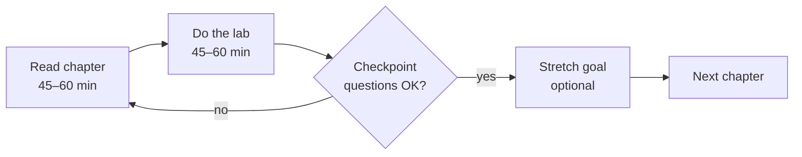

🌐 [ภาษาไทย](../th/00-toc.md) | [English](../en/00-toc.md)

# 00 · Table of Contents & How to Use This Guide

> ⏱ **Estimated time:** 15 min · 📅 **Roadmap day:** Week 1 · Day 1 (Mon 7 Sep 2026) · 🎯 **Level:** —

**In this chapter**
- [Who this guide is for](#1-who-this-guide-is-for)
- [What you need](#2-what-you-need)
- [How to use the chapters, labs and roadmap](#3-how-to-use-the-chapters-labs-and-roadmap)
- [Full table of contents](#4-full-table-of-contents)

## 1. Who this guide is for

Analysts, business users and consultants who already know spreadsheets or another BI tool and want to become **productive in Google Looker Studio** — and understand when the enterprise product, **Looker**, is the better choice.

You will finish with a portfolio-quality, three-page Sales & Marketing dashboard built on realistic synthetic data, plus a repository you can publish under your own name.

## 2. What you need

| Item | Notes |
|---|---|
| Google account | A free Gmail account is enough for chapters 02–09 |
| Google Cloud project (free) | Needed for BigQuery labs from chapter 03 onward. The **BigQuery sandbox** needs no credit card |
| The `datasets/` folder | Download this repo or clone it; see [datasets/README.md](../../datasets/README.md) |
| ~1 hour per weekday | See [ROADMAP.md](../../ROADMAP.md) |
| Optional | Looker Studio Pro trial for chapter 11; Looker trial for chapter 13 |

## 3. How to use the chapters, labs and roadmap

- Each chapter starts with **⏱ Estimated time** and **📅 Roadmap day** so you know where you are in the 6-week plan.
- Callouts: 💡 Tip · ⚠️ Warning · 🧪 Lab · 🔒 Pro only · 🔁 Coming from Tableau/Power BI?
- Every lab ends with **checkpoint questions**. If you cannot answer them, re-read the section — the labs build on each other.
- Screenshots are referenced as placeholders (`assets/images/chXX-YY.png`) so the guide stays accurate even when the UI changes slightly. The text always describes the exact click path.

## 4. Full table of contents

### Chapters

| # | Chapter | Level | Lab |
|---|---|---|---|
| 00 | [Table of Contents & How to Use This Guide](00-toc.md) | — | — |
| 01 | [Self-Service BI Landscape: Tableau · Power BI · Looker Studio · Looker](01-bi-landscape.md) | Intro | — |
| 02 | [Getting Started: account, UI tour, first report in 15 minutes](02-getting-started.md) | Basic | [Lab 02](../../labs/lab02-getting-started/README.md) |
| 03 | [Data Sources & Connectors (Sheets, CSV, BigQuery)](03-data-sources.md) | Basic | [Lab 03](../../labs/lab03-data-sources/README.md) |
| 04 | [Core Charts & Tables, Formatting, Themes](04-charts-tables.md) | Basic | [Lab 04](../../labs/lab04-charts-tables/README.md) |
| 05 | [Filters, Controls, Date Ranges, Interactions](05-filters-controls.md) | Basic | [Lab 05](../../labs/lab05-filters-controls/README.md) |
| 06 | [Calculated Fields & Functions](06-calculated-fields.md) | Intermediate | [Lab 06](../../labs/lab06-calculated-fields/README.md) |
| 07 | [Data Blending & Joins](07-blending.md) | Intermediate | [Lab 07](../../labs/lab07-blending/README.md) |
| 08 | [Parameters & Dynamic Reports](08-parameters.md) | Intermediate | [Lab 08](../../labs/lab08-parameters/README.md) |
| 09 | [Dashboard Design Principles](09-dashboard-design.md) | Intermediate | [Lab 09](../../labs/lab09-dashboard-design/README.md) |
| 10 | [Performance, Extract Data, BigQuery Best Practices](10-performance.md) | Advanced | [Lab 10](../../labs/lab10-performance/README.md) |
| 11 | [Sharing, Scheduling, Embedding, Access Control, Looker Studio Pro](11-sharing-pro.md) | Advanced | [Lab 11](../../labs/lab11-sharing-pro/README.md) |
| 12 | [Community Visualizations & Advanced Customization](12-community-viz.md) | Advanced | [Lab 12](../../labs/lab12-community-viz/README.md) |
| 13 | [Looker (Enterprise) Overview: LookML, Semantic Layer, Migration](13-looker-overview.md) | Advanced | [Lab 13](../../labs/lab13-looker-overview/README.md) |
| 14 | [Capstone: End-to-End Sales & Marketing Dashboard](14-capstone.md) | Capstone | [Lab 14](../../labs/lab14-capstone/README.md) |
| 99 | [Publishing This Repo to GitHub](99-publish-to-github.md) | Appendix | — |

### Datasets

| File | Description |
|---|---|
| [sales_orders.csv](../../datasets/sales_orders.csv) | ~19.6k order lines, 2024–2026 |
| [customers.csv](../../datasets/customers.csv) | 2,000 customers with segment, region, province |
| [products.csv](../../datasets/products.csv) | 60 products, 5 categories |
| [marketing_campaigns.csv](../../datasets/marketing_campaigns.csv) | Monthly campaigns by channel with funnel metrics |
| [web_traffic.csv](../../datasets/web_traffic.csv) | Daily sessions by channel × device |
| [hr_headcount.csv](../../datasets/hr_headcount.csv) | Monthly headcount (intentionally messy) |
| [Data dictionary](../../datasets/README.md) | Column definitions TH/EN + load instructions |

### Other

- [ROADMAP.md](../../ROADMAP.md) — 6-week schedule with dates
- [STYLE-GUIDE.md](../STYLE-GUIDE.md) — writing conventions
- [CONTRIBUTING.md](../../CONTRIBUTING.md) · [CREDITS.md](../../CREDITS.md) · [LICENSE](../../LICENSE)

---
← Previous: — | [Next: 01 · Self-Service BI Landscape →](01-bi-landscape.md)

Made by **The Narit Lab** · [MIT License](../../LICENSE) · [Back to TOC](00-toc.md)
