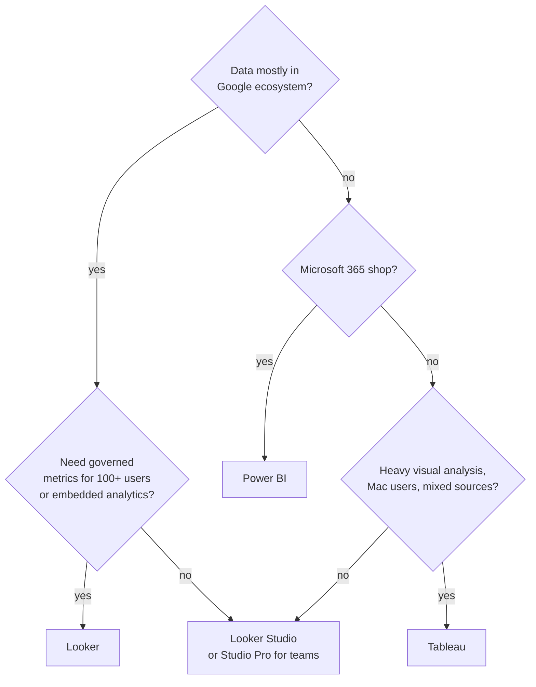

🌐 [ภาษาไทย](../th/01-bi-landscape.md) | [English](../en/01-bi-landscape.md)

# 01 · Self-Service BI Landscape: Tableau vs Power BI vs Looker Studio vs Looker

> ⏱ **Estimated time:** 45 min · 📅 **Roadmap day:** Week 1 · Day 1 · 🎯 **Level:** Intro

**In this chapter**
- [Four tools, two families](#1-four-tools-two-families)
- [Feature comparison matrix](#2-feature-comparison-matrix)
- [Pricing snapshot](#3-pricing-snapshot)
- [Decision guide: which tool for which job](#4-decision-guide-which-tool-for-which-job)
- [Where Looker Studio shines — and where it does not](#5-where-looker-studio-shines--and-where-it-does-not)
- [Glossary crosswalk](#6-glossary-crosswalk)

## 1. Four tools, two families

Self-service BI splits into two families:

- **Visual-first tools** where analysts connect to data and build directly: **Tableau**, **Power BI**, **Looker Studio**.
- **Model-first (semantic layer) tools** where a central team defines metrics in code and everyone explores the same definitions: **Looker**.

Google confusingly sells both under the "Looker" name:

| Product | Formerly | What it is |
|---|---|---|
| **Looker Studio** | Google Data Studio (renamed Oct 2022) | Free, browser-based report builder. Anyone with a Google account can use it |
| **Looker Studio Pro** | — | Paid add-on: team workspaces, Google Cloud support, SLA, scheduled delivery to Chat, mobile app, Gemini features, Looker-linked personal reports |
| **Looker** (a.k.a. Looker Core) | Looker (acquired 2020) | Enterprise platform with **LookML** semantic layer, governed Explores, embedded analytics, API-first |

## 2. Feature comparison matrix

| Criterion | Tableau | Power BI | Looker Studio | Looker |
|---|---|---|---|---|
| Deployment | Desktop + Server/Cloud | Desktop (Windows) + Service | Browser only | Browser (Google-hosted or self-hosted) |
| Authoring on Mac | Yes | No (browser-only editing is limited) | Yes | Yes |
| Learning curve | Medium | Medium | **Low** | High (LookML) |
| Semantic layer | Tableau Semantics / published data sources | Datasets + DAX measures | Per-data-source fields (light) | **LookML — strongest** |
| Data modelling | Relationships, joins, extracts | Star schema, DAX, Power Query | Blends (up to 5 tables), calculated fields | Joins in LookML, PDTs |
| Calculation language | Tableau calcs, LOD, table calcs | DAX, M | Functions (CASE, REGEXP, date) — no LOD | LookML measures + SQL |
| Live query vs extract | Both | Import / DirectQuery | Live + Extract Data (100 MB) | Live (in-database) |
| Google ecosystem | Connectors | Connectors | **Native** (Sheets, GA4, Ads, BigQuery) | Native BigQuery, also other warehouses |
| Microsoft ecosystem | Connectors | **Native** | Limited | Connectors |
| Row-level security | Yes | Yes | Basic (email filter, BigQuery RLS) | **Yes (user attributes)** |
| Embedding | Yes (licensed) | Yes (Premium/Embedded) | iframe (free) | Signed embed, API |
| Version control | Limited | Deployment pipelines | Report version history only | **Git-native** |
| Scheduled delivery | Yes | Yes | Email (free), Chat (Pro) | Yes |
| AI assistant (2026) | Tableau Agent / Pulse | Copilot | Gemini in Looker Studio (Pro) | Gemini in Looker |
| Community | Very large | Very large | Large | Medium |

> **🔁 Coming from Tableau/Power BI?** The two biggest surprises: Looker Studio has **no LOD / no DAX-style measures** (you mostly stay at the row-level aggregation the chart implies), and there is **no desktop app** — everything is in the browser, autosaved.

## 3. Pricing snapshot

Prices change; verify on each vendor's site. As a rule of thumb in 2026:

| Tool | Typical model | Ballpark |
|---|---|---|
| Looker Studio | Free | $0 (you pay only for underlying data, e.g., BigQuery scans) |
| Looker Studio Pro | Per user per project per month | Low single-digit USD per user/month tier |
| Looker | Platform fee + per-user (Viewer / Standard / Developer) | Enterprise contract, typically tens of thousands USD/year |
| Tableau | Per user (Viewer / Explorer / Creator) | ~$15 / $42 / $75 user/month |
| Power BI | Per user (Pro / Premium Per User) or capacity (Fabric) | ~$14 / $24 user/month; capacity from a few hundred USD/month |

> **⚠️ Warning** "Free" Looker Studio on top of BigQuery can still cost money: every chart runs a query. Chapter 10 shows how to keep scans small.

## 4. Decision guide: which tool for which job

| Job to be done | Best fit | Why |
|---|---|---|
| Marketing report from GA4 + Google Ads + Sheets, shared with a client this week | **Looker Studio** | Native connectors, free, shareable link |
| Company-wide KPI definitions that must match across 20 teams | **Looker** | LookML single source of truth |
| Finance team living in Excel, SharePoint, Dynamics | **Power BI** | Native M365 integration, DAX for finance logic |
| Exploratory visual analysis with complex table calcs | **Tableau** | Richest visual grammar and calc language |
| Small business dashboard on a Google Sheet | **Looker Studio** | 15 minutes to first report |
| Customer-facing embedded analytics in a SaaS app | **Looker** (or Tableau/Power BI Embedded) | Secure embed + row-level security |
| Ad-hoc analysis on BigQuery public data | **Looker Studio** | Free connector to BigQuery |

## 5. Where Looker Studio shines — and where it does not

**Shines**
- Zero cost, zero install, instant sharing via Google Drive-style permissions.
- Best-in-class Google connectors (Sheets, BigQuery, GA4, Search Console, YouTube, Ads).
- Fast to learn; a business user can build a decent report in an afternoon.
- Community visualizations and connectors extend it a long way.

**Struggles**
- Complex modelling: blends max out at 5 tables and are recomputed per chart.
- Advanced calculations across aggregation levels (no LOD).
- Large data straight from Sheets or CSV (slow above ~100k rows; move to BigQuery).
- Enterprise governance (version control, certified metrics) — that is what Looker is for.

## 6. Glossary crosswalk

| Concept | Tableau | Power BI | Looker Studio | Looker |
|---|---|---|---|---|
| Container of visuals | Workbook / Dashboard | Report / Dashboard | **Report** (pages) | Dashboard |
| Connection + fields | Data source | Dataset / Semantic model | **Data source** | Explore (from LookML model) |
| Category field | Dimension | Column / Category | **Dimension** | Dimension |
| Numeric aggregate | Measure | Measure (DAX) | **Metric** | Measure |
| Computed field | Calculated field | Calculated column / Measure | **Calculated field** | LookML dimension / measure |
| Combine tables | Relationships / Joins / Blend | Relationships | **Blend** | Joins in LookML |
| User input value | Parameter | What-if parameter | **Parameter** | Filter / Parameter (Liquid) |
| Interactive selector | Filter / Parameter control | Slicer | **Control** | Dashboard filter |
| Single number tile | Text/BAN | Card | **Scorecard** | Single value tile |

---
**Next step:** No lab for this chapter. Write down, for your own organization, which quadrant of the decision tree you fall in — you will revisit this in chapter 13.

← [Previous: 00 · TOC](00-toc.md) | [Next: 02 · Getting Started →](02-getting-started.md)

Made by **The Narit Lab** · [MIT License](../../LICENSE) · [Back to TOC](00-toc.md)
