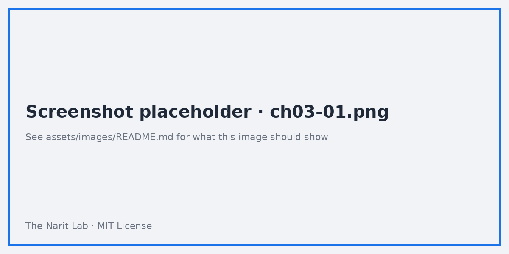
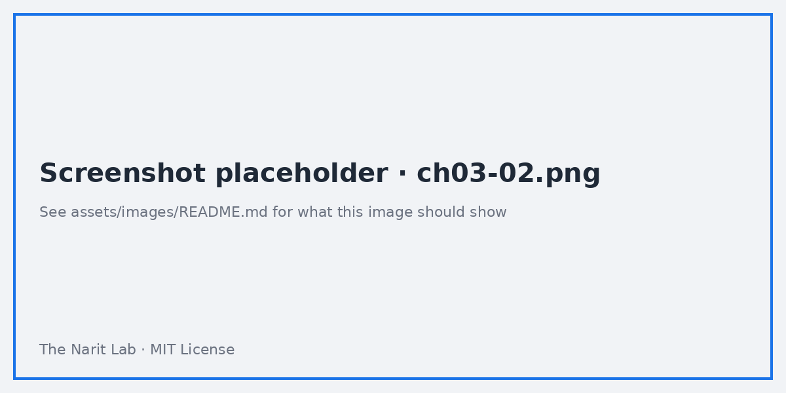
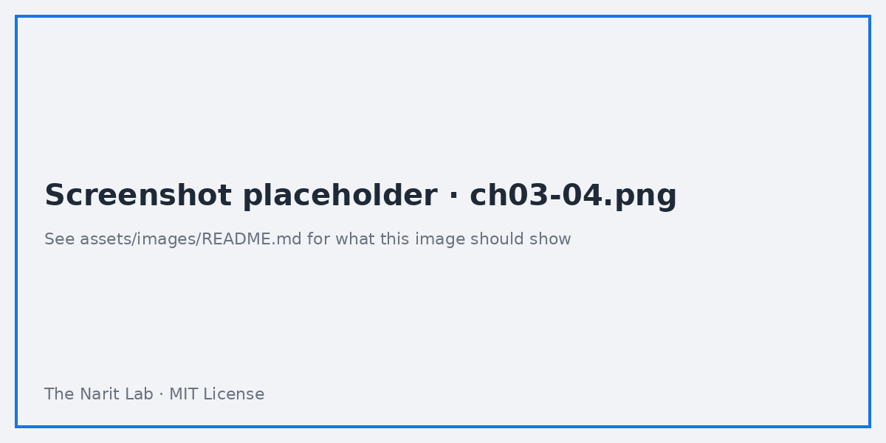

🌐 [ภาษาไทย](../th/03-data-sources.md) | [English](../en/03-data-sources.md)

# 03 · Data Sources & Connectors (Sheets, CSV, BigQuery)

> ⏱ **Estimated time:** 60 min · 📅 **Roadmap day:** Week 1 · Day 3–4 · 🎯 **Level:** Basic

**In this chapter**
- [Connector types](#1-connector-types)
- [Anatomy of a data source](#2-anatomy-of-a-data-source)
- [Google Sheets connector](#3-google-sheets-connector)
- [File upload (CSV)](#4-file-upload-csv)
- [BigQuery connector](#5-bigquery-connector)
- [Field types, aggregation and why they matter](#6-field-types-aggregation-and-why-they-matter)
- [Credentials: owner vs viewer](#7-credentials-owner-vs-viewer)
- [Data freshness and caching](#8-data-freshness-and-caching)
- [Reusable vs embedded, and swapping sources](#9-reusable-vs-embedded-and-swapping-sources)

## 1. Connector types

**Add data** opens the connector gallery with two tabs:

| Tab | Examples | Support |
|---|---|---|
| **Google connectors** | Google Sheets, BigQuery, File upload, Google Analytics (GA4), Google Ads, Search Console, YouTube Analytics, Cloud SQL for MySQL/PostgreSQL, MySQL, PostgreSQL, Microsoft SQL Server, Extract Data, Looker, Google Cloud Storage | Built and supported by Google |
| **Partner connectors** | Supermetrics, Funnel, Windsor.ai, Power My Analytics, plus hundreds more for Meta Ads, TikTok, Shopify, HubSpot, LINE Ads… | Third party; many are paid |

> **💡 Tip** Before paying for a partner connector, check whether the platform can export to BigQuery or Google Sheets natively (Meta, Shopify, HubSpot all can). Then use the free Google connector.

## 2. Anatomy of a data source

A data source = **connection** + **schema**. Open one (Data sources list → name) to see:

- **Field name** — rename freely; renaming here renames in every report.
- **Type** — Number, Text, Date & Time (many sub-formats), Boolean, Geo (Country, City, Latitude/Longitude…), URL, Image, Currency.
- **Default aggregation** — Sum, Average, Count, Count Distinct, Min, Max, None. Dimensions have *None*.
- **Description** — shows as a tooltip for editors.
- **Add a field** / **Add a parameter** — data-source-level calculated fields (chapter 06).
- **Data credentials**, **Data freshness**, **Community visualizations access** (top bar).

## 3. Google Sheets connector

Best for: small reference tables, manual inputs (targets, mappings), quick prototypes.

1. **Add data → Google Sheets** → pick spreadsheet → pick worksheet.
2. Options: **Use first row as headers**, **Include hidden and filtered cells**, **Optional range** (e.g. `A1:N`).
3. Click **Add**.

Rules for a Sheets-friendly tab:
- One header row, no merged cells, no blank rows or columns inside the data.
- One data type per column (a column mixing text and numbers becomes Text).
- Dates as real dates, not text like `1/9/26`. Use `YYYY-MM-DD` if in doubt.
- Keep it under ~100k cells for snappy reports; beyond that, go to BigQuery.

> **⚠️ Warning** Google Sheets data sources fetch the **whole sheet** on each refresh. Charts on a 200k-row sheet will be slow and may time out.

## 4. File upload (CSV)

Best for: one-off analysis, data you cannot put in Sheets.

1. **Add data → File upload** → drop the CSV. Limits: 100 MB per file, 2 GB per user in total; UTF-8 encoding.
2. Uploaded files become a **data set** stored in Looker Studio; you can append more files with the same schema.
3. Uploaded data cannot be edited in place — re-upload to change it.

## 5. BigQuery connector

Best for: anything above ~100k rows, live production data, joins done in SQL.

Four ways to connect:

| Mode | Use when |
|---|---|
| **My projects** → dataset → table/view | You own the data. Simplest and fastest |
| **Shared projects** | Someone shared a project ID with you |
| **Custom query** | You want SQL (aggregations, joins, parameters). Supports `@parameter` placeholders (chapter 08) |
| **Public datasets** | Learning and demos, e.g. `bigquery-public-data.thelook_ecommerce` |

Setting up the free sandbox:
1. Go to **https://console.cloud.google.com** → create a project (e.g. `looker-guide-2026`).
2. Open **BigQuery**. The sandbox gives 10 GB storage and 1 TB queries per month, no credit card.
3. Create dataset `looker_guide` in region `asia-southeast1` (or your region) and load the six CSVs (commands in [datasets/README.md](../../datasets/README.md)).

> **💡 Tip** For date partitioned tables the connector offers **Use `_PARTITIONTIME` as date range dimension**. Turn it on — it makes the date range control prune partitions and cut cost.

## 6. Field types, aggregation and why they matter

Wrong types are the #1 cause of "my chart is empty" questions.

| Symptom | Cause | Fix |
|---|---|---|
| `order_date` shows as text; time series unavailable | Type detected as Text | Change type to **Date** (or Date & Time → specify format) |
| `discount` sums to 4,391 | Default aggregation Sum on a rate | Set aggregation to **Average**, or create a proper weighted field |
| `customer_id` appears as a number with commas | Type Number | Change to **Text** |
| Map shows nothing | Type Text | Change to **Geo → Country / Region / City** |
| `unit_price` × `quantity` wrong in table | Aggregated fields multiplied | Create calculated field at row level: `unit_price * quantity` |

In the data source editor, click the type dropdown next to a field to change it. Changes apply everywhere the data source is used.

## 7. Credentials: owner vs viewer

Under **Data credentials**:

- **Owner's credentials** (default): viewers see data through *your* access. Simple; the norm for dashboards.
- **Viewer's credentials**: each viewer must have their own access to the Sheet / BigQuery table. Use this when row-level security is enforced in BigQuery (authorized views, RLS policies) and the report must respect it.
- **Service account** (BigQuery only): a dedicated identity so reports do not break when an employee leaves. Recommended for production.

> **🔁 Coming from Tableau/Power BI?** Owner's credentials ≈ embedded credentials on a published data source. Viewer's credentials ≈ "prompt user" / SSO passthrough.

## 8. Data freshness and caching

Looker Studio caches query results. **Data freshness** (data source top bar) sets how long a cache is trusted:

| Connector | Options |
|---|---|
| Google Sheets, most partner connectors | 15 min · 1 h · 4 h · 12 h |
| BigQuery | 1 min · 15 min · 1 h · 4 h · 12 h |
| File upload | Static until re-uploaded |

Viewers can force a refresh with **↻ Refresh data** (top-right in view mode). Every refresh re-runs queries, so a 1-minute freshness on BigQuery can cost real money on a busy report.

## 9. Reusable vs embedded, and swapping sources

- **Embedded** data sources exist inside one report. Created via **Add data** inside a report.
- **Reusable** data sources appear on the home page → **Data sources**, can be shared independently, and used by many reports. Create via **Create → Data source**, or convert an embedded one with **Resource → Manage added data sources → Make reusable**.

To point a whole report at a different table (e.g. dev sheet → prod BigQuery table):
1. **File → Report settings → Data source → Select data source**, or
2. Select multiple charts → Properties → **Data source** → change, or
3. **File → Make a copy** and choose new sources in the copy dialog — the template pattern.

Field names must match, otherwise charts show *Invalid dimension/metric*; fix them in the properties panel.

---
**Lab:** [Lab 03 — Connect Sheets, CSV and BigQuery](../../labs/lab03-data-sources/README.md)

← [Previous: 02 · Getting Started](02-getting-started.md) | [Next: 04 · Core Charts & Tables →](04-charts-tables.md)

Made by **The Narit Lab** · [MIT License](../../LICENSE) · [Back to TOC](00-toc.md)
