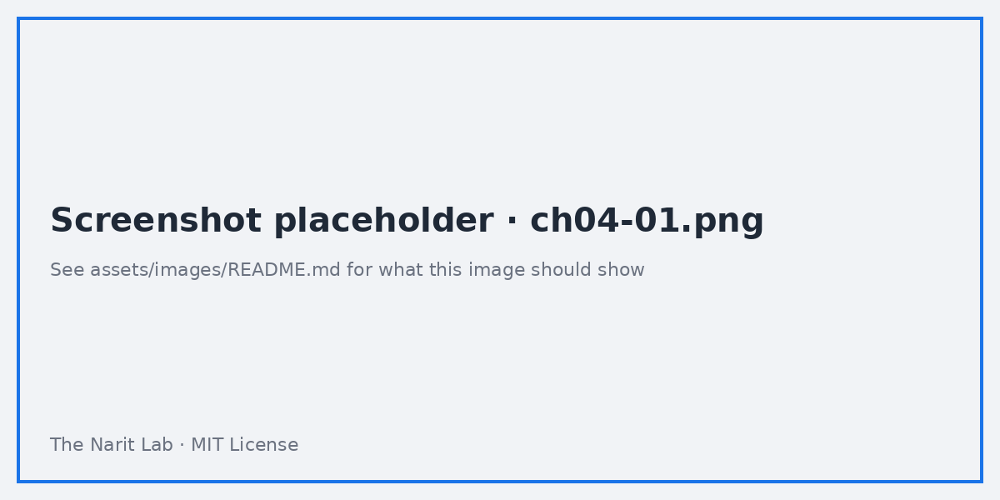
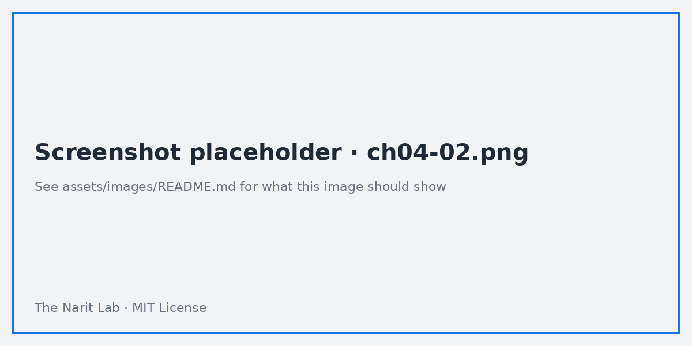

🌐 [ภาษาไทย](../th/04-charts-tables.md) | [English](../en/04-charts-tables.md)

# 04 · Core Charts & Tables, Formatting, Themes

> ⏱ **Estimated time:** 60 min · 📅 **Roadmap day:** Week 1 · Day 5 (Fri 11 Sep 2026) + Lab Week 2 · Day 6 · 🎯 **Level:** Basic

**In this chapter**
- [How a chart is defined](#1-how-a-chart-is-defined)
- [Chart type guide](#2-chart-type-guide)
- [Tables and pivot tables in depth](#3-tables-and-pivot-tables-in-depth)
- [Scorecards and comparisons](#4-scorecards-and-comparisons)
- [Time series, bar, line, combo](#5-time-series-bar-line-combo)
- [Formatting numbers, dates and conditional formatting](#6-formatting-numbers-dates-and-conditional-formatting)
- [Themes and layout](#7-themes-and-layout)
- [Optional metrics, drill-down and metric sliders](#8-optional-metrics-drill-down-and-metric-sliders)

## 1. How a chart is defined

Every chart in Looker Studio is: **data source + dimensions + metrics + date range + sort + filters + style**. The **Setup** tab holds the first six; **Style** holds the last. When a chart looks wrong, check Setup first — 80% of problems are an aggregation or a date range.

## 2. Chart type guide

| Question you are answering | Use | Avoid |
|---|---|---|
| What is the number right now? | **Scorecard** | Gauge (unless a target exists) |
| How did it change over time? | **Time series** / Line | Pie |
| Which category is biggest? | **Bar** (horizontal, sorted) | Column with 20+ categories |
| Part of a whole (≤5 parts) | **Donut / Pie** or 100% stacked bar | Pie with 10 slices |
| Two metrics related? | **Scatter** / Bubble | Dual-axis line unless units differ |
| Detail rows | **Table** with heatmap / bars | Pivot when one dimension suffices |
| Cross-tab of two dimensions | **Pivot table** | Table with 30 columns |
| Where geographically? | **Google Maps** (bubble/filled) or Geo chart | 3D anything |
| Funnel stages | **Funnel** (native) or bar | Pie |
| Distribution over time by category | **Stacked bar** / Area | Multiple pies |
| Text/KPI narrative | **Text** with dynamic values via scorecards | — |

> **🔁 Coming from Tableau?** Looker Studio charts are fixed types, not a "Show Me" grammar. A dual-axis combo chart is its own type (**Combo chart**), not two marks layered.

## 3. Tables and pivot tables in depth

**Table** setup:
- Up to 10 dimensions and 20 metrics; **Rows per page** 5–5000; **Show summary row** for totals.
- **Style → Metric** lets you render a column as **Number**, **Heatmap**, or **Bar** (in-cell bars are great for rankings).
- **Wrap text**, **Row numbers**, and **Show pagination** are Style options.
- Columns can be **resized** by dragging headers in Edit mode; **Fit to data** option too.

**Pivot table**:
- Row dimensions, column dimensions, metrics; expand/collapse is supported with multiple row dimensions.
- Totals per row/column; **Show totals** can be set separately.
- Limit: 500k cells rendered; keep column dimensions low-cardinality (months, regions), not order IDs.

## 4. Scorecards and comparisons

A scorecard shows one aggregated metric. Two features turn it into a KPI tile:

1. **Comparison date range** (Setup → Date range → Comparison): *Previous period*, *Previous year*, or fixed. The tile shows the delta as % or absolute, green/red.
2. **Compact numbers** (Style): `1.23M` instead of `1,234,567`. Set **Decimal precision** to 1–2.

Common patterns:
- Sales this month vs last month: Default date range *This month*, comparison *Previous period*.
- YTD vs last YTD: *Year to date*, comparison *Previous year*.
- Profit margin: metric = calculated field `SUM(profit) / SUM(sales_amount)` formatted as Percent (chapter 06).

> **💡 Tip** Put 3–5 scorecards in a row at the top of a page — the *KPI strip*. Readers expect it.

## 5. Time series, bar, line, combo

**Time series** needs a Date dimension. Under Setup you can:
- Change granularity: click the calendar icon on the dimension → *Year, Quarter, Month, Week, Day, Hour…*
- Add **Breakdown dimension** (e.g. `sales_channel`) for multiple lines. Limit series with **Breakdown dimension → Number of series**.
- **Trendline** (linear/exponential/polynomial) and **Reference line** (constant, metric, or parameter) live under Style.
- **Missing data**: line to zero / line breaks / linear interpolation.

**Bar/Column**: turn on **Stacked** or **100% stacked** in Setup; horizontal bars read better for long labels; always sort by the metric unless order is meaningful (months).

**Combo chart**: bars + lines with two Y axes. Use when units differ (revenue vs margin %). Assign each metric to left/right axis in Style.

## 6. Formatting numbers, dates and conditional formatting

**Number formats** (Style → per metric or in the data source):
- Type: Number, Percent, Currency (choose THB/USD…), Duration.
- Compact numbers, decimal precision, prefix/suffix.

**Date formats**: in the data source, set Date type and choose display format (e.g. `MMM YYYY`). Chart-level: Style → date format.

**Conditional formatting** (tables, scorecards, pivots): Style → **Conditional formatting → Add** — rules like *if `profit` < 0 then red text* or color scale across a column. Rules can reference another field, so a table sorted by sales can still highlight low margins.

## 7. Themes and layout

**Theme and layout** (toolbar) has two tabs:

- **Theme**: pick from built-in themes, or **Extract theme from image** (upload a logo, it builds a palette). **Customize** to set fonts, chart colors, background, border radius. Theme settings apply report-wide; per-chart Style overrides them.
- **Layout**: canvas size (default 1200 × 900; use 1600 wide for TVs), **Has margin**, **Grid settings** (snap to grid, 10 px is a good default), **Display mode** (Fit to width vs Actual size), navigation type (Left, Tab, Top).

> **💡 Tip** Set the theme *before* building 30 charts. Changing theme later is fine, but per-chart overrides you made will stick and look inconsistent.

## 8. Optional metrics, drill-down and metric sliders

- **Optional metrics** (Setup toggle): viewers can pick which metrics to show in a table or chart — one chart serves many needs.
- **Drill down** (Setup toggle on charts with several dimensions): viewers click a bar to go from Category → Sub-category → Product. Set the **Default drill-down level**.
- **Metric sliders** (Setup): viewers filter rows by a metric range directly in the chart, e.g. show only channels with sales > 1M.
- **Chart header** (Style): Show on hover / Always show / Do not show. The header exposes export, sort, and drill controls.

---
**Lab:** [Lab 04 — Build a formatted sales overview page](../../labs/lab04-charts-tables/README.md)

← [Previous: 03 · Data Sources](03-data-sources.md) | [Next: 05 · Filters, Controls & Interactions →](05-filters-controls.md)

Made by **The Narit Lab** · [MIT License](../../LICENSE) · [Back to TOC](00-toc.md)
