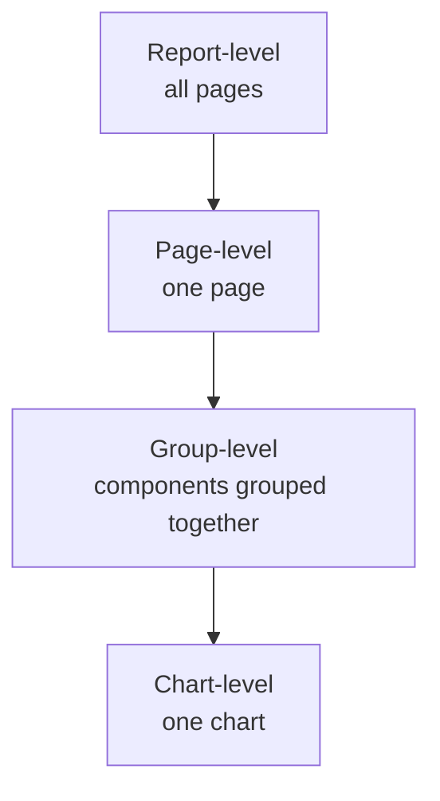

🌐 [ภาษาไทย](../th/05-filters-controls.md) | [English](../en/05-filters-controls.md)

# 05 · Filters, Controls, Date Ranges, Interactions

> ⏱ **Estimated time:** 60 min · 📅 **Roadmap day:** Week 2 · Day 7–8 · 🎯 **Level:** Basic

**In this chapter**
- [Three ways to filter](#1-three-ways-to-filter)
- [Filter scope: report, page, group, chart](#2-filter-scope-report-page-group-chart)
- [Controls catalogue](#3-controls-catalogue)
- [Date range control and default dates](#4-date-range-control-and-default-dates)
- [Editor filters (fixed filters)](#5-editor-filters-fixed-filters)
- [Cross-filtering and chart interactions](#6-cross-filtering-and-chart-interactions)
- [Filter bar and control behaviour](#7-filter-bar-and-control-behaviour)
- [Common gotchas](#8-common-gotchas)

## 1. Three ways to filter

| Method | Who sets it | Typical use |
|---|---|---|
| **Controls** (drop-down, slider, date range…) | Viewer, at read time | Interactive dashboards |
| **Editor filters** (Setup → Filter) | Editor, fixed | Exclude cancelled orders, focus a page on one region |
| **Cross-filtering** | Viewer, by clicking a chart | Explore relationships without extra controls |

Plus data-level filtering: SQL `WHERE` in a BigQuery custom query, or Sheets filter views — cheapest when the exclusion is permanent.

## 2. Filter scope: report, page, group, chart

Controls and editor filters apply to whatever **level** they belong to:

- Right-click a control → **Make report-level** to apply on every page (sticky filters).
- Select a control and several charts → right-click → **Group**: the control now filters only charts in the group. Great for a page with two independent sections.
- Chart-level editor filters are set on the chart's Setup tab and affect only that chart.

> **💡 Tip** A filter or control affects a chart only if they share a **data source** — or if the field exists in a blend/data source with the same name and the control's **Data source** is set accordingly. Chapter 07 shows how to filter blended charts.

## 3. Controls catalogue

**Add a control** offers:

| Control | Behaviour | Best for |
|---|---|---|
| **Drop-down list** | Multi-select list with search; shows metric next to values optionally | Region, channel, category |
| **Fixed-size list** | Same, always expanded | ≤6 values you want visible |
| **Input box** | Free text; contains / equals / regex match | Search by customer name |
| **Advanced filter** | Text with operators (contains, starts with, regex) | Power users |
| **Slider** | Numeric range on a metric or dimension | Price range, discount |
| **Checkbox** | Boolean field true/false | Loyalty member |
| **Date range control** | Calendar with presets | Every dashboard |
| **Data control** | Lets viewers switch the *account/property* for GA4, Ads etc. | Agencies with many clients |
| **Dimension control** / **Metric control** | Viewer picks which dimension/metric charts use (via parameter binding) | "Show me sales by ___" |
| **Button** | Navigate to page/URL, or reset filters | Navigation, "Clear filters" |
| **Presentation controls** (Pro/2025+) | Tabbed/segmented containers | App-like reports |

Control setup options worth knowing:
- **Default selection**: pre-select values (e.g. `Completed`).
- **Order**: by dimension name or metric value.
- **Single select** toggle (Style) for radio-like behaviour.
- **Search box** on/off; **Show metric** next to each value.
- Controls can be **filtered themselves** (Setup → Filter) to hide values you never want offered.

## 4. Date range control and default dates

A report has three layers of date logic:

1. **Chart default date range** — Setup → Date range → *Auto* (follow control) or *Custom* (fixed, ignores control). Custom is useful for a "Full history" chart next to filtered ones.
2. **Date range control** — the viewer's choice. Set its **Default date range** (e.g. *Last 90 days*, *This year to date*, *Advanced* like *Today minus 1 month to Today*).
3. **Date range dimension** — which date field the control filters (Setup → Date range dimension). Sales charts use `order_date`; a shipping chart may use `ship_date`.

> **⚠️ Warning** If a chart's date range dimension is blank (e.g. a lookup table with no date), the date control is ignored for that chart silently.

Comparison in controls: viewers cannot set comparison ranges in the control itself; set **Comparison date range** per chart (chapter 04).

## 5. Editor filters (fixed filters)

Setup → **Filter → Add a filter**:
- Name it clearly (`Completed orders only`) — filters are reusable across charts and pages via **Resource → Manage filters**.
- Build with **Include/Exclude**, field, operator (equals, contains, in, regex match, is null, between…). Combine clauses with **AND**; add a second condition with **OR**.
- Filters can be applied at chart, group, page, or report level (Page/Report settings).

## 6. Cross-filtering and chart interactions

**Chart interactions** (Setup → bottom) enable **Cross-filtering**: clicking a bar/row/slice filters other charts on the page that share the data source. Ctrl/⌘-click for multi-select; click again to clear.

- Enable on category charts (bar, pie, table, map), disable on time series unless you want date-brushing (drag on a time series to filter a date range — supported).
- Cross-filtering respects the same scope rules as controls (page by default; group if grouped).
- Viewers see a small funnel icon in the chart header when a cross-filter is active.

## 7. Filter bar and control behaviour

- **Filter bar** (File → Report settings → *Filter bar*): shows active filters as chips at the top and lets viewers add quick filters without you placing controls. Good for exploratory reports.
- **Sticky selections**: viewers' control selections persist when they navigate between pages if the control is report-level.
- **Reset**: a **Button → Reset** control, or the *Reset* link in view mode's top bar, clears all viewer selections.
- **Report links with filters**: viewers can **Share → Get report link → Link to current report state** so a URL carries their selections. Handy for support tickets.

## 8. Common gotchas

| Problem | Reason | Fix |
|---|---|---|
| Control does nothing | Different data source than the charts | Set the control's Data source, or use a blend/param |
| Date control ignored by one chart | Chart has *Custom* date range | Switch to *Auto* |
| Drop-down shows 5,000 values and lags | High-cardinality dimension | Add a filter to the control, or use Input box |
| Filter hides all rows | AND where you meant OR | Use *OR* clause or *In* operator |
| Numbers change when filter applied on blended chart | Filter applies to one side of the blend | Filter on the join key or in the blend config |

---
**Lab:** [Lab 05 — Make the sales page interactive](../../labs/lab05-filters-controls/README.md)

← [Previous: 04 · Charts & Tables](04-charts-tables.md) | [Next: 06 · Calculated Fields & Functions →](06-calculated-fields.md)

Made by **The Narit Lab** · [MIT License](../../LICENSE) · [Back to TOC](00-toc.md)
