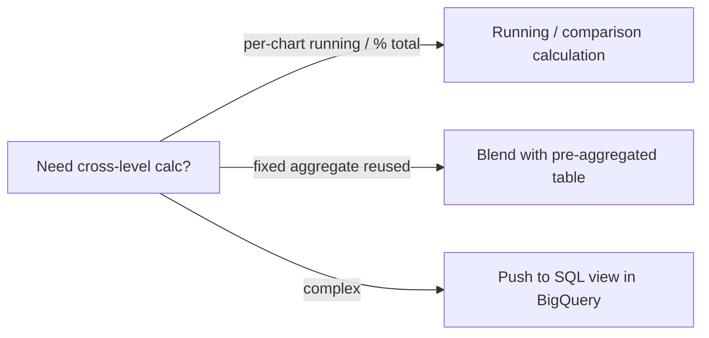

🌐 [ภาษาไทย](../th/06-calculated-fields.md) | [English](../en/06-calculated-fields.md)

# 06 · Calculated Fields & Functions (Text, Date, CASE, REGEXP)

> ⏱ **Estimated time:** 2 × 60 min · 📅 **Roadmap day:** Week 2 · Day 9–10 + Lab Week 3 · Day 11 · 🎯 **Level:** Intermediate

**In this chapter**
- [Where calculated fields live](#1-where-calculated-fields-live)
- [Row-level vs aggregated — the one rule to remember](#2-row-level-vs-aggregated--the-one-rule-to-remember)
- [Arithmetic and aggregation functions](#3-arithmetic-and-aggregation-functions)
- [Text functions](#4-text-functions)
- [Date & time functions](#5-date--time-functions)
- [CASE and conditional logic](#6-case-and-conditional-logic)
- [REGEXP functions](#7-regexp-functions)
- [Ratios, running totals and "no LOD" workarounds](#8-ratios-running-totals-and-no-lod-workarounds)
- [Function quick reference](#9-function-quick-reference)

## 1. Where calculated fields live

| Level | Create via | Scope | Use when |
|---|---|---|---|
| **Data source** | Data source editor → **Add a field** | Every report using the source | Business logic everyone needs (margin, order bucket) |
| **Chart** | Chart Setup → **Add metric/dimension → Create field** | One chart | Quick experiments, chart-specific labels |


The editor validates as you type: green check = OK; red = error with a message. Field names are case-sensitive and appear as `field_name`; text literals use `"double"` or `'single'` quotes.

> **💡 Tip** Chart-level fields cannot be reused. Once a formula works, recreate it at data-source level and delete the chart copy.

## 2. Row-level vs aggregated — the one rule to remember

Looker Studio has two kinds of formulas:

- **Row-level (non-aggregated)**: uses raw fields only — `unit_price * quantity`, `UPPER(region)`, `DATETIME_DIFF(ship_date, order_date, DAY)`. The result becomes a new field that can then be aggregated by the chart (SUM, AVG…).
- **Aggregated**: uses aggregation functions — `SUM(profit) / SUM(sales_amount)`. The result is already a metric; the chart cannot re-aggregate it.

**You cannot mix them in one formula.** `SUM(profit) / sales_amount` is an error ("Invalid formula – cannot mix aggregated and non-aggregated"). Think about which level you need *before* writing.

> **🔁 Coming from Tableau?** Row-level = a regular calc; aggregated = an aggregate calc. There is no LOD or table calc — see §8 for what to do instead.

## 3. Arithmetic and aggregation functions

```sql
-- Row-level
unit_price * quantity                         -- gross line value
sales_amount - cost_amount                    -- profit (already in data)
ROUND(discount * 100, 0)                      -- discount as whole percent

-- Aggregated
SUM(profit) / SUM(sales_amount)               -- profit margin (format as Percent)
SUM(sales_amount) / COUNT_DISTINCT(order_id)  -- average order value
AVG(quantity)                                  -- avg units per line
MAX(order_date)                                -- latest order
```

Functions: `SUM AVG MIN MAX COUNT COUNT_DISTINCT APPROX_COUNT_DISTINCT MEDIAN PERCENTILE STDDEV VARIANCE` plus `ABS ROUND FLOOR CEIL POWER SQRT LOG LOG10 NARY_MAX NARY_MIN`.

**Handle division by zero** with `NARY_MAX(SUM(x), 1)` or a `CASE` guard:

```sql
CASE WHEN SUM(sales_amount) = 0 THEN 0 ELSE SUM(profit) / SUM(sales_amount) END
```

## 4. Text functions

```sql
CONCAT(region, " / ", province)                 -- combined label
UPPER(customer_name)  LOWER(...)  TRIM(...)
LEFT_TEXT(order_id, 2)                          -- "SO"
RIGHT_TEXT(order_id, 6)
SUBSTR(product_id, 2, 4)                        -- "0028"
LENGTH(customer_name)
REPLACE(payment_method, "Cash on Delivery", "COD")
CONTAINS_TEXT(product_name, "Pro")              -- boolean
STARTS_WITH(campaign_name, "LINE")  ENDS_WITH(...)
SPLIT(campaign_name, " ", 1)                    -- first token
CAST(quantity AS TEXT)                          -- number → text
CAST(some_text AS NUMBER)                       -- text → number
```

Also `HASH(text, "SHA256")` for anonymising IDs and `TOCITY / TOCOUNTRY / TOREGION` for geo conversions.

## 5. Date & time functions

Types: **Date** (`2026-09-07`), **Date & Time** (`2026-09-07 08:30:00`). Conversion and arithmetic:

```sql
-- Convert text to date
PARSE_DATE("%Y-%m-%d", order_date_text)
PARSE_DATETIME("%d/%m/%Y %H:%M", thai_text)      -- e.g. 07/09/2026 08:30
TODATE(order_date_text, "DEFAULT_DASH", "%Y%m%d")  -- legacy but still works

-- Parts
YEAR(order_date)  QUARTER(order_date)  MONTH(order_date)  WEEK(order_date)  DAY(order_date)
WEEKDAY(order_date)          -- 0 = Sunday … 6 = Saturday
DATETIME_TRUNC(order_date, MONTH)   -- first day of month (keeps Date type — great for grouping)
FORMAT_DATETIME("%b %Y", order_date)  -- "Sep 2026" as text

-- Differences and shifting
DATETIME_DIFF(ship_date, order_date, DAY)       -- fulfilment days
DATETIME_ADD(order_date, INTERVAL 30 DAY)
DATETIME_SUB(CURRENT_DATE(), INTERVAL 1 YEAR)
CURRENT_DATE()  CURRENT_DATETIME()  TODAY()
```

Useful derived fields for `sales_orders`:

```sql
-- Fiscal year starting October (common in Thai public sector)
CASE WHEN MONTH(order_date) >= 10 THEN YEAR(order_date) + 1 ELSE YEAR(order_date) END

-- Weekend flag
CASE WHEN WEEKDAY(order_date) IN (0, 6) THEN "Weekend" ELSE "Weekday" END

-- Days to ship bucket
CASE
  WHEN DATETIME_DIFF(ship_date, order_date, DAY) <= 2 THEN "0–2 days"
  WHEN DATETIME_DIFF(ship_date, order_date, DAY) <= 5 THEN "3–5 days"
  ELSE "6+ days"
END
```

## 6. CASE and conditional logic

Two forms:

```sql
-- Searched CASE (most common)
CASE
  WHEN sales_amount >= 10000 THEN "Large"
  WHEN sales_amount >= 3000  THEN "Medium"
  ELSE "Small"
END

-- Simple CASE
CASE region
  WHEN "Bangkok" THEN "BKK"
  WHEN "Central" THEN "CTR"
  ELSE "UPC"
END

-- Shorthand
IF(order_status = "Completed", sales_amount, 0)     -- completed revenue only
IFNULL(discount, 0)
NULLIF(quantity, 0)
COALESCE(province, region, "Unknown")
```

**Cleaning `hr_headcount.csv`** — the file mixes headcount rows and `_movement` rows:

```sql
-- Headcount (only for real level rows)
IF(level != "_movement", headcount_or_hires, NULL)

-- Hires and exits (only for movement rows)
IF(level = "_movement", headcount_or_hires, NULL)     -- hires
IF(level = "_movement", avg_salary_or_exits, NULL)   -- exits

-- Average salary should never sum across levels: use AVG or weighted
SUM(IF(level != "_movement", headcount_or_hires * avg_salary_or_exits, 0))
  / SUM(IF(level != "_movement", headcount_or_hires, 0))
```

Then add an editor filter `level != _movement` on the headcount charts.

> **⚠️ Warning** `CASE` branches must return the same type. `WHEN x THEN "text" ELSE 0` fails. Use `CAST` or `NULL`.

## 7. REGEXP functions

Looker Studio uses RE2 syntax (same as BigQuery).

```sql
REGEXP_MATCH(campaign_name, ".*(Facebook|TikTok).*")   -- boolean, whole-string match
REGEXP_CONTAINS(campaign_name, "Ads")                   -- boolean, partial match
REGEXP_EXTRACT(campaign_name, "^(\\w+)")                -- first word → "Facebook"
REGEXP_EXTRACT(campaign_name, "(\\w{3} \\d{4})$")       -- "Sep 2026"
REGEXP_REPLACE(customer_name, "\\s+\\w\\.$", "")        -- strip " A."
```

Notes:
- Escape backslashes twice in the editor: `\\d`, `\\w`, `\\s`.
- `REGEXP_MATCH` must match the **entire** string; wrap with `.*…*.` for "contains" or use `REGEXP_CONTAINS`.
- Regex filters are also available in controls and editor filters (operator *RegExp Match / RegExp Contains*).


Marketing example — channel family from `channel`:

```sql
CASE
  WHEN REGEXP_CONTAINS(channel, "Facebook|TikTok|YouTube") THEN "Social & Video"
  WHEN REGEXP_CONTAINS(channel, "Google|SEO") THEN "Search"
  WHEN REGEXP_CONTAINS(channel, "LINE|Email") THEN "Owned"
  ELSE "Other"
END
```

## 8. Ratios, running totals and "no LOD" workarounds

| Need | Looker Studio approach |
|---|---|
| Ratio per row of a table | Aggregated field `SUM(a)/SUM(b)` — evaluates per row *and* per total correctly |
| Running total / % of total / difference from previous | Chart-level: click metric → **Comparison calculation** or **Running calculation** (Running sum, Running average, Percent of total, Difference from previous…) — these are the closest thing to table calcs |
| Count of customers with >3 orders | Cannot nest aggregations. Pre-aggregate in BigQuery SQL, or blend the table with itself (chapter 07) |
| Fixed LOD like `{FIXED region: SUM(sales)}` | Blend a pre-aggregated copy of the source keyed on `region` (chapter 07), or a BigQuery view with a window function |
| Percentile / median | `PERCENTILE(x, 90)`, `MEDIAN(x)` — supported for most connectors |



## 9. Function quick reference

| Family | Functions |
|---|---|
| Aggregation | `SUM AVG MIN MAX COUNT COUNT_DISTINCT APPROX_COUNT_DISTINCT MEDIAN PERCENTILE STDDEV VARIANCE` |
| Arithmetic | `+ - * / ABS ROUND FLOOR CEIL POWER SQRT LOG LOG10 NARY_MAX NARY_MIN` |
| Text | `CONCAT UPPER LOWER TRIM LEFT_TEXT RIGHT_TEXT SUBSTR LENGTH REPLACE CONTAINS_TEXT STARTS_WITH ENDS_WITH SPLIT CAST HASH` |
| Date | `PARSE_DATE PARSE_DATETIME FORMAT_DATETIME DATETIME_TRUNC DATETIME_DIFF DATETIME_ADD DATETIME_SUB YEAR QUARTER MONTH WEEK DAY WEEKDAY HOUR CURRENT_DATE CURRENT_DATETIME TODAY UNIX_DATE` |
| Logic | `CASE IF IFNULL NULLIF COALESCE AND OR NOT IN IS NULL` |
| Regex | `REGEXP_MATCH REGEXP_CONTAINS REGEXP_EXTRACT REGEXP_REPLACE` |
| Geo | `TOCITY TOCOUNTRY TOREGION TOSUBCONTINENT TOCONTINENT` |
| Misc | `IMAGE HYPERLINK` (clickable links / images in tables), `URL_ENCODE` |

---
**Lab:** [Lab 06 — Build a calculated-field library](../../labs/lab06-calculated-fields/README.md)

← [Previous: 05 · Filters & Controls](05-filters-controls.md) | [Next: 07 · Data Blending & Joins →](07-blending.md)

<sub>Made by **The Narit Lab** · [MIT License](../../LICENSE) · [Back to TOC](00-toc.md)</sub>
