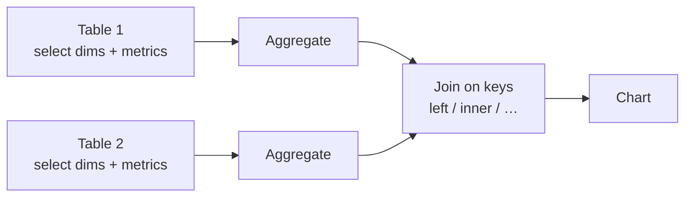

🌐 [ภาษาไทย](../th/07-blending.md) | [English](../en/07-blending.md)

# 07 · Data Blending & Joins

> ⏱ **Estimated time:** 60 min · 📅 **Roadmap day:** Week 3 · Day 12–13 (Tue 22 – Wed 23 Sep 2026) · 🎯 **Level:** Intermediate

**In this chapter**
- [What a blend is (and is not)](#1-what-a-blend-is-and-is-not)
- [Creating a blend](#2-creating-a-blend)
- [Join types](#3-join-types)
- [Pattern 1: lookup enrichment (fact + dimensions)](#4-pattern-1-lookup-enrichment-fact--dimensions)
- [Pattern 2: two fact tables at the same grain](#5-pattern-2-two-fact-tables-at-the-same-grain)
- [Pattern 3: self-blend for "LOD" style aggregates](#6-pattern-3-self-blend-for-lod-style-aggregates)
- [Filters, controls and date ranges on blends](#7-filters-controls-and-date-ranges-on-blends)
- [Limits, performance and when to use SQL instead](#8-limits-performance-and-when-to-use-sql-instead)

## 1. What a blend is (and is not)

A **blend** combines up to **5 tables** (data sources) into one virtual source for a chart. Each table is first **aggregated to the dimensions you pick**, then the aggregated results are **joined** on the keys you configure.

That order matters:

It is **not** a database join at row level. If you include only `region` from `sales_orders` and `region` + `target` from a targets sheet, the blend joins *regional totals* with *regional targets* — exactly what you want. Include `order_id` too and the grain changes.

> **🔁 Coming from Tableau/Power BI?** A blend ≈ Tableau data blending (aggregate then join), not Tableau relationships / Power BI model relationships. It is defined per chart (or saved and reused), not once for the report.

## 2. Creating a blend

1. Select a chart → Setup → under Data source click **Blend data**, or **Resource → Manage blends → Add a blend**.
2. The blend editor shows **Table 1** on the left. Add **dimensions** and **metrics** you need from it. Optionally rename the table.
3. Click **Join another table** → choose the second data source → pick its dimensions/metrics.
4. Click the **join icon** between tables → choose **join type** and **join conditions** (field from left = field from right). Multiple conditions are AND-ed.
5. Repeat for up to 5 tables. Each table joins to the one immediately to its left.
6. Name the blend (top-left) and **Save**. It appears in the chart's data source picker and under Manage blends.

Options per table:
- **Date range dimension** — needed so the date control can filter this table.
- **Filters** — table-specific editor filters inside the blend.

## 3. Join types

| Type | Keeps | Use when |
|---|---|---|
| **Left outer** | All rows from left; matching from right | Fact on the left, lookups on the right (default choice) |
| **Right outer** | All rows from right | Rarely; swap tables instead |
| **Inner** | Only matches | You want to drop unmatched rows, e.g. active products only |
| **Full outer** | All rows from both | Two fact tables where either side may be missing (sales vs targets by month) |
| **Cross** | Cartesian product, no keys | Combine a one-row parameter/targets table with everything |

> **⚠️ Warning** Full outer joins produce NULL keys on one side. Use `COALESCE(table1.month, table2.month)` in a calculated field for a clean dimension.

## 4. Pattern 1: lookup enrichment (fact + dimensions)

Goal: sales by **customer segment** and **product category** — fields that live in `customers` and `products`, not in `sales_orders`.

- Table 1 `sales_orders`: dims `customer_id`, `product_id`, `order_date`; metrics `sales_amount`, `profit`, `Record Count`.
- Table 2 `customers`: dims `customer_id`, `segment`, `region`. Join **left outer** on `customer_id`.
- Table 3 `products`: dims `product_id`, `category`, `brand`. Join **left outer** on `product_id` (to table 2 → actually to the chain; choose the key that exists on the left side, `product_id` from table 1 is carried through).

Chart: bar of `SUM(sales_amount)` by `segment`, breakdown `category`.

> **💡 Tip** Because aggregation happens before the join, keep only the dims you display plus the keys. Extra dims from the fact table shrink the aggregation grain and slow the blend.

## 5. Pattern 2: two fact tables at the same grain

Goal: **Marketing ROI** — monthly sales vs monthly marketing spend.

- Table 1 `sales_orders`: dim `order_date` → set granularity **Month** (create field `DATETIME_TRUNC(order_date, MONTH)` named `month`); metric `sales_amount`.
- Table 2 `marketing_campaigns`: dim `start_date` truncated to month as `month`; metrics `spend`, `leads`, `conversions`.
- Join **full outer** on `month = month`.
- Blend metric: `SUM(sales_amount) / SUM(spend)` = revenue per baht of spend.

## 6. Pattern 3: self-blend for "LOD" style aggregates

Goal: each region's share of total sales, or each order's sales vs the region average.

- Table 1 `sales_orders`: dims `region` (via customers, or add `region` first), metric `sales_amount`.
- Table 2 `sales_orders` **again**: no dimensions, metric `sales_amount` → this yields one grand-total row.
- Join **cross** (no keys).
- Field: `SUM(Table1.sales_amount) / SUM(Table2.sales_amount)` → share of total.

Same trick with dims `region` on table 2 and `province` on table 1 gives province vs region totals — a FIXED-LOD equivalent.

## 7. Filters, controls and date ranges on blends

- A **control** filters a blended chart only if the control's field comes from a table in the blend **and** the control's data source is that table (or the field is shared by name and you set the control to the blend).
- **Date range control** applies per table through each table's *Date range dimension*. Forgetting it on one table gives "sales for last 30 days vs spend for all time" — a classic mistake.
- Editor filters on the chart apply **after** the join; filters inside the blend apply **before**. To keep NULL rows from a left join, filter inside the blend on the right table.

## 8. Limits, performance and when to use SQL instead

| Limit | Value |
|---|---|
| Tables per blend | 5 |
| Join conditions | Multiple per join |
| Calculated fields in blend | Yes, on blend output |
| Blend data freshness | Follows each source |

Blends are computed **per chart**, so a page with 8 blended charts runs 8 × N queries. If you notice slowness, or you need more than 5 tables, row-level joins, or window functions:

- **BigQuery**: write a view or scheduled query that joins everything; connect Looker Studio to the view. Faster, cheaper (if partitioned), and reusable.
- **Google Sheets**: use `=VLOOKUP` / `=QUERY` to pre-join in the sheet for small data.
- **Looker**: define joins once in LookML (chapter 13).

> **💡 Tip** Rule of thumb: prototype with a blend, productionise in SQL.

---
**Lab:** [Lab 07 — Enrich sales with customers/products and build a Marketing ROI blend](../../labs/lab07-blending/README.md)

← [Previous: 06 · Calculated Fields](06-calculated-fields.md) | [Next: 08 · Parameters & Dynamic Reports →](08-parameters.md)

Made by **The Narit Lab** · [MIT License](../../LICENSE) · [Back to TOC](00-toc.md)
