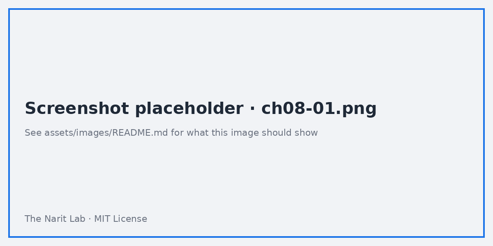

🌐 [ภาษาไทย](../th/08-parameters.md) | [English](../en/08-parameters.md)

# 08 · Parameters & Dynamic Reports

> ⏱ **Estimated time:** 60 min · 📅 **Roadmap day:** Week 3 · Day 14–15 (Thu 24 – Fri 25 Sep 2026) · 🎯 **Level:** Intermediate

**In this chapter**
- [What a parameter is](#1-what-a-parameter-is)
- [Creating parameters](#2-creating-parameters)
- [Binding a control to a parameter](#3-binding-a-control-to-a-parameter)
- [Use case 1: what-if target simulator](#4-use-case-1-what-if-target-simulator)
- [Use case 2: dynamic dimension / metric switching](#5-use-case-2-dynamic-dimension--metric-switching)
- [Use case 3: BigQuery custom query parameters](#6-use-case-3-bigquery-custom-query-parameters)
- [Use case 4: dynamic text, thresholds and currency](#7-use-case-4-dynamic-text-thresholds-and-currency)
- [Parameters in URLs](#8-parameters-in-urls)
- [Limits and tips](#9-limits-and-tips)

## 1. What a parameter is

A **parameter** is a named value that viewers can change and that formulas can reference. Unlike a filter, it does not remove rows — it **changes how fields are calculated or which fields are shown**.

| Type | Example values |
|---|---|
| Text | `"THB"`, `"Sales"` |
| Number | `1.15`, `500000` |
| Boolean | `true / false` |
| List (text or number, single or multi-select) | `Region / Channel / Category` |

Parameters live at **data source level** (usable in that source's calculated fields and BigQuery queries) or **report level** (Resource → Manage parameters; usable in report-level calculated fields and blends).

## 2. Creating parameters

1. Data source editor → **Add a parameter** (or Resource → Manage parameters → Add).
2. Name (`Target Growth`), ID (auto, e.g. `target_growth`), data type, permitted values (any / list of values / range), default value.
3. Save. The parameter appears in the Data panel in purple.



## 3. Binding a control to a parameter

Any of these controls can drive a parameter: **Input box**, **Slider**, **Drop-down list**, **Fixed-size list**, **Checkbox**, **Button**. Add the control, then in Setup choose the parameter as its **Control field**. The control's options come from the parameter's permitted values.

Parameters can also be set by **Report links** (URL) — see §8.

## 4. Use case 1: what-if target simulator

Question: "If we grow 15% next year, what monthly revenue do we need?"

1. Parameter `growth_rate`: Number, range 0–1, step 0.01, default 0.15. Control: **Slider**.
2. Calculated field:
```sql
-- next year monthly target
SUM(sales_amount) * (1 + growth_rate)
```
3. Time series: `SUM(sales_amount)` and the target field as two lines. Moving the slider redraws the target line instantly.

Extend with `target_margin` and highlight months where `SUM(profit)/SUM(sales_amount) < target_margin` via conditional formatting.


## 5. Use case 2: dynamic dimension / metric switching

Question: "Show sales by ___" where the viewer picks Region, Channel, or Category.

1. Parameter `dim_selector`: Text, list of values `Region`, `Channel`, `Category`, default `Region`. Control: **Drop-down list** (single select).
2. Calculated dimension:
```sql
CASE dim_selector
  WHEN "Region"   THEN region
  WHEN "Channel"  THEN sales_channel
  WHEN "Category" THEN category
END
```
3. Use this field as the bar chart's dimension; set the chart title with the parameter (see §7).

Same for metrics:
```sql
CASE metric_selector
  WHEN "Sales"  THEN SUM(sales_amount)
  WHEN "Profit" THEN SUM(profit)
  WHEN "Orders" THEN COUNT_DISTINCT(order_id)
END
```

> **💡 Tip** Looker Studio also has dedicated **Dimension control** and **Metric control** components that do this without a CASE — they work with **Optional metrics** and drill-down. Use them for simple swaps; use CASE when you need custom logic.

## 6. Use case 3: BigQuery custom query parameters

In a BigQuery **Custom query** data source, tick **Enable date range parameters** and **Enable parameters**. Then reference them as `@name`:

```sql
SELECT
  DATE_TRUNC(order_date, MONTH) AS month,
  sales_channel,
  SUM(sales_amount) AS sales,
  SUM(profit) AS profit
FROM `your_project.looker_guide.sales_orders`
WHERE order_date BETWEEN PARSE_DATE('%Y%m%d', @DS_START_DATE)
                     AND PARSE_DATE('%Y%m%d', @DS_END_DATE)
  AND sales_channel IN UNNEST(@channels)        -- multi-select list parameter
  AND discount <= @max_discount                  -- number parameter
GROUP BY 1, 2
```

- `@DS_START_DATE`, `@DS_END_DATE` (strings `YYYYMMDD`) and `@DS_USER_EMAIL` (viewer's email, for row-level security) are built in.
- Your own parameters must be created in the data source and are passed as typed values. List parameters arrive as arrays — use `IN UNNEST(@param)`.

This pattern pushes filtering into BigQuery **before** aggregation: fewer bytes scanned, faster charts.


> **⚠️ Warning** Do not concatenate parameters into SQL strings (there is no need — BigQuery binds them safely). Custom queries with parameters cannot be cached across different parameter values, so each change is a new query.

## 7. Use case 4: dynamic text, thresholds and currency

- **Dynamic titles**: a Scorecard with metric `dim_selector` (aggregation: none, as text) placed as a heading shows "Region", "Channel"… Alternatively `CONCAT("Sales by ", dim_selector)`.
- **Thresholds**: parameter `sla_days`; field `IF(DATETIME_DIFF(ship_date, order_date, DAY) > sla_days, "Late", "On time")` feeds a pie and a filter.
- **Currency conversion**: parameter `fx_rate` (default 36.5); field `SUM(sales_amount) / fx_rate` labelled "Sales (USD)".
- **Toggle views**: Boolean parameter `show_profit`; `IF(show_profit, SUM(profit), SUM(sales_amount))`.

## 8. Parameters in URLs

Report links accept parameter values through the `params` query string (URL-encoded JSON):

```
https://lookerstudio.google.com/reporting/REPORT_ID/page/PAGE_ID?params=%7B%22ds0.growth_rate%22%3A0.2%7D
```

Decoded: `{"ds0.growth_rate":0.2}` where `ds0` is the data source alias shown in **Resource → Manage added data sources** (hover the source). Filters can be passed the same way with `df` keys. Use **Share → Get report link → Link to current report state** to get a working example and then edit it.

Use: embed the report in a portal and pass the client's region from the portal URL.

## 9. Limits and tips

- Parameters are **per viewer session** — two viewers can hold different values at once.
- Text parameters used in CASE must match values exactly (case-sensitive).
- A parameter cannot be used as a dimension directly in some connectors; wrap it in a calculated field.
- Keep the number of parameters small and label controls clearly; readers mistake parameter controls for filters.
- Version history restores parameters and controls like any other component.

---
**Lab:** [Lab 08 — What-if simulator and parameterised BigQuery query](../../labs/lab08-parameters/README.md)

← [Previous: 07 · Data Blending](07-blending.md) | [Next: 09 · Dashboard Design Principles →](09-dashboard-design.md)

<sub>Made by **The Narit Lab** · [MIT License](../../LICENSE) · [Back to TOC](00-toc.md)</sub>
