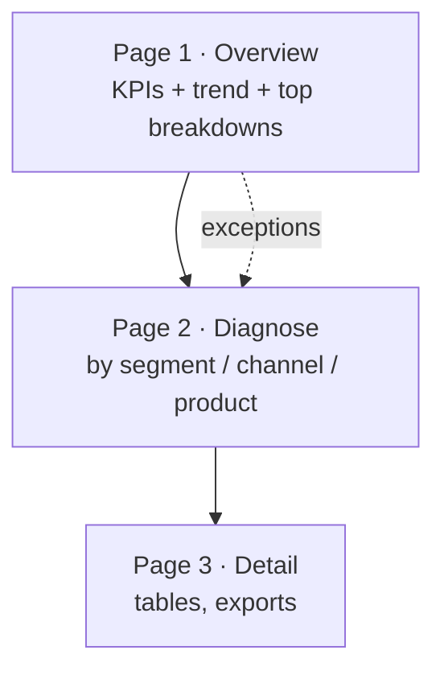
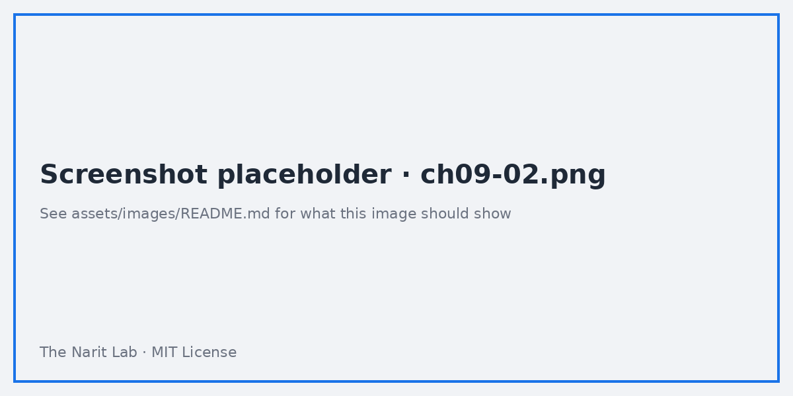

🌐 [ภาษาไทย](../th/09-dashboard-design.md) | [English](../en/09-dashboard-design.md)

# 09 · Dashboard Design Principles (Layout, Color, Storytelling)

> ⏱ **Estimated time:** 60 min · 📅 **Roadmap day:** Week 4 · Day 16–17 · 🎯 **Level:** Intermediate

**In this chapter**
- [Start with the audience and the decision](#1-start-with-the-audience-and-the-decision)
- [Information hierarchy and the Z-pattern](#2-information-hierarchy-and-the-z-pattern)
- [Layout grid in Looker Studio](#3-layout-grid-in-looker-studio)
- [Color: purpose, not decoration](#4-color-purpose-not-decoration)
- [Typography and text components](#5-typography-and-text-components)
- [Chart hygiene checklist](#6-chart-hygiene-checklist)
- [Storytelling: from overview to detail](#7-storytelling-from-overview-to-detail)
- [Mobile and TV layouts](#8-mobile-and-tv-layouts)
- [Before / after example](#9-before--after-example)

## 1. Start with the audience and the decision

Before adding a chart, write one sentence: *"This page helps **[who]** decide **[what]** every **[how often]**."*

| Audience | Cadence | They want | Page style |
|---|---|---|---|
| CEO / executives | Weekly | 5 KPIs, trend, exceptions | One screen, no scrolling, big numbers |
| Managers | Daily | Their team vs target, drill to detail | KPI strip + breakdowns + table |
| Analysts | Ad hoc | Everything, filters, export | Dense, many controls, data tables |
| Clients / external | Monthly | Proof of value, plain language | Branded, narrative text, few charts |

Every chart must answer a question that audience actually asks. If you cannot name the question, remove the chart.

## 2. Information hierarchy and the Z-pattern

Readers scan top-left → top-right → bottom-left → bottom-right.

```
┌──────────────────────────────────────────────┐
│ Title · date range · filters          [logo] │  ← context
├────────┬────────┬────────┬────────┬──────────┤
│  KPI 1 │  KPI 2 │  KPI 3 │  KPI 4 │  KPI 5   │  ← the answer
├────────┴────────┴────────┴────────┴──────────┤
│  Trend over time (wide)      │ Breakdown A   │  ← why
├──────────────────────────────┼───────────────┤
│  Breakdown B                 │ Detail table  │  ← so what / drill
└──────────────────────────────┴───────────────┘
```

Rules:
1. The most important number is top-left, largest.
2. One trend chart per page carries the narrative.
3. Detail tables go last (bottom or a separate page).
4. Filters are top-right or in a left rail, never scattered.

## 3. Layout grid in Looker Studio

- **Theme and layout → Layout → Grid settings**: snap to grid ON, grid size **10 px** (or 12 px), canvas **1200 × 900** for laptops, **1600 × 900** for wall screens.
- Use **12 columns**: on a 1200 px canvas with 20 px margins, each column ≈ 96 px. KPI tiles = 2 columns each (5 tiles + gaps), charts = 6/6 or 8/4.
- Align with **right-click → Align → Left/Top** and **Distribute → Horizontally**. Select several components and set identical **width/height** in Style → Position and size.
- Keep **consistent spacing** (e.g. 20 px between components, 40 px between sections).
- Prefer **rectangles with subtle background** to group related charts instead of heavy borders.

> **💡 Tip** Build one perfect KPI tile, then Ctrl/⌘+D duplicate it four times and just change the metric. Consistency for free.

## 4. Color: purpose, not decoration

| Use color for | Do | Don't |
|---|---|---|
| Semantics | Green good / red bad *consistently*; gray for "other" | Green for a category in one chart and for "good" in another |
| Emphasis | One accent color; everything else muted | Rainbow categorical palettes |
| Brand | Extract theme from logo, then desaturate for charts | Logo-bright colors on every bar |
| Accessibility | Test with a color-blindness simulator; add labels/icons, not only color | Red vs green as the only difference |

Practical setup: Theme → Customize → set **Chart palette** to 4–6 colors: brand blue, teal, gray, light gray, then a positive green and a negative red used only in conditional formatting. Turn on **Dimension value color** overrides so `Bangkok` is always the same color on every chart (Resource → Manage dimension value colors).

## 5. Typography and text components

- Two sizes for numbers (KPI 28–36 px, table 12–13 px) and two for text (headers 16–18 px, body 12–13 px).
- Left-align text, right-align numbers, center only headers.
- Use **Text** components for section titles and a one-line *insight* under key charts ("Marketplace grew 22% YoY, driven by Nov–Dec"). Readers remember sentences, not axes.
- Add a **footer** text: data source, refresh cadence, owner, "Made by …".

## 6. Chart hygiene checklist

- [ ] Title states the *what* and *unit*: "Monthly sales (THB)".
- [ ] Axis starts at zero for bars; ok to zoom for lines if labelled.
- [ ] Sorted bars (largest first) unless natural order (time, age groups).
- [ ] ≤ 7 categories per chart; group the rest into "Other" with a CASE.
- [ ] Gridlines light gray or off; remove chart borders/shadows.
- [ ] Data labels only where they add precision; compact numbers on.
- [ ] Legends placed top or removed when a single series.
- [ ] Date range and filters visible so numbers are never ambiguous.
- [ ] Tooltips / **Show data** left on for drill.
- [ ] Empty states handled (no "No data" boxes on a first load).

## 7. Storytelling: from overview to detail

Structure multi-page reports as a funnel:



- Use **navigation** (left or tab) with short page names: *Overview · Marketing · Customers · Data*.
- Add **Buttons** for "Go to detail" next to charts, and **drill-down** for in-place exploration.
- Repeat the KPI strip on each page with the page's own KPIs so context never disappears.
- End with a **"How to read this report"** page or text block — the least glamorous, most appreciated component.

## 8. Mobile and TV layouts

- Looker Studio has **no responsive layout**; a page renders at its canvas size. For mobile viewers, add a **separate page** at 400 × 1400 px with stacked scorecards and one chart per row, and link to it with a button.
- For TV dashboards: 1920 × 1080 canvas, font sizes ×1.5, dark theme, no controls, **auto-refresh** via a browser extension or the Looker Studio Pro mobile/kiosk options.

## 9. Before / after example


Typical "before": 14 charts, 4 pies, 3 palettes, filters in three corners, no titles. "After": KPI strip, one trend, two sorted bars, one table, single palette, filters top-right, insight text.



> **🧪 Lab** Lab 09 gives you the "before" page and asks you to rebuild it.

---
**Lab:** [Lab 09 — Redesign the executive page](../../labs/lab09-dashboard-design/README.md)

← [Previous: 08 · Parameters](08-parameters.md) | [Next: 10 · Performance & BigQuery →](10-performance.md)

<sub>Made by **The Narit Lab** · [MIT License](../../LICENSE) · [Back to TOC](00-toc.md)</sub>
