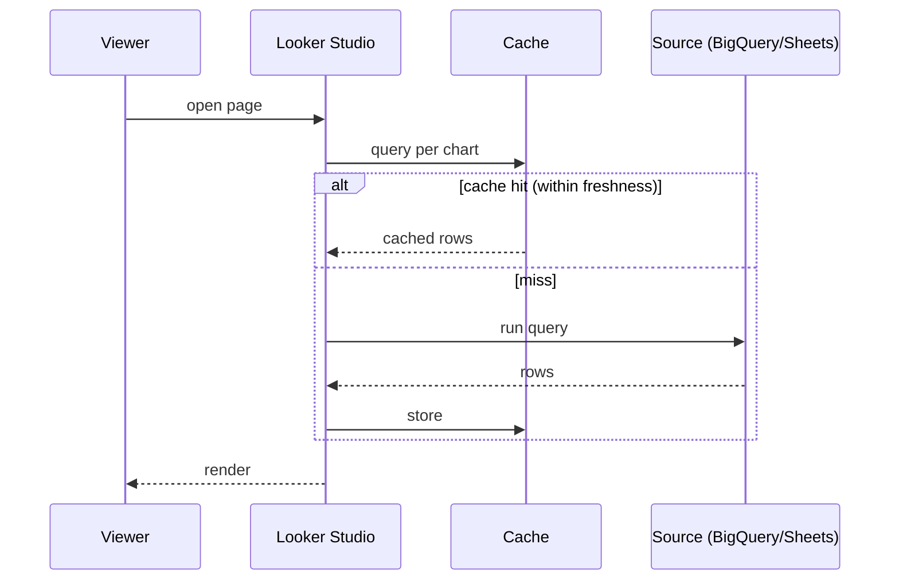
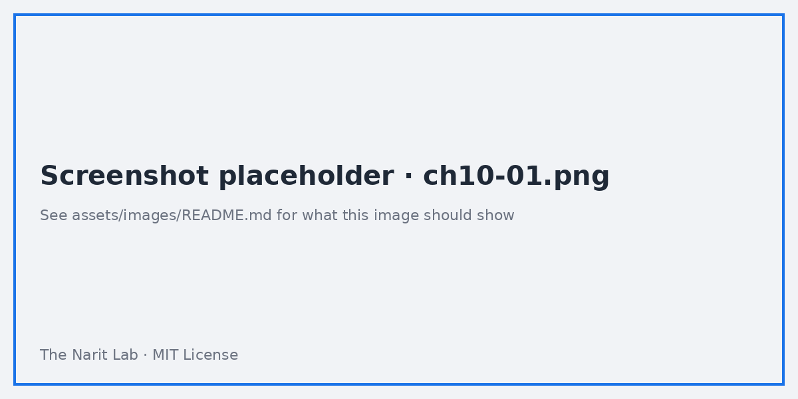
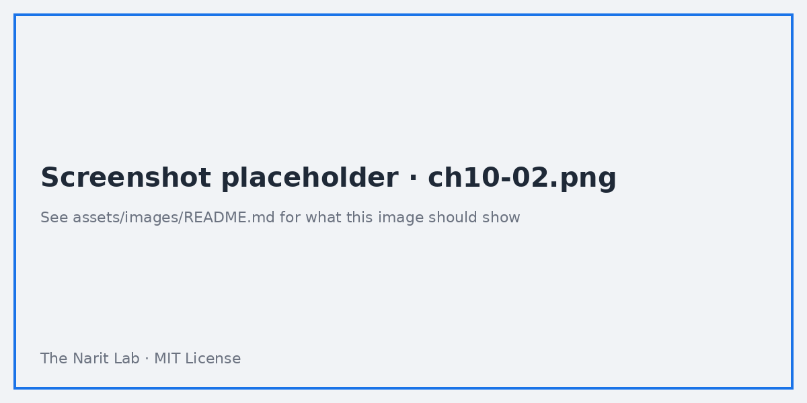

🌐 [ภาษาไทย](../th/10-performance.md) | [English](../en/10-performance.md)

# 10 · Performance, Extract Data, BigQuery Best Practices

> ⏱ **Estimated time:** 60 min · 📅 **Roadmap day:** Week 4 · Day 18–19 (Wed 30 Sep – Thu 1 Oct 2026) · 🎯 **Level:** Advanced

**In this chapter**
- [How Looker Studio runs queries](#1-how-looker-studio-runs-queries)
- [Measuring: where the time goes](#2-measuring-where-the-time-goes)
- [Extract Data connector](#3-extract-data-connector)
- [BigQuery: partitioning, clustering and cost](#4-bigquery-partitioning-clustering-and-cost)
- [BigQuery: aggregate tables and BI Engine](#5-bigquery-aggregate-tables-and-bi-engine)
- [Report-level optimisations](#6-report-level-optimisations)
- [Google Sheets and file limits](#7-google-sheets-and-file-limits)
- [Performance checklist](#8-performance-checklist)

## 1. How Looker Studio runs queries

Every chart = **one query** to its data source (blends = one per table, then joined). A page with 12 charts and 3 controls sends ~15 queries on load, and again when any control changes. Results are **cached** per (query, credentials) for the data-freshness window.



Implications:
- Fewer charts per page = fewer queries.
- Charts with identical dims/metrics/filters share a cache entry.
- Longer data freshness = more cache hits and lower cost.

## 2. Measuring: where the time goes

- In view mode, a slow chart shows a spinner; hover the **ⓘ** in the chart header after load to see query time (when available).
- For BigQuery, open **BigQuery → Job history** (or `INFORMATION_SCHEMA.JOBS`) and filter by label `requestor:looker_studio` to see each query, its duration and **bytes billed**.
- Build a quick benchmark: same chart on Sheets vs Extract vs BigQuery raw vs BigQuery aggregate table. Lab 10 does exactly this.



## 3. Extract Data connector

**Add data → Extract Data** snapshots a subset of an existing data source into Looker Studio's own storage:

1. Choose the source, pick **dimensions** and **metrics** to keep (only what you need), optional **filters** and **date range**.
2. Set **Auto update** (daily/weekly/monthly at a time you choose).
3. Save. Charts using the extract read from memory — very fast.

| Pros | Cons |
|---|---|
| Fast, no per-query cost | 100 MB per extract limit |
| Reduces load on Sheets/APIs (GA4 quota!) | Data is as fresh as the last update |
| Pre-aggregated at extract grain | New fields require re-extract |

Best for: dashboards on GA4/Ads/Sheets that do not need real time; executive summaries; anything with API quotas.



## 4. BigQuery: partitioning, clustering and cost

BigQuery on-demand pricing bills per **bytes scanned**. Looker Studio can hammer a table with hundreds of small queries a day.

**Partition** your fact tables by date and make Looker Studio use it:

```sql
CREATE OR REPLACE TABLE `looker_guide.sales_orders_p`
PARTITION BY order_date
CLUSTER BY sales_channel, product_id
AS SELECT * FROM `looker_guide.sales_orders`;
```

- In the data source, set `order_date` as the date range dimension → every date-filtered chart prunes partitions.
- **Cluster** by the columns you filter/group on most (channel, region).
- Prefer **SELECT specific columns**; the data source only requests fields used by charts, but a custom query with `SELECT *` defeats that.
- **Require partition filter** on production tables to prevent full scans from a chart with "Auto" date range and no control.

Cost math: 19,637 rows × 14 columns ≈ 2 MB → trivial here, but a 200 GB events table queried 500 times/day at $6.25/TB ≈ $625/day unpartitioned vs a few dollars partitioned.

## 5. BigQuery: aggregate tables and BI Engine

**Aggregate (rollup) tables** — pre-compute the grain your dashboard shows:

```sql
CREATE OR REPLACE TABLE `looker_guide.sales_daily_channel`
PARTITION BY order_date AS
SELECT order_date, sales_channel, payment_method,
       SUM(sales_amount) sales, SUM(profit) profit, COUNT(*) orders
FROM `looker_guide.sales_orders`
GROUP BY 1,2,3;
```

Schedule it with **BigQuery scheduled queries** (hourly/daily). Point overview pages at the rollup, detail pages at the raw table. Or use a **materialized view** for automatic refresh when the aggregation is simple.

**BI Engine**: an in-memory acceleration layer for BigQuery. Reserve capacity (GB) in the BigQuery console → **BI Engine**; queries from Looker Studio on cached tables return in milliseconds and are not billed per byte. Worth it once a report has many concurrent viewers.

## 6. Report-level optimisations

| Technique | Effect |
|---|---|
| Split pages: overview vs detail | Fewer queries per load |
| Set **data freshness** to the slowest acceptable (e.g. 4–12 h) | More cache hits |
| Avoid high-cardinality dimensions in charts and drop-downs | Smaller results |
| Replace 5 similar charts with one chart + **optional metrics** / dimension control | 1 query instead of 5 |
| Filter at data source (SQL WHERE / partition) rather than editor filters | Less data moved |
| Reduce blends; move joins to SQL | Fewer queries, one join |
| Turn off **Show summary row** on huge tables | Removes an extra aggregate |
| Limit rows per page (50–100) and time series points (monthly not daily for 3 years) | Faster rendering |
| Prefer **Owner's credentials** or service account | Shared cache across viewers |

## 7. Google Sheets and file limits

- Sheets connector reads the whole tab; performance degrades past ~50–100k cells used per query, and Sheets itself caps at 10 million cells.
- File upload: 100 MB/file, 2 GB total per user; fast because it is stored by Looker Studio, but static.
- If Sheets is your only option: keep one tab per data source, remove formulas (paste values), avoid volatile functions (`NOW`, `IMPORTRANGE` chains), and use **Extract Data** on top.

## 8. Performance checklist

- [ ] Fact tables in BigQuery are partitioned by date and clustered; date range dimension set.
- [ ] Overview pages read from aggregate tables or extracts.
- [ ] Data freshness ≥ 1 h unless real time is a stated requirement.
- [ ] ≤ 10 charts per page; blends ≤ 3 per page.
- [ ] No `SELECT *` custom queries; no unfiltered high-cardinality drop-downs.
- [ ] Job history reviewed: top 5 queries by bytes billed have been optimised.
- [ ] BI Engine considered for reports with >20 concurrent viewers.

---
**Lab:** [Lab 10 — Benchmark Sheets vs Extract vs BigQuery and cut bytes scanned](../../labs/lab10-performance/README.md)

← [Previous: 09 · Dashboard Design](09-dashboard-design.md) | [Next: 11 · Sharing, Scheduling, Embedding & Pro →](11-sharing-pro.md)

<sub>Made by **The Narit Lab** · [MIT License](../../LICENSE) · [Back to TOC](00-toc.md)</sub>
