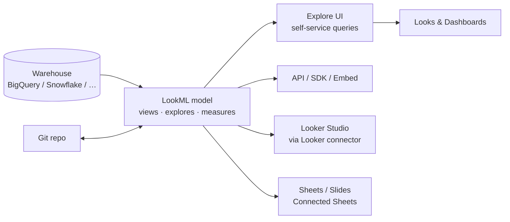
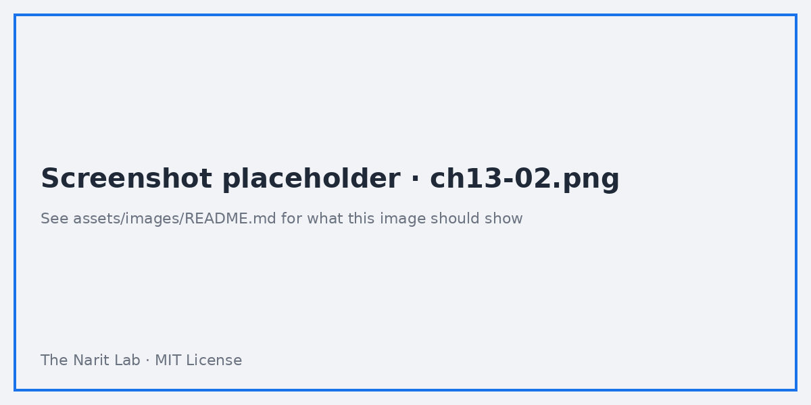
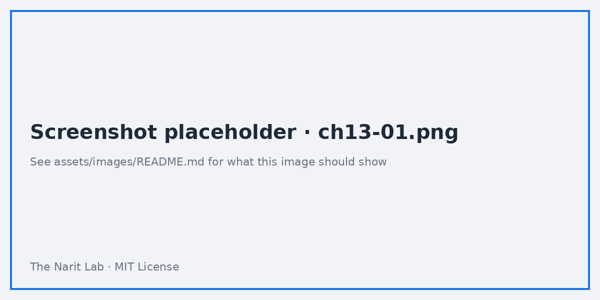

🌐 [ภาษาไทย](../th/13-looker-overview.md) | [English](../en/13-looker-overview.md)

# 13 · Looker (Enterprise) Overview: LookML, Semantic Layer, Migration Path

> ⏱ **Estimated time:** 60 min · 📅 **Roadmap day:** Week 5 · Day 24–25 · 🎯 **Level:** Advanced

**In this chapter**
- [Looker in one picture](#1-looker-in-one-picture)
- [Core objects](#2-core-objects)
- [LookML by example](#3-lookml-by-example)
- [Explores, Looks, dashboards and boards](#4-explores-looks-dashboards-and-boards)
- [Governance features that Looker Studio lacks](#5-governance-features-that-looker-studio-lacks)
- [Looker + Looker Studio together](#6-looker--looker-studio-together)
- [Choosing: Looker Studio → Pro → Looker](#7-choosing-looker-studio--pro--looker)
- [Migration path and effort](#8-migration-path-and-effort)

## 1. Looker in one picture



Looker does **not** store data. It generates SQL from a **LookML** model, runs it live in your warehouse, and governs *definitions* (what "revenue" means) centrally. Google's SKU name is *Looker (Google Cloud core)*; people just say Looker.

## 2. Core objects

| Object | What it is | Looker Studio equivalent |
|---|---|---|
| **Connection** | Warehouse credentials | Data source connection |
| **Project** | A Git repo of LookML files | — |
| **Model** | File declaring connection + explores | — |
| **View** | A table (or derived table) with **dimensions** and **measures** | Data source field list |
| **Explore** | A view plus joins; the entry point users query | Blend (but defined once, reusable, row-level joins) |
| **Look** | A saved query/visual | A chart |
| **Dashboard** | Tiles of Looks/queries with filters | Report page |
| **Board** | Curated landing page of dashboards | Home page folders |
| **User attributes** | Per-user values used for RLS, defaults | `@DS_USER_EMAIL` / email filter |
| **PDT / aggregate awareness** | Persisted derived tables and automatic rollup routing | Aggregate tables (manual) |

## 3. LookML by example

`sales_orders.view.lkml`:

```lookml
view: sales_orders {
  sql_table_name: `looker_guide.sales_orders` ;;

  dimension: order_id   { primary_key: yes  type: string  sql: ${TABLE}.order_id ;; }
  dimension_group: order {
    type: time
    timeframes: [date, week, month, quarter, year]
    sql: ${TABLE}.order_date ;;
  }
  dimension: sales_channel { type: string sql: ${TABLE}.sales_channel ;; }
  dimension: customer_id   { type: string sql: ${TABLE}.customer_id ;; hidden: yes }
  dimension: sales_amount  { type: number sql: ${TABLE}.sales_amount ;; hidden: yes }

  measure: total_sales  { type: sum  sql: ${sales_amount} ;;  value_format_name: decimal_0 }
  measure: total_profit { type: sum  sql: ${TABLE}.profit ;; }
  measure: margin_pct   { type: number sql: 1.0 * ${total_profit} / NULLIF(${total_sales},0) ;; value_format_name: percent_1 }
  measure: order_count  { type: count_distinct sql: ${order_id} ;; }
}
```

`sales.model.lkml`:

```lookml
connection: "bigquery_prod"
include: "/views/*.view.lkml"

explore: sales_orders {
  label: "Sales"
  join: customers { type: left_outer  relationship: many_to_one
                    sql_on: ${sales_orders.customer_id} = ${customers.customer_id} ;; }
  join: products  { type: left_outer  relationship: many_to_one
                    sql_on: ${sales_orders.product_id} = ${products.product_id} ;; }
  access_filter: { field: customers.region  user_attribute: region }   # row-level security
}
```

Notice what this buys you compared with chapter 07's blend: joins declared once with cardinality (`relationship`) so Looker avoids fan-out double counting, symmetric aggregates, reusable measures with formats, and RLS in one line.



## 4. Explores, Looks, dashboards and boards

- **Explore**: pick dimensions/measures from the field picker → Looker writes SQL → table + visualization. Filters, pivots, table calculations (yes, Looker has them), and **drill** to row detail defined in LookML.
- **Look**: save an Explore query. **Dashboard**: tiles, cross-filtering, dashboard filters mapped to fields, scheduling and alerts (`when total_sales < 1M`).
- **Boards** curate dashboards for a team.
- **Gemini in Looker**: natural-language Explore, formula/LookML assistance, dashboard summaries.



## 5. Governance features that Looker Studio lacks

| Capability | Looker | Looker Studio |
|---|---|---|
| Single definition of metrics reused everywhere | LookML measures | Copy-paste calculated fields |
| Version control, code review, CI | Git + LookML validator | Version history only |
| Row-level security | `access_filter`, user attributes | Email filter / BigQuery RLS |
| Caching policy per model, datagroups | Yes | Data freshness per source |
| Aggregate awareness | Automatic | Manual table switching |
| Alerts | Yes | No (Pulse-like features via Pro/Gemini emerging) |
| Embedded analytics with SSO | Signed embed, API | iframe |
| Content validation (broken fields) | Content Validator | Manual |
| Usage analytics | System Activity explores | GA4 tracking |

## 6. Looker + Looker Studio together

The **Looker connector** in Looker Studio lets you build Looker Studio reports on a **Looker Explore**: same governed measures, same RLS (with Pro *personal report links* each viewer queries as themselves), Looker Studio's easier layout tools. Many organisations use exactly this split:

- **Looker**: modelling, governance, embedded analytics, alerts.
- **Looker Studio (Pro)**: fast self-service reporting for business users and external sharing.


## 7. Choosing: Looker Studio → Pro → Looker

| Signal | Recommendation |
|---|---|
| ≤ 5 report builders, data in Sheets/GA4/BigQuery, no RLS | **Looker Studio** |
| Team ownership, client deliveries, need support/SLA, Gemini | **Looker Studio Pro** |
| Metric disputes between teams ("whose revenue is right?") | **Looker** |
| Embedding analytics in your product, per-customer security | **Looker** |
| Hundreds of viewers, heavy BigQuery bills | **Looker** (caching, aggregate awareness) or Studio + BI Engine |
| Analysts want SQL-level control with Git | **Looker** |
| Budget under a few thousand USD/year | Stay on Looker Studio / Pro |

Revisit your chapter 01 decision-tree answer now — has it changed?

## 8. Migration path and effort

Moving from Looker Studio to Looker is a **remodel**, not a file conversion:

1. **Inventory** reports: which data sources, which calculated fields, which blends. Blends and calculated fields become LookML views and measures.
2. **Model** the warehouse: one view per table, explores per business process (Sales, Marketing, Web). Add `relationship` to every join.
3. **Rebuild** dashboards in Looker (or keep them in Looker Studio on top of the Looker connector — often the pragmatic choice).
4. **Secure**: user attributes and `access_filter` replace email filters.
5. **Govern**: Git workflow, dev/prod branches, content validator in CI.

Rough effort: a 3-page Looker Studio report with 5 data sources ≈ 2–4 developer days to model in LookML plus 1–2 days per dashboard. The payoff is when the 6th and 7th report reuse the same model.

---
**Lab:** [Lab 13 — Write LookML for the sales model (paper or trial)](../../labs/lab13-looker-overview/README.md)

← [Previous: 12 · Community Visualizations](12-community-viz.md) | [Next: 14 · Capstone →](14-capstone.md)

<sub>Made by **The Narit Lab** · [MIT License](../../LICENSE) · [Back to TOC](00-toc.md)</sub>
