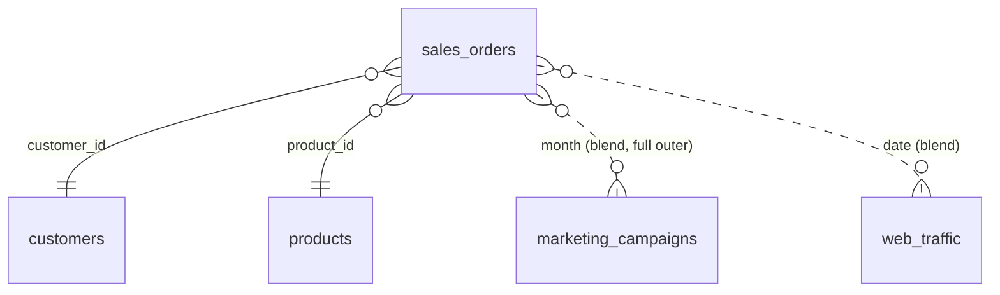
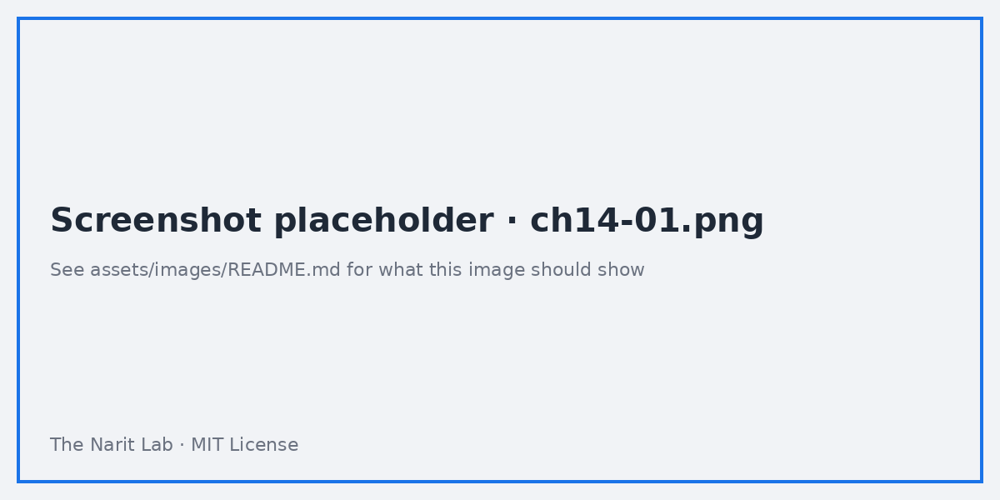
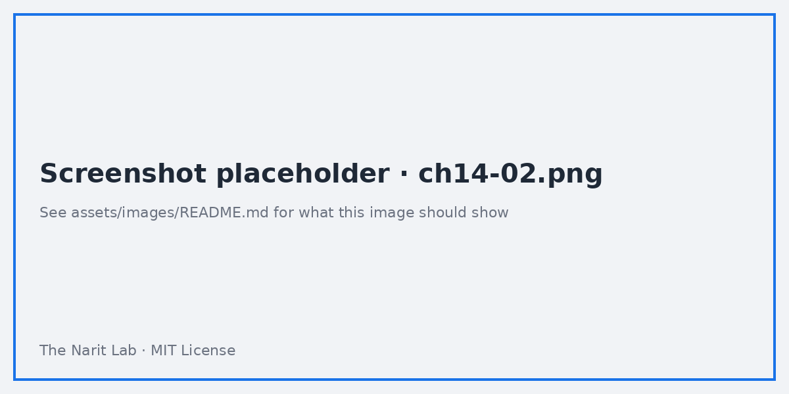

🌐 [ภาษาไทย](../th/14-capstone.md) | [English](../en/14-capstone.md)

# 14 · Capstone Project: End-to-End Sales & Marketing Dashboard

> ⏱ **Estimated time:** 4 × 60 min · 📅 **Roadmap day:** Week 6 · Day 26–29 · 🎯 **Level:** Capstone

**In this chapter**
- [The brief](#1-the-brief)
- [Requirements and KPI definitions](#2-requirements-and-kpi-definitions)
- [Data model](#3-data-model)
- [Page wireframes](#4-page-wireframes)
- [Build plan (4 sessions)](#5-build-plan-4-sessions)
- [Acceptance checklist](#6-acceptance-checklist)
- [Grading rubric](#7-grading-rubric)
- [Presenting your work](#8-presenting-your-work)

## 1. The brief

You are the analyst for *Siam Goods Co.*, a mid-size Thai retailer selling through online, marketplace, retail shops and sales reps. The leadership team wants **one report** they open every Monday to answer:

1. How are sales and profit trending, and are we on target for +15% growth?
2. Which marketing channels give the best return, and where is spend wasted?
3. Which customer segments and product categories drive growth, and where are returns highest?

Deliverable: a **3-page Looker Studio report** on the guide's datasets (BigQuery recommended, Sheets acceptable), shared with the instructor/peer, plus a **one-paragraph insight summary** per page.

## 2. Requirements and KPI definitions

| KPI | Definition | Field / formula |
|---|---|---|
| Net Sales | Completed orders only | `SUM(IF(order_status="Completed", sales_amount, 0))` |
| Gross Profit | Completed orders | `SUM(IF(order_status="Completed", profit, 0))` |
| Margin % | Gross Profit / Net Sales | ratio field, Percent |
| Orders | Distinct completed orders | `COUNT_DISTINCT(IF(order_status="Completed", order_id, NULL))` |
| AOV | Net Sales / Orders | ratio field |
| Return Rate | Returned orders / all orders | `COUNT_DISTINCT(IF(order_status="Returned", order_id, NULL)) / COUNT_DISTINCT(order_id)` |
| Growth vs target | Actual vs `previous year × (1 + growth_rate)` | parameter `growth_rate` default 0.15 |
| Marketing Spend | `SUM(spend)` | — |
| ROAS | Attributed revenue / spend | `SUM(revenue)/SUM(spend)` |
| CPL | Spend / leads | `SUM(spend)/SUM(leads)` |
| Conversion Rate | conversions / clicks | ratio |
| New Customers | Customers whose first order is in period | pre-aggregate in SQL (first_order_date) or approximate with `signup_date` |

Definitions must be written on an **About** page in the report.

## 3. Data model



Recommended BigQuery view for page 1 & 3 (avoids a 3-table blend on every chart):

```sql
CREATE OR REPLACE VIEW `looker_guide.v_sales_enriched` AS
SELECT s.*, c.segment, c.region, c.province, c.age_group, c.loyalty_member, c.signup_date,
       p.category, p.sub_category, p.brand, p.status AS product_status,
       DATE_TRUNC(s.order_date, MONTH) AS order_month
FROM `looker_guide.sales_orders` s
LEFT JOIN `looker_guide.customers` c USING (customer_id)
LEFT JOIN `looker_guide.products`  p USING (product_id);
```

Sheets alternative: use a blend (Lab 07 pattern 1) and accept slower charts.

## 4. Page wireframes

**Page 1 — Executive Summary (1200 × 900)**
```
[Title: Siam Goods · Weekly Business Review]  [Date range: Last 12 months] [Region ▾]
[Net Sales ▲%] [Gross Profit ▲%] [Margin %] [Orders ▲%] [AOV] [Return Rate]
[Monthly Net Sales vs Target (+15%) — combo: bars actual, line target]      [Sales by Channel — bar]
[Sales by Region — filled map or bar]           [Top 10 Products — table w/ bars] [Insight text]
```

**Page 2 — Marketing**
```
[Spend] [Attributed Revenue] [ROAS] [Leads] [CPL] [Conv. Rate]
[Monthly Spend vs Net Sales — full-outer blend, dual axis]
[ROAS by Channel — sorted bar, conditional color < 1.0]  [Funnel: Impressions → Clicks → Leads → Conversions]
[Web sessions by channel × device — stacked bar]  [Campaign table — optional metrics]
```

**Page 3 — Customers & Products**
```
[Customers ordered] [New customers] [Loyalty share] [Return Rate]
[Sales by Segment × Category — pivot heatmap]   [Return rate by Category — bar]
[Age group × Channel — 100% stacked]            [Product detail — table, drill Category→Sub-category→Product]
```

**Page 4 — About**: definitions, data sources, refresh, owner, how to use filters.





## 5. Build plan (4 sessions)

| Session | Date | Do | Chapters used |
|---|---|---|---|
| 1 | Mon 12 Oct | Load data to BigQuery (or Sheets), create view, create reusable data sources, define all calculated fields + `growth_rate` parameter, set theme, build page skeleton with grid | 03, 06, 08, 09 |
| 2 | Tue 13 Oct | Page 1: KPI strip with comparisons, target combo chart, channel/region/product charts, controls, cross-filtering | 04, 05, 08 |
| 3 | Wed 14 Oct | Page 2: marketing blend, ROAS bar with conditional formatting, funnel, web traffic, campaign table with optional metrics | 07, 04 |
| 4 | Thu 15 Oct | Page 3 + About page; performance pass (freshness, extract if Sheets), sharing, schedule Monday 08:00 delivery, write insights | 10, 11, 09 |

## 6. Acceptance checklist

- [ ] All KPIs match the definitions table (spot-check two numbers against a BigQuery query).
- [ ] Date range control drives every chart on pages 1–3 (each blend table has a date dimension).
- [ ] Region control is report-level and filters blends correctly.
- [ ] Target line responds to the `growth_rate` slider.
- [ ] No chart shows "Configuration incomplete" or "No data" on default load.
- [ ] Consistent theme; KPI tiles identical size; grid aligned.
- [ ] Every chart has a title with units; ≤ 7 categories per chart.
- [ ] About page complete; footer with owner and refresh time.
- [ ] Shared with at least one reviewer as Viewer; scheduled email set for Monday 08:00 Asia/Bangkok.
- [ ] Insight paragraph per page written in plain language.

## 7. Grading rubric

| Criterion | Weight | Excellent (full marks) |
|---|---|---|
| Correctness of KPIs | 30% | All definitions implemented, validated against SQL |
| Interactivity | 15% | Controls, cross-filter, drill, parameter all working |
| Design | 20% | Clear hierarchy, consistent palette, readable on one screen |
| Data modelling & performance | 15% | View/rollup used, blends minimal, load < 5 s |
| Storytelling | 10% | Insights are specific, numeric, actionable |
| Sharing & documentation | 10% | Access set correctly, schedule, About page |

## 8. Presenting your work

Record a 3-minute walkthrough (Loom/Screen recording): start with the decision the report supports, show one insight per page, end with a next step. Add the link and a screenshot to your GitHub repo README (chapter 99). That is your portfolio piece.

---
**Lab:** [Lab 14 — Capstone build guide with step-by-step checkpoints](../../labs/lab14-capstone/README.md)

← [Previous: 13 · Looker Overview](13-looker-overview.md) | [Next: 99 · Publish to GitHub →](99-publish-to-github.md)

<sub>Made by **The Narit Lab** · [MIT License](../../LICENSE) · [Back to TOC](00-toc.md)</sub>
