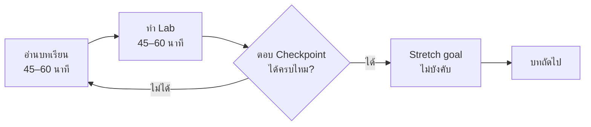

🌐 [ภาษาไทย](../th/00-toc.md) | [English](../en/00-toc.md)

# 00 · สารบัญ และวิธีใช้คู่มือเล่มนี้

> ⏱ **เวลาโดยประมาณ:** 15 นาที · 📅 **วันตาม Roadmap:** สัปดาห์ 1 · วันที่ 1 · 🎯 **ระดับ:** —

**ในบทนี้**
- [คู่มือนี้เหมาะกับใคร](#1-คู่มือนี้เหมาะกับใคร)
- [สิ่งที่ต้องเตรียม](#2-สิ่งที่ต้องเตรียม)
- [วิธีใช้บทเรียน Lab และ Roadmap](#3-วิธีใช้บทเรียน-lab-และ-roadmap)
- [สารบัญฉบับเต็ม](#4-สารบัญฉบับเต็ม)

## 1. คู่มือนี้เหมาะกับใคร

นักวิเคราะห์ ผู้ใช้งานฝั่งธุรกิจ และที่ปรึกษาที่คุ้นเคยกับ Excel/Google Sheets หรือเครื่องมือ BI อื่นอยู่แล้ว และต้องการใช้ **Google Looker Studio** ได้อย่างคล่องตัวในงานจริง รวมถึงเข้าใจว่าเมื่อไรควรขยับไปใช้ **Looker** ซึ่งเป็นผลิตภัณฑ์ระดับองค์กร

จบคู่มือนี้จะได้ Dashboard ยอดขายและการตลาด 3 หน้าที่พร้อมใช้เป็นผลงาน (portfolio) สร้างจากข้อมูลสังเคราะห์ที่สมจริง พร้อม repository บน GitHub ในชื่อของตัวเอง

## 2. สิ่งที่ต้องเตรียม

| รายการ | หมายเหตุ |
|---|---|
| บัญชี Google | Gmail ฟรีก็ใช้ได้สำหรับบทที่ 02–09 |
| โปรเจกต์ Google Cloud (ฟรี) | ใช้ทำ Lab BigQuery ตั้งแต่บทที่ 03 — **BigQuery sandbox** ไม่ต้องผูกบัตรเครดิต |
| โฟลเดอร์ `datasets/` | ดาวน์โหลดหรือ clone repo นี้ ดู [datasets/README.md](../../datasets/README.md) |
| เวลาวันละ ~1 ชั่วโมง (จันทร์–ศุกร์) | ดู [ROADMAP.md](../../ROADMAP.md) |
| ไม่บังคับ | ทดลอง Looker Studio Pro สำหรับบทที่ 11 และ Looker trial สำหรับบทที่ 13 |

## 3. วิธีใช้บทเรียน Lab และ Roadmap

- ทุกบทขึ้นต้นด้วย **⏱ เวลาโดยประมาณ** และ **📅 วันตาม Roadmap** เพื่อให้รู้ว่าอยู่ตรงไหนของแผน 6 สัปดาห์
- Callout ที่ใช้: 💡 Tip · ⚠️ Warning · 🧪 Lab · 🔒 Pro only · 🔁 มาจาก Tableau/Power BI?
- ทุก Lab จบด้วย **คำถาม Checkpoint** ถ้าตอบไม่ได้ให้กลับไปอ่านหัวข้อนั้นก่อน เพราะ Lab แต่ละบทต่อยอดจากบทก่อนหน้า
- คู่มือเน้นตัวหนังสือเป็นหลัก ทุกขั้นตอนบอกลำดับการคลิกไว้ครบ จึงยังใช้ได้แม้ UI จะเปลี่ยนเล็กน้อย

## 4. สารบัญฉบับเต็ม

### บทเรียน

| # | บท | ระดับ | Lab |
|---|---|---|---|
| 00 | [สารบัญ และวิธีใช้คู่มือเล่มนี้](00-toc.md) | — | — |
| 01 | [ภาพรวม Self-Service BI: Tableau · Power BI · Looker Studio · Looker](01-bi-landscape.md) | Intro | — |
| 02 | [เริ่มต้นใช้งาน: บัญชี ทัวร์หน้าจอ สร้างรายงานแรกใน 15 นาที](02-getting-started.md) | Basic | [Lab 02](../../labs/lab02-getting-started/README.md) |
| 03 | [Data Source และ Connector (Sheets, CSV, BigQuery)](03-data-sources.md) | Basic | [Lab 03](../../labs/lab03-data-sources/README.md) |
| 04 | [Chart และ Table พื้นฐาน การจัดรูปแบบ Theme](04-charts-tables.md) | Basic | [Lab 04](../../labs/lab04-charts-tables/README.md) |
| 05 | [Filter, Control, Date Range และ Interaction](05-filters-controls.md) | Basic | [Lab 05](../../labs/lab05-filters-controls/README.md) |
| 06 | [Calculated Field และฟังก์ชัน](06-calculated-fields.md) | Intermediate | [Lab 06](../../labs/lab06-calculated-fields/README.md) |
| 07 | [Data Blending และ Join](07-blending.md) | Intermediate | [Lab 07](../../labs/lab07-blending/README.md) |
| 08 | [Parameter และรายงานแบบ Dynamic](08-parameters.md) | Intermediate | [Lab 08](../../labs/lab08-parameters/README.md) |
| 09 | [หลักการออกแบบ Dashboard](09-dashboard-design.md) | Intermediate | [Lab 09](../../labs/lab09-dashboard-design/README.md) |
| 10 | [Performance, Extract Data และ BigQuery Best Practices](10-performance.md) | Advanced | [Lab 10](../../labs/lab10-performance/README.md) |
| 11 | [การแชร์ ตั้งเวลาส่ง Embed สิทธิ์การเข้าถึง และ Looker Studio Pro](11-sharing-pro.md) | Advanced | [Lab 11](../../labs/lab11-sharing-pro/README.md) |
| 12 | [Community Visualization และการปรับแต่งขั้นสูง](12-community-viz.md) | Advanced | [Lab 12](../../labs/lab12-community-viz/README.md) |
| 13 | [ภาพรวม Looker (Enterprise): LookML, Semantic Layer, เส้นทางย้ายระบบ](13-looker-overview.md) | Advanced | [Lab 13](../../labs/lab13-looker-overview/README.md) |
| 14 | [Capstone: Dashboard ยอดขายและการตลาดครบวงจร](14-capstone.md) | Capstone | [Lab 14](../../labs/lab14-capstone/README.md) |
| 99 | [เผยแพร่ repo นี้ขึ้น GitHub](99-publish-to-github.md) | ภาคผนวก | — |

### ชุดข้อมูล

| ไฟล์ | คำอธิบาย |
|---|---|
| [sales_orders.csv](../../datasets/sales_orders.csv) | รายการคำสั่งซื้อ ~19.6k แถว ปี 2024–2026 |
| [customers.csv](../../datasets/customers.csv) | ลูกค้า 2,000 ราย พร้อม segment ภูมิภาค จังหวัด |
| [products.csv](../../datasets/products.csv) | สินค้า 60 รายการ 5 หมวด |
| [marketing_campaigns.csv](../../datasets/marketing_campaigns.csv) | แคมเปญรายเดือนแยกช่องทาง พร้อมตัวเลข funnel |
| [web_traffic.csv](../../datasets/web_traffic.csv) | Session รายวันแยก channel × device |
| [hr_headcount.csv](../../datasets/hr_headcount.csv) | จำนวนพนักงานรายเดือน (จงใจให้รกเพื่อฝึกทำความสะอาด) |
| [Data dictionary](../../datasets/README.md) | คำอธิบายคอลัมน์ TH/EN และวิธีโหลดข้อมูล |

### อื่น ๆ

- [ROADMAP.md](../../ROADMAP.md) — ตารางเรียน 6 สัปดาห์พร้อมวันที่
- [STYLE-GUIDE.md](../STYLE-GUIDE.md) — แนวทางการเขียน
- [CONTRIBUTING.md](../../CONTRIBUTING.md) · [CREDITS.md](../../CREDITS.md) · [LICENSE](../../LICENSE)

---
← ก่อนหน้า: — | [ถัดไป: 01 · ภาพรวม Self-Service BI →](01-bi-landscape.md)

Made by **The Narit Lab** · [MIT License](../../LICENSE) · [กลับสารบัญ](00-toc.md)
