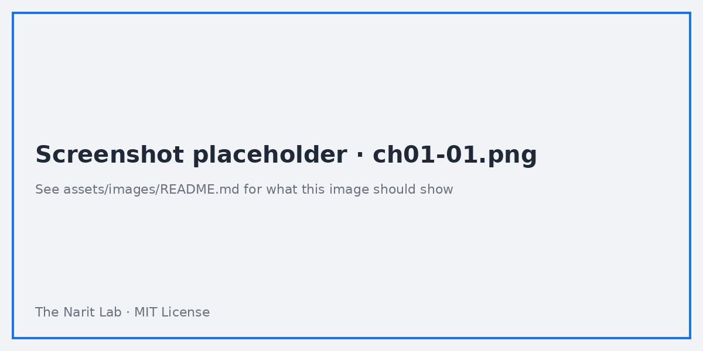
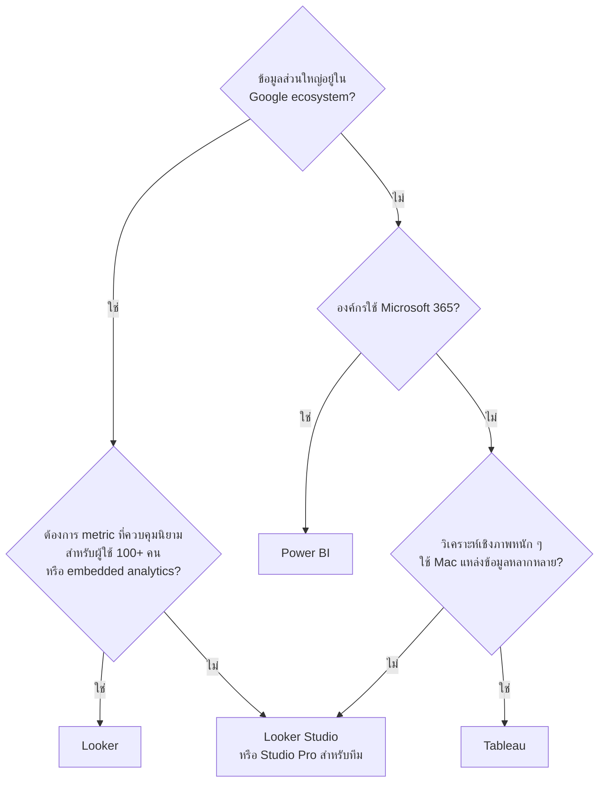

🌐 [ภาษาไทย](../th/01-bi-landscape.md) | [English](../en/01-bi-landscape.md)

# 01 · ภาพรวม Self-Service BI: Tableau vs Power BI vs Looker Studio vs Looker

> ⏱ **เวลาโดยประมาณ:** 45 นาที · 📅 **วันตาม Roadmap:** สัปดาห์ 1 · วันที่ 1 · 🎯 **ระดับ:** Intro

**ในบทนี้**
- [เครื่องมือ 4 ตัว 2 ตระกูล](#1-เครื่องมือ-4-ตัว-2-ตระกูล)
- [ตารางเปรียบเทียบฟีเจอร์](#2-ตารางเปรียบเทียบฟีเจอร์)
- [ราคาโดยสังเขป](#3-ราคาโดยสังเขป)
- [แนวทางตัดสินใจ: งานแบบไหนใช้เครื่องมือไหน](#4-แนวทางตัดสินใจ-งานแบบไหนใช้เครื่องมือไหน)
- [จุดแข็งและข้อจำกัดของ Looker Studio](#5-จุดแข็งและข้อจำกัดของ-looker-studio)
- [ตารางเทียบศัพท์](#6-ตารางเทียบศัพท์)

## 1. เครื่องมือ 4 ตัว 2 ตระกูล

เครื่องมือ Self-Service BI แบ่งได้เป็น 2 ตระกูล

- **Visual-first** — นักวิเคราะห์ต่อข้อมูลแล้วสร้างกราฟได้เลย ได้แก่ **Tableau**, **Power BI**, **Looker Studio**
- **Model-first (semantic layer)** — ทีมกลางนิยาม metric เป็นโค้ด แล้วทุกคนใช้นิยามเดียวกัน ได้แก่ **Looker**

Google ใช้ชื่อ "Looker" กับทั้งสองอย่าง ซึ่งทำให้สับสนได้ง่าย

| ผลิตภัณฑ์ | ชื่อเดิม | คืออะไร |
|---|---|---|
| **Looker Studio** | Google Data Studio (เปลี่ยนชื่อ ต.ค. 2022) | เครื่องมือสร้างรายงานบนเบราว์เซอร์ ฟรี ใครมีบัญชี Google ก็ใช้ได้ |
| **Looker Studio Pro** | — | ส่วนเสริมแบบเสียเงิน: Team workspace, Google Cloud support, SLA, ส่งรายงานเข้า Chat, แอปมือถือ, ฟีเจอร์ Gemini, รายงานที่ผูกกับ Looker แบบ personal link |
| **Looker** (หรือ Looker Core) | Looker (Google ซื้อกิจการปี 2020) | แพลตฟอร์มระดับองค์กร มี semantic layer ด้วย **LookML**, Explore ที่ควบคุมนิยาม, embedded analytics, API-first |

## 2. ตารางเปรียบเทียบฟีเจอร์

| หัวข้อ | Tableau | Power BI | Looker Studio | Looker |
|---|---|---|---|---|
| รูปแบบติดตั้ง | Desktop + Server/Cloud | Desktop (Windows) + Service | เบราว์เซอร์อย่างเดียว | เบราว์เซอร์ (Google โฮสต์ หรือติดตั้งเอง) |
| สร้างรายงานบน Mac | ได้ | ไม่ได้ (แก้บนเว็บได้จำกัด) | ได้ | ได้ |
| ความยากในการเรียน | ปานกลาง | ปานกลาง | **ต่ำ** | สูง (ต้องเขียน LookML) |
| Semantic layer | Tableau Semantics / published data source | Dataset + DAX measure | Field ระดับ data source (เบา) | **LookML — แข็งแรงที่สุด** |
| การจัดโมเดลข้อมูล | Relationship, join, extract | Star schema, DAX, Power Query | Blend (สูงสุด 5 ตาราง), calculated field | Join ใน LookML, PDT |
| ภาษาคำนวณ | Tableau calc, LOD, table calc | DAX, M | ฟังก์ชัน (CASE, REGEXP, date) — ไม่มี LOD | LookML measure + SQL |
| Live vs Extract | ทั้งคู่ | Import / DirectQuery | Live + Extract Data (100 MB) | Live (รันใน database) |
| ระบบนิเวศ Google | ผ่าน connector | ผ่าน connector | **Native** (Sheets, GA4, Ads, BigQuery) | Native BigQuery และ warehouse อื่น |
| ระบบนิเวศ Microsoft | ผ่าน connector | **Native** | จำกัด | ผ่าน connector |
| Row-level security | มี | มี | พื้นฐาน (email filter, BigQuery RLS) | **มี (user attribute)** |
| Embedding | มี (ต้องมี license) | มี (Premium/Embedded) | iframe (ฟรี) | Signed embed, API |
| Version control | จำกัด | Deployment pipeline | Version history เท่านั้น | **ใช้ Git โดยตรง** |
| ตั้งเวลาส่งรายงาน | มี | มี | Email (ฟรี), Chat (Pro) | มี |
| ผู้ช่วย AI (2026) | Tableau Agent / Pulse | Copilot | Gemini in Looker Studio (Pro) | Gemini in Looker |
| ชุมชนผู้ใช้ | ใหญ่มาก | ใหญ่มาก | ใหญ่ | ปานกลาง |

> **🔁 มาจาก Tableau/Power BI?** สองสิ่งที่จะแปลกใจที่สุดคือ Looker Studio **ไม่มี LOD และไม่มี measure แบบ DAX** (ส่วนใหญ่จะคำนวณที่ระดับ aggregation ตามที่ chart กำหนด) และ **ไม่มีโปรแกรม Desktop** ทุกอย่างอยู่บนเบราว์เซอร์และบันทึกอัตโนมัติ

## 3. ราคาโดยสังเขป

ราคาเปลี่ยนแปลงได้ ควรตรวจสอบจากเว็บผู้ผลิตอีกครั้ง ตัวเลขคร่าว ๆ ในปี 2026:

| เครื่องมือ | รูปแบบคิดเงิน | ระดับราคา |
|---|---|---|
| Looker Studio | ฟรี | 0 บาท (จ่ายเฉพาะค่าข้อมูลต้นทาง เช่น ค่า scan ของ BigQuery) |
| Looker Studio Pro | ต่อผู้ใช้ต่อโปรเจกต์ต่อเดือน | หลักไม่กี่ดอลลาร์ต่อผู้ใช้ต่อเดือน |
| Looker | ค่าแพลตฟอร์ม + ต่อผู้ใช้ (Viewer / Standard / Developer) | สัญญาระดับองค์กร มักอยู่ที่หลักหลายหมื่นดอลลาร์ต่อปี |
| Tableau | ต่อผู้ใช้ (Viewer / Explorer / Creator) | ~$15 / $42 / $75 ต่อผู้ใช้ต่อเดือน |
| Power BI | ต่อผู้ใช้ (Pro / PPU) หรือ capacity (Fabric) | ~$14 / $24 ต่อผู้ใช้ต่อเดือน; capacity เริ่มที่หลักร้อยดอลลาร์ต่อเดือน |

> **⚠️ Warning** Looker Studio "ฟรี" แต่ถ้าต่อกับ BigQuery ก็ยังมีค่าใช้จ่ายได้ เพราะทุก chart คือ 1 query บทที่ 10 จะสอนวิธีคุมปริมาณข้อมูลที่ถูก scan

## 4. แนวทางตัดสินใจ: งานแบบไหนใช้เครื่องมือไหน

| งานที่ต้องทำ | เหมาะที่สุด | เหตุผล |
|---|---|---|
| รายงานการตลาดจาก GA4 + Google Ads + Sheets ส่งลูกค้าภายในสัปดาห์นี้ | **Looker Studio** | connector native ฟรี แชร์ลิงก์ได้ทันที |
| นิยาม KPI ระดับองค์กรที่ 20 ทีมต้องได้ตัวเลขตรงกัน | **Looker** | LookML เป็น single source of truth |
| ทีมการเงินที่อยู่กับ Excel, SharePoint, Dynamics | **Power BI** | ผูกกับ M365 โดยตรง, DAX เหมาะกับตรรกะการเงิน |
| วิเคราะห์เชิงสำรวจที่ต้องใช้ table calc ซับซ้อน | **Tableau** | ภาษาภาพและภาษาคำนวณครบที่สุด |
| Dashboard ธุรกิจเล็กบน Google Sheet | **Looker Studio** | 15 นาทีได้รายงานแรก |
| Embedded analytics ให้ลูกค้าใน SaaS | **Looker** (หรือ Tableau/Power BI Embedded) | Secure embed + row-level security |
| วิเคราะห์เฉพาะกิจบน BigQuery public data | **Looker Studio** | connector BigQuery ฟรี |

## 5. จุดแข็งและข้อจำกัดของ Looker Studio

**จุดแข็ง**
- ไม่มีค่าใช้จ่าย ไม่ต้องติดตั้ง แชร์ได้ทันทีด้วยสิทธิ์แบบเดียวกับ Google Drive
- Connector ฝั่ง Google ดีที่สุดในตลาด (Sheets, BigQuery, GA4, Search Console, YouTube, Ads)
- เรียนรู้เร็ว ผู้ใช้ฝั่งธุรกิจสร้างรายงานที่ใช้งานได้จริงภายในครึ่งวัน
- Community visualization และ community connector ขยายความสามารถได้อีกมาก

**ข้อจำกัด**
- โมเดลข้อมูลซับซ้อน: Blend ได้สูงสุด 5 ตาราง และคำนวณใหม่ทุก chart
- การคำนวณข้ามระดับ aggregation (ไม่มี LOD)
- ข้อมูลขนาดใหญ่ตรงจาก Sheets หรือ CSV (เริ่มช้าที่ ~100k แถว ควรย้ายไป BigQuery)
- Governance ระดับองค์กร (version control, certified metric) — นั่นคือหน้าที่ของ Looker

## 6. ตารางเทียบศัพท์

| แนวคิด | Tableau | Power BI | Looker Studio | Looker |
|---|---|---|---|---|
| ที่รวม visual | Workbook / Dashboard | Report / Dashboard | **Report** (มีหลาย page) | Dashboard |
| การเชื่อมต่อ + รายการ field | Data source | Dataset / Semantic model | **Data source** | Explore (จาก LookML model) |
| Field ประเภทหมวดหมู่ | Dimension | Column / Category | **Dimension** | Dimension |
| ตัวเลขที่ aggregate | Measure | Measure (DAX) | **Metric** | Measure |
| Field ที่คำนวณ | Calculated field | Calculated column / Measure | **Calculated field** | LookML dimension / measure |
| รวมตาราง | Relationship / Join / Blend | Relationship | **Blend** | Join ใน LookML |
| ค่าที่ผู้ใช้ป้อน | Parameter | What-if parameter | **Parameter** | Filter / Parameter (Liquid) |
| ตัวเลือกแบบโต้ตอบ | Filter / Parameter control | Slicer | **Control** | Dashboard filter |
| กล่องตัวเลขเดี่ยว | Text/BAN | Card | **Scorecard** | Single value tile |

---
**ขั้นถัดไป:** บทนี้ไม่มี Lab ให้จดไว้ว่าองค์กรของตัวเองอยู่ตรงไหนของ decision tree แล้วกลับมาทบทวนอีกครั้งในบทที่ 13

← [ก่อนหน้า: 00 · สารบัญ](00-toc.md) | [ถัดไป: 02 · เริ่มต้นใช้งาน →](02-getting-started.md)

Made by **The Narit Lab** · [MIT License](../../LICENSE) · [กลับสารบัญ](00-toc.md)
