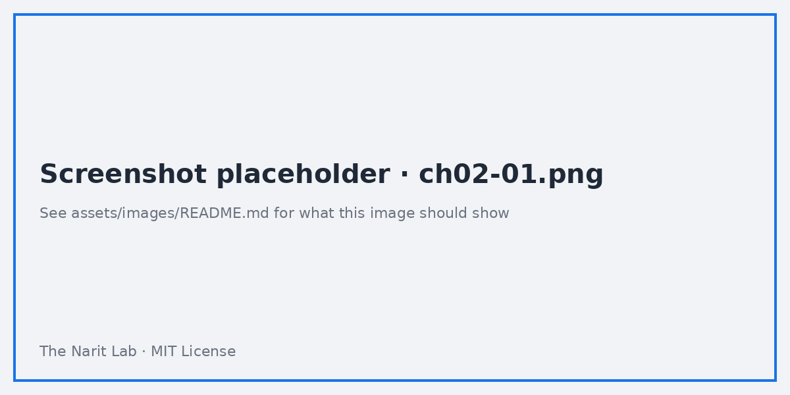
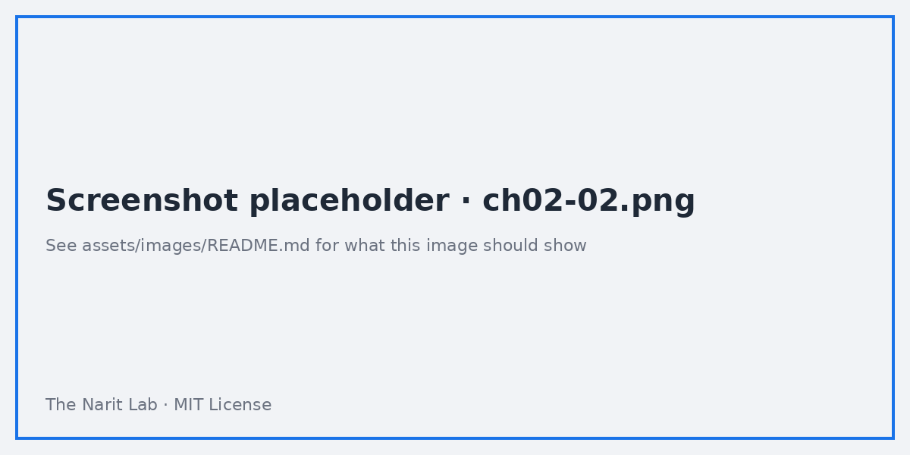
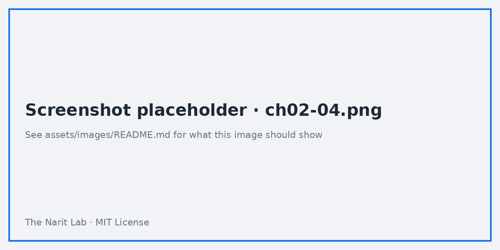

🌐 [ภาษาไทย](../th/02-getting-started.md) | [English](../en/02-getting-started.md)

# 02 · เริ่มต้นใช้งาน: บัญชี ทัวร์หน้าจอ สร้างรายงานแรกใน 15 นาที

> ⏱ **เวลาโดยประมาณ:** 45 นาที (+ Lab 45 นาที) · 📅 **วันตาม Roadmap:** สัปดาห์ 1 · วันที่ 2 (อ. 8 ก.ย. 2569) · 🎯 **ระดับ:** Basic

**ในบทนี้**
- [เข้าสู่ระบบและหน้า Home](#1-เข้าสู่ระบบและหน้า-home)
- [Report, Data source, Explorer — 3 วัตถุหลัก](#2-report-data-source-explorer--3-วัตถุหลัก)
- [ทัวร์หน้าจอ Report editor](#3-ทัวร์หน้าจอ-report-editor)
- [รายงานแรกใน 15 นาที](#4-รายงานแรกใน-15-นาที)
- [Edit mode กับ View mode, บันทึกอัตโนมัติ, Version history](#5-edit-mode-กับ-view-mode-บันทึกอัตโนมัติ-version-history)
- [คีย์ลัดที่ควรจำ](#6-คีย์ลัดที่ควรจำ)

## 1. เข้าสู่ระบบและหน้า Home

1. ไปที่ **https://lookerstudio.google.com** แล้วเข้าสู่ระบบด้วยบัญชี Google (Gmail ส่วนตัวหรือ Google Workspace ก็ได้)
2. ครั้งแรกจะให้ยอมรับข้อกำหนด เลือกประเทศและการรับข่าวสาร (เปลี่ยนภายหลังได้ที่ **Settings**)
3. จะเข้าสู่หน้า **Home** แถบซ้ายมี **Reports**, **Data sources**, **Explorer**, **Templates** ด้านบนมีปุ่ม **Create** และช่องค้นหา

> **💡 Tip** ถ้าองค์กรใช้ Google Workspace แล้วขึ้นว่า "You don't have access" แปลว่าผู้ดูแลระบบปิดบริการ Looker Studio ไว้ ให้ขอ IT เปิดบริการใน Admin console แทนการเอาข้อมูลบริษัทไปใช้กับบัญชีส่วนตัว

## 2. Report, Data source, Explorer — 3 วัตถุหลัก

| วัตถุ | คืออะไร | เทียบกับ |
|---|---|---|
| **Data source** | การเชื่อมต่อที่บันทึกไว้กับ 1 ตาราง/ชีต/query พร้อมรายการ field ชนิดข้อมูล และ aggregation เริ่มต้น ใช้ซ้ำได้หลายรายงาน | Published data source ของ Tableau / Dataset ของ Power BI |
| **Report** | หน้ารายงาน 1 หน้าขึ้นไปที่มี chart และ control อ้างอิง data source | Workbook / .pbix |
| **Explorer** | กระดานทดลองสร้าง chart แบบเร็ว ๆ ไม่แชร์โดยปริยาย | Sheet ทดลองใน Tableau |

Data source มีได้ 2 แบบ คือ **embedded** (อยู่ในรายงานเดียว) และ **reusable** (ปรากฏในรายการ Data sources และแชร์แยกได้) วันนี้เราสร้างแบบ embedded ก่อน ส่วน reusable อยู่ในบทที่ 03

## 3. ทัวร์หน้าจอ Report editor

คลิก **Create → Report** แล้วเพิ่ม data source ใดก็ได้เพื่อเปิด editor จะเห็น 4 โซน

1. **Toolbar** (บน): undo/redo, **Add page**, **Add data**, **Add a chart**, **Add a control**, ข้อความ/รูป/รูปทรง, **Theme and layout**, สลับ **View / Edit**, **Share**
2. **Canvas** (กลาง): ตัวหน้ารายงาน ขนาดเริ่มต้น 1200 × 900 px เปลี่ยนได้ที่ **Theme and layout → Layout**
3. **Properties panel** (ขวา): ของ component ที่เลือกอยู่ — แท็บ **Setup** (data source, dimension, metric, sort, filter) และแท็บ **Style** (สี ฟอนต์ แกน)
4. **Data panel** (ขวาสุด): field ทั้งหมดของ data source ที่เพิ่มไว้ สีเขียว = dimension, สีน้ำเงิน = metric, สีม่วง = parameter ลาก field ไปวางบน chart หรือวางบน canvas เพื่อสร้าง chart อัตโนมัติ

เมนูที่ใช้บ่อย
- **Resource → Manage added data sources** — แก้ field, refresh schema
- **File → Report settings** — data source เริ่มต้น, data freshness, การติดตามด้วย Google Analytics
- **Page → Current page settings** — data source และ filter ระดับหน้า

## 4. รายงานแรกใน 15 นาที

ใช้ไฟล์ `sales_orders.csv` โหลดเข้า Google Sheet ก่อน (ดู [datasets/README.md](../../datasets/README.md))

1. **Create → Report**
2. ในหน้าต่าง **Add data to report** เลือก **Google Sheets** → เลือก spreadsheet และแท็บ `sales_orders` ติ๊ก **Use first row as headers** และ **Include hidden and filtered cells** ไว้ → **Add** → **Add to report**
3. Looker Studio จะวางตารางเริ่มต้นให้ 1 ตาราง ลบทิ้งได้ (เลือกแล้วกด Delete)
4. **Add a chart → Scorecard** ที่ **Setup** ตั้ง Metric = `sales_amount` (aggregation SUM) เปลี่ยนชื่อที่แสดงเป็น *Total Sales* โดยคลิกไอคอนดินสอหน้า metric
5. **Add a chart → Time series** Dimension = `order_date`, Metric = `sales_amount` ที่ **Style** ปิด data label และตั้งความหนาเส้น 2
6. **Add a chart → Table** Dimension = `sales_channel`, Metrics = `sales_amount`, `profit`, `Record Count` เรียงตาม `sales_amount` จากมากไปน้อย
7. **Add a control → Date range control** วางมุมขวาบน ค่าเริ่มต้น = *Last 12 months*
8. คลิก **Theme and layout** แล้วเลือก theme ใดก็ได้ ทั้งหน้าจะเปลี่ยนสไตล์ตาม
9. เปลี่ยนชื่อรายงาน (มุมซ้ายบน) เป็น *Sales Overview — Lab 02*
10. คลิก **View** เพื่อดูแบบผู้อ่าน ลองเปลี่ยนช่วงวันที่แล้วดู chart ทั้ง 3 เปลี่ยนตาม

> **🧪 Lab** [Lab 02](../../labs/lab02-getting-started/README.md) ทำซ้ำขั้นตอนนี้พร้อม checkpoint และเพิ่มหน้าที่ 2

## 5. Edit mode กับ View mode, บันทึกอัตโนมัติ, Version history

- **ไม่มีปุ่ม Save** ทุกการเปลี่ยนแปลงถูกบันทึกทันที
- **View** คือสิ่งที่ผู้อ่านเห็น **Edit** สำหรับผู้แก้ไข ปุ่มสลับอยู่มุมขวาบน
- **File → Version history** ใช้ตั้งชื่อเวอร์ชัน ("ก่อนออกแบบใหม่") และย้อนกลับได้ — เป็นตาข่ายนิรภัยเดียวที่มี จึงควรตั้งชื่อเวอร์ชันก่อนแก้ครั้งใหญ่ทุกครั้ง
- **File → Make a copy** ทำสำเนารายงาน และเลือกได้ว่าจะคง data source เดิมหรือเปลี่ยนใหม่ ซึ่งเป็นวิธีทำ template

> **⚠️ Warning** เพราะบันทึกทันที การแก้รายงานที่ใช้งานจริงอยู่จะเปลี่ยนสิ่งที่ผู้อ่านเห็นแบบ real time งานสำคัญควรทำบนสำเนาแล้วค่อยสลับเข้าไป (บทที่ 11 อธิบาย workflow แบบ dev → prod)

## 6. คีย์ลัดที่ควรจำ

| การกระทำ | คีย์ลัด |
|---|---|
| คัดลอก / วาง component (ข้ามรายงานได้) | Ctrl/⌘ + C / V |
| ทำซ้ำ | Ctrl/⌘ + D |
| Undo / Redo | Ctrl/⌘ + Z / Shift + Z |
| ขยับ component ทีละนิด | ลูกศร (Shift = 10 px) |
| จัดเรียง / กระจายระยะ | คลิกขวา → Align |
| สลับ View / Edit | Ctrl/⌘ + Shift + E |
| ดูข้อมูลเบื้องหลัง chart | คลิกขวาที่ chart → Show data |

---
**Lab:** [Lab 02 — รายงานแรกของคุณ](../../labs/lab02-getting-started/README.md)

← [ก่อนหน้า: 01 · ภาพรวม BI](01-bi-landscape.md) | [ถัดไป: 03 · Data Source และ Connector →](03-data-sources.md)

Made by **The Narit Lab** · [MIT License](../../LICENSE) · [กลับสารบัญ](00-toc.md)
