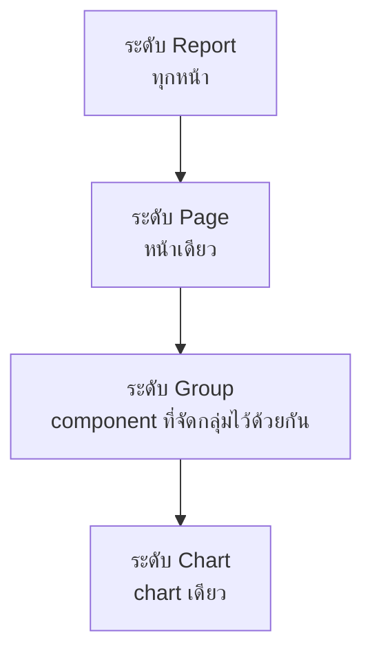

🌐 [ภาษาไทย](../th/05-filters-controls.md) | [English](../en/05-filters-controls.md)

# 05 · Filter, Control, Date Range และ Interaction

> ⏱ **เวลาโดยประมาณ:** 60 นาที · 📅 **วันตาม Roadmap:** สัปดาห์ 2 · วันที่ 7–8 · 🎯 **ระดับ:** Basic

**ในบทนี้**
- [กรองข้อมูลได้ 3 วิธี](#1-กรองข้อมูลได้-3-วิธี)
- [ขอบเขตของ filter: report, page, group, chart](#2-ขอบเขตของ-filter-report-page-group-chart)
- [รายการ control](#3-รายการ-control)
- [Date range control และวันที่เริ่มต้น](#4-date-range-control-และวันที่เริ่มต้น)
- [Editor filter (filter แบบตายตัว)](#5-editor-filter-filter-แบบตายตัว)
- [Cross-filtering และ chart interaction](#6-cross-filtering-และ-chart-interaction)
- [Filter bar และพฤติกรรมของ control](#7-filter-bar-และพฤติกรรมของ-control)
- [ปัญหาที่เจอบ่อย](#8-ปัญหาที่เจอบ่อย)

## 1. กรองข้อมูลได้ 3 วิธี

| วิธี | ใครกำหนด | ใช้กับ |
|---|---|---|
| **Control** (drop-down, slider, date range…) | ผู้อ่าน ตอนเปิดดู | Dashboard แบบโต้ตอบ |
| **Editor filter** (Setup → Filter) | ผู้แก้ไข กำหนดตายตัว | ตัดคำสั่งซื้อที่ยกเลิก, ให้หน้าหนึ่งโฟกัสภูมิภาคเดียว |
| **Cross-filtering** | ผู้อ่าน โดยคลิกที่ chart | สำรวจความสัมพันธ์โดยไม่ต้องเพิ่ม control |

และการกรองที่ระดับข้อมูล: `WHERE` ใน BigQuery custom query หรือ filter view ใน Sheets — ประหยัดที่สุดเมื่อเป็นการตัดออกถาวร

## 2. ขอบเขตของ filter: report, page, group, chart

Control และ editor filter มีผลตาม **ระดับ** ที่มันสังกัด

- คลิกขวาที่ control → **Make report-level** เพื่อให้มีผลทุกหน้า (filter ติดตัวไปทุกหน้า)
- เลือก control และ chart หลายตัว → คลิกขวา → **Group**: control จะกรองเฉพาะ chart ในกลุ่มนั้น เหมาะกับหน้าที่มี 2 ส่วนแยกกัน
- Editor filter ระดับ chart ตั้งที่แท็บ Setup ของ chart และมีผลกับ chart นั้นเท่านั้น

> **💡 Tip** filter หรือ control จะมีผลกับ chart ก็ต่อเมื่อใช้ **data source เดียวกัน** — หรือ field มีชื่อเดียวกันใน blend/data source และตั้ง **Data source** ของ control ให้ถูก บทที่ 07 จะสอนการกรอง chart ที่เป็น blend

## 3. รายการ control

**Add a control** มีให้เลือก

| Control | พฤติกรรม | เหมาะกับ |
|---|---|---|
| **Drop-down list** | เลือกได้หลายค่า มีช่องค้นหา แสดง metric ข้างค่าได้ | ภูมิภาค ช่องทาง หมวดสินค้า |
| **Fixed-size list** | เหมือนกันแต่กางไว้ตลอด | ≤6 ค่าที่อยากให้เห็นเสมอ |
| **Input box** | พิมพ์อิสระ; contains / equals / regex | ค้นหาชื่อลูกค้า |
| **Advanced filter** | ข้อความพร้อม operator (contains, starts with, regex) | ผู้ใช้ขั้นสูง |
| **Slider** | ช่วงตัวเลขบน metric หรือ dimension | ช่วงราคา ส่วนลด |
| **Checkbox** | field แบบ Boolean จริง/เท็จ | สมาชิกสะสมแต้ม |
| **Date range control** | ปฏิทินพร้อมค่าสำเร็จรูป | ทุก dashboard |
| **Data control** | ให้ผู้อ่านสลับ *account/property* ของ GA4, Ads ฯลฯ | เอเจนซีที่มีลูกค้าหลายราย |
| **Dimension control** / **Metric control** | ผู้อ่านเลือกว่า chart จะใช้ dimension/metric ไหน (ผ่าน parameter) | "ดูยอดขายแยกตาม ___" |
| **Button** | ไปหน้า/URL อื่น หรือรีเซ็ต filter | นำทาง, ปุ่ม "ล้าง filter" |
| **Presentation controls** (Pro/2025+) | container แบบแท็บ/segment | รายงานที่ดูเหมือนแอป |

ตัวเลือกใน Setup ของ control ที่ควรรู้
- **Default selection**: เลือกค่าไว้ล่วงหน้า (เช่น `Completed`)
- **Order**: เรียงตามชื่อ dimension หรือค่าของ metric
- **Single select** (Style) ให้เลือกได้ค่าเดียวแบบ radio
- เปิด/ปิด **Search box**; **Show metric** ข้างแต่ละค่า
- control เอง**กรองได้** (Setup → Filter) เพื่อซ่อนค่าที่ไม่อยากให้เลือก

## 4. Date range control และวันที่เริ่มต้น

รายงานมีตรรกะวันที่ 3 ชั้น

1. **Date range เริ่มต้นของ chart** — Setup → Date range → *Auto* (ตาม control) หรือ *Custom* (ตายตัว ไม่สนใจ control) Custom เหมาะกับ chart "ประวัติทั้งหมด" ที่วางข้าง chart ที่ถูกกรอง
2. **Date range control** — ตัวเลือกของผู้อ่าน ตั้ง **Default date range** ได้ (เช่น *Last 90 days*, *This year to date*, *Advanced* อย่าง *Today minus 1 month ถึง Today*)
3. **Date range dimension** — control จะกรอง field วันที่ไหน (Setup → Date range dimension) chart ยอดขายใช้ `order_date` ส่วน chart การจัดส่งอาจใช้ `ship_date`

> **⚠️ Warning** ถ้า date range dimension ของ chart ว่าง (เช่น ตาราง lookup ที่ไม่มีวันที่) date control จะถูกเมินสำหรับ chart นั้นแบบเงียบ ๆ

การเปรียบเทียบใน control: ผู้อ่านตั้งช่วงเปรียบเทียบเองใน control ไม่ได้ ต้องตั้ง **Comparison date range** รายอันที่ chart (บทที่ 04)

## 5. Editor filter (filter แบบตายตัว)

Setup → **Filter → Add a filter**
- ตั้งชื่อให้ชัด (`Completed orders only`) — filter ใช้ซ้ำข้าม chart และหน้าได้ที่ **Resource → Manage filters**
- สร้างด้วย **Include/Exclude**, field, operator (equals, contains, in, regex match, is null, between…) เงื่อนไขในบรรทัดเดียวกันเชื่อมด้วย **AND** เพิ่มบรรทัด **OR** ได้
- ใช้ได้ที่ระดับ chart, group, page หรือ report (ที่ Page/Report settings)

## 6. Cross-filtering และ chart interaction

**Chart interactions** (ล่างสุดของ Setup) เปิด **Cross-filtering**: คลิกแท่ง/แถว/ชิ้นเพื่อกรอง chart อื่นในหน้าที่ใช้ data source เดียวกัน กด Ctrl/⌘ ค้างเพื่อเลือกหลายค่า คลิกซ้ำเพื่อล้าง

- เปิดกับ chart ประเภทหมวดหมู่ (bar, pie, table, map) ปิดกับ time series เว้นแต่ต้องการลากเลือกช่วงวันที่ (date brushing ทำได้)
- Cross-filtering ใช้กติกาขอบเขตเดียวกับ control (ระดับ page โดยปริยาย; group ถ้าจัดกลุ่มไว้)
- ผู้อ่านจะเห็นไอคอนกรวยเล็ก ๆ ที่ header ของ chart เมื่อ cross-filter ทำงานอยู่

## 7. Filter bar และพฤติกรรมของ control

- **Filter bar** (File → Report settings → *Filter bar*): แสดง filter ที่ใช้อยู่เป็น chip ด้านบน และให้ผู้อ่านเพิ่ม quick filter ได้เองโดยไม่ต้องวาง control เหมาะกับรายงานเชิงสำรวจ
- **Sticky selection**: ค่าที่ผู้อ่านเลือกใน control ระดับ report จะติดไปเมื่อเปลี่ยนหน้า
- **Reset**: ใช้ **Button → Reset** หรือลิงก์ *Reset* ที่แถบบนของ view mode เพื่อล้างการเลือกทั้งหมด
- **ลิงก์รายงานพร้อม filter**: ผู้อ่านกด **Share → Get report link → Link to current report state** เพื่อให้ URL พกค่าที่เลือกไว้ มีประโยชน์เวลาส่งเรื่องให้ support

## 8. ปัญหาที่เจอบ่อย

| ปัญหา | สาเหตุ | วิธีแก้ |
|---|---|---|
| Control ไม่ทำอะไรเลย | data source คนละตัวกับ chart | ตั้ง Data source ของ control หรือใช้ blend/parameter |
| Date control ไม่มีผลกับ chart หนึ่ง | chart ตั้ง date range เป็น *Custom* | เปลี่ยนเป็น *Auto* |
| Drop-down มี 5,000 ค่าและหน่วง | dimension มีค่าไม่ซ้ำเยอะเกิน | เพิ่ม filter ให้ control หรือใช้ Input box |
| Filter แล้วแถวหายหมด | ใช้ AND ทั้งที่ตั้งใจให้เป็น OR | ใช้บรรทัด *OR* หรือ operator *In* |
| ตัวเลขเพี้ยนเมื่อกรอง chart ที่เป็น blend | filter มีผลแค่ฝั่งเดียวของ blend | กรองที่ join key หรือกรองใน blend config |

---
**Lab:** [Lab 05 — ทำหน้ายอดขายให้โต้ตอบได้](../../labs/lab05-filters-controls/README.md)

← [ก่อนหน้า: 04 · Chart และ Table](04-charts-tables.md) | [ถัดไป: 06 · Calculated Field และฟังก์ชัน →](06-calculated-fields.md)

Made by **The Narit Lab** · [MIT License](../../LICENSE) · [กลับสารบัญ](00-toc.md)
