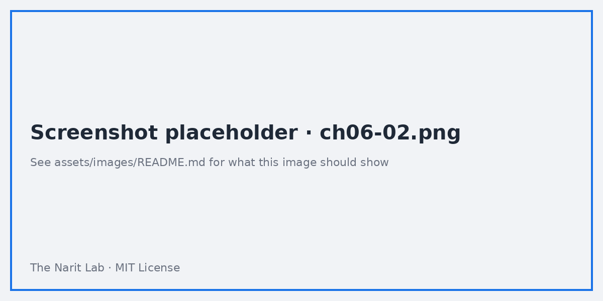
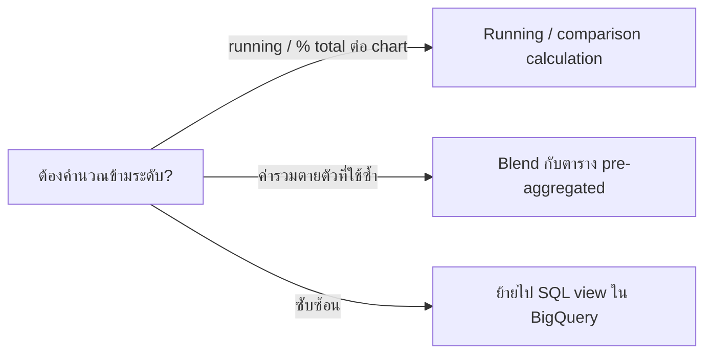

🌐 [ภาษาไทย](../th/06-calculated-fields.md) | [English](../en/06-calculated-fields.md)

# 06 · Calculated Field และฟังก์ชัน (Text, Date, CASE, REGEXP)

> ⏱ **เวลาโดยประมาณ:** 2 × 60 นาที · 📅 **วันตาม Roadmap:** สัปดาห์ 2 · วันที่ 9–10 (พฤ. 17 – ศ. 18 ก.ย. 2569) + Lab สัปดาห์ 3 · วันที่ 11 · 🎯 **ระดับ:** Intermediate

**ในบทนี้**
- [Calculated field อยู่ที่ไหนได้บ้าง](#1-calculated-field-อยู่ที่ไหนได้บ้าง)
- [Row-level กับ Aggregated — กติกาข้อเดียวที่ต้องจำ](#2-row-level-กับ-aggregated--กติกาข้อเดียวที่ต้องจำ)
- [ฟังก์ชันคำนวณและ aggregation](#3-ฟังก์ชันคำนวณและ-aggregation)
- [ฟังก์ชันข้อความ](#4-ฟังก์ชันข้อความ)
- [ฟังก์ชันวันที่และเวลา](#5-ฟังก์ชันวันที่และเวลา)
- [CASE และตรรกะแบบมีเงื่อนไข](#6-case-และตรรกะแบบมีเงื่อนไข)
- [ฟังก์ชัน REGEXP](#7-ฟังก์ชัน-regexp)
- [อัตราส่วน, running total และวิธีแทน LOD](#8-อัตราส่วน-running-total-และวิธีแทน-lod)
- [ตารางสรุปฟังก์ชัน](#9-ตารางสรุปฟังก์ชัน)

## 1. Calculated field อยู่ที่ไหนได้บ้าง

| ระดับ | สร้างผ่าน | ขอบเขต | ใช้เมื่อ |
|---|---|---|---|
| **Data source** | Data source editor → **Add a field** | ทุก report ที่ใช้ source นี้ | ตรรกะธุรกิจที่ทุกคนต้องใช้ (margin, กลุ่มขนาดออเดอร์) |
| **Chart** | Chart Setup → **Add metric/dimension → Create field** | chart เดียว | ทดลองเร็ว ๆ, label เฉพาะ chart |


Editor ตรวจสูตรขณะพิมพ์: เครื่องหมายถูกสีเขียว = ผ่าน; สีแดง = มีข้อผิดพลาดพร้อมข้อความ ชื่อ field แยกตัวพิมพ์เล็ก-ใหญ่และแสดงเป็น `field_name`; ข้อความใช้เครื่องหมายคำพูด `"double"` หรือ `'single'`

> **💡 Tip** Field ระดับ chart ใช้ซ้ำไม่ได้ พอสูตรทำงานแล้วให้สร้างใหม่ที่ระดับ data source แล้วลบสำเนาใน chart

## 2. Row-level กับ Aggregated — กติกาข้อเดียวที่ต้องจำ

Looker Studio มีสูตร 2 แบบ

- **Row-level (ไม่รวมยอด)**: ใช้ field ดิบเท่านั้น — `unit_price * quantity`, `UPPER(region)`, `DATETIME_DIFF(ship_date, order_date, DAY)` ผลลัพธ์กลายเป็น field ใหม่ที่ chart รวมยอดต่อได้ (SUM, AVG…)
- **Aggregated (รวมยอด)**: ใช้ฟังก์ชัน aggregation — `SUM(profit) / SUM(sales_amount)` ผลลัพธ์เป็น metric แล้ว chart รวมยอดซ้ำไม่ได้

**ผสมสองแบบในสูตรเดียวไม่ได้** `SUM(profit) / sales_amount` จะ error ("Invalid formula – cannot mix aggregated and non-aggregated") คิดก่อนเขียนว่าต้องการระดับไหน

> **🔁 มาจาก Tableau?** Row-level = calc ปกติ; aggregated = aggregate calc ไม่มี LOD หรือ table calc — ดู §8 ว่าต้องทำอย่างไรแทน

## 3. ฟังก์ชันคำนวณและ aggregation

```sql
-- Row-level
unit_price * quantity                         -- มูลค่าบรรทัดก่อนส่วนลด
sales_amount - cost_amount                    -- กำไร (มีในข้อมูลอยู่แล้ว)
ROUND(discount * 100, 0)                      -- ส่วนลดเป็นเปอร์เซ็นต์เต็ม

-- Aggregated
SUM(profit) / SUM(sales_amount)               -- อัตรากำไร (format เป็น Percent)
SUM(sales_amount) / COUNT_DISTINCT(order_id)  -- มูลค่าเฉลี่ยต่อออเดอร์
AVG(quantity)                                  -- จำนวนชิ้นเฉลี่ยต่อบรรทัด
MAX(order_date)                                -- ออเดอร์ล่าสุด
```

ฟังก์ชัน: `SUM AVG MIN MAX COUNT COUNT_DISTINCT APPROX_COUNT_DISTINCT MEDIAN PERCENTILE STDDEV VARIANCE` และ `ABS ROUND FLOOR CEIL POWER SQRT LOG LOG10 NARY_MAX NARY_MIN`

**กันหารด้วยศูนย์** ด้วย `NARY_MAX(SUM(x), 1)` หรือ `CASE`

```sql
CASE WHEN SUM(sales_amount) = 0 THEN 0 ELSE SUM(profit) / SUM(sales_amount) END
```

## 4. ฟังก์ชันข้อความ

```sql
CONCAT(region, " / ", province)                 -- label รวม
UPPER(customer_name)  LOWER(...)  TRIM(...)
LEFT_TEXT(order_id, 2)                          -- "SO"
RIGHT_TEXT(order_id, 6)
SUBSTR(product_id, 2, 4)                        -- "0028"
LENGTH(customer_name)
REPLACE(payment_method, "Cash on Delivery", "COD")
CONTAINS_TEXT(product_name, "Pro")              -- boolean
STARTS_WITH(campaign_name, "LINE")  ENDS_WITH(...)
SPLIT(campaign_name, " ", 1)                    -- คำแรก
CAST(quantity AS TEXT)                          -- ตัวเลข → ข้อความ
CAST(some_text AS NUMBER)                       -- ข้อความ → ตัวเลข
```

มี `HASH(text, "SHA256")` สำหรับปิดบัง ID และ `TOCITY / TOCOUNTRY / TOREGION` สำหรับแปลงข้อมูลภูมิศาสตร์ด้วย

## 5. ฟังก์ชันวันที่และเวลา

ชนิดข้อมูล: **Date** (`2026-09-07`), **Date & Time** (`2026-09-07 08:30:00`) การแปลงและคำนวณ

```sql
-- แปลงข้อความเป็นวันที่
PARSE_DATE("%Y-%m-%d", order_date_text)
PARSE_DATETIME("%d/%m/%Y %H:%M", thai_text)      -- เช่น 07/09/2026 08:30
TODATE(order_date_text, "DEFAULT_DASH", "%Y%m%d")  -- แบบเก่าแต่ยังใช้ได้

-- ส่วนประกอบ
YEAR(order_date)  QUARTER(order_date)  MONTH(order_date)  WEEK(order_date)  DAY(order_date)
WEEKDAY(order_date)          -- 0 = อาทิตย์ … 6 = เสาร์
DATETIME_TRUNC(order_date, MONTH)   -- วันแรกของเดือน (ยังเป็น Date — เหมาะกับการจัดกลุ่ม)
FORMAT_DATETIME("%b %Y", order_date)  -- "Sep 2026" เป็นข้อความ

-- ส่วนต่างและการเลื่อน
DATETIME_DIFF(ship_date, order_date, DAY)       -- จำนวนวันจัดส่ง
DATETIME_ADD(order_date, INTERVAL 30 DAY)
DATETIME_SUB(CURRENT_DATE(), INTERVAL 1 YEAR)
CURRENT_DATE()  CURRENT_DATETIME()  TODAY()
```

Field ที่มีประโยชน์สำหรับ `sales_orders`

```sql
-- ปีงบประมาณเริ่มตุลาคม (ราชการไทย)
CASE WHEN MONTH(order_date) >= 10 THEN YEAR(order_date) + 1 ELSE YEAR(order_date) END

-- ธงวันหยุดสุดสัปดาห์
CASE WHEN WEEKDAY(order_date) IN (0, 6) THEN "Weekend" ELSE "Weekday" END

-- กลุ่มจำนวนวันจัดส่ง
CASE
  WHEN DATETIME_DIFF(ship_date, order_date, DAY) <= 2 THEN "0–2 days"
  WHEN DATETIME_DIFF(ship_date, order_date, DAY) <= 5 THEN "3–5 days"
  ELSE "6+ days"
END
```

## 6. CASE และตรรกะแบบมีเงื่อนไข

มี 2 รูปแบบ

```sql
-- Searched CASE (ใช้บ่อยสุด)
CASE
  WHEN sales_amount >= 10000 THEN "Large"
  WHEN sales_amount >= 3000  THEN "Medium"
  ELSE "Small"
END

-- Simple CASE
CASE region
  WHEN "Bangkok" THEN "BKK"
  WHEN "Central" THEN "CTR"
  ELSE "UPC"
END

-- แบบย่อ
IF(order_status = "Completed", sales_amount, 0)     -- นับเฉพาะยอดที่สำเร็จ
IFNULL(discount, 0)
NULLIF(quantity, 0)
COALESCE(province, region, "Unknown")
```

**ทำความสะอาด `hr_headcount.csv`** — ไฟล์นี้ปนแถว headcount กับแถว `_movement`

```sql
-- Headcount (เฉพาะแถวที่เป็นระดับตำแหน่งจริง)
IF(level != "_movement", headcount_or_hires, NULL)

-- Hires และ exits (เฉพาะแถว movement)
IF(level = "_movement", headcount_or_hires, NULL)     -- hires
IF(level = "_movement", avg_salary_or_exits, NULL)   -- exits

-- เงินเดือนเฉลี่ยต้องไม่ถูก SUM ข้ามระดับ: ใช้ AVG หรือถ่วงน้ำหนัก
SUM(IF(level != "_movement", headcount_or_hires * avg_salary_or_exits, 0))
  / SUM(IF(level != "_movement", headcount_or_hires, 0))
```

จากนั้นใส่ editor filter `level != _movement` ให้ chart headcount

> **⚠️ Warning** ทุกกิ่งของ `CASE` ต้องคืนค่าชนิดเดียวกัน `WHEN x THEN "text" ELSE 0` จะ error ให้ใช้ `CAST` หรือ `NULL`

## 7. ฟังก์ชัน REGEXP

Looker Studio ใช้ syntax RE2 (เหมือน BigQuery)

```sql
REGEXP_MATCH(campaign_name, ".*(Facebook|TikTok).*")   -- boolean, ต้อง match ทั้งสตริง
REGEXP_CONTAINS(campaign_name, "Ads")                   -- boolean, match บางส่วน
REGEXP_EXTRACT(campaign_name, "^(\\w+)")                -- คำแรก → "Facebook"
REGEXP_EXTRACT(campaign_name, "(\\w{3} \\d{4})$")       -- "Sep 2026"
REGEXP_REPLACE(customer_name, "\\s+\\w\\.$", "")        -- ตัด " A." ท้ายชื่อ
```

ข้อควรรู้
- escape backslash สองครั้งใน editor: `\\d`, `\\w`, `\\s`
- `REGEXP_MATCH` ต้อง match **ทั้ง** สตริง; ครอบด้วย `.*…*.` เพื่อให้เป็น "contains" หรือใช้ `REGEXP_CONTAINS`
- ใช้ regex ใน control และ editor filter ได้ด้วย (operator *RegExp Match / RegExp Contains*)



ตัวอย่างการตลาด — กลุ่มช่องทางจาก `channel`

```sql
CASE
  WHEN REGEXP_CONTAINS(channel, "Facebook|TikTok|YouTube") THEN "Social & Video"
  WHEN REGEXP_CONTAINS(channel, "Google|SEO") THEN "Search"
  WHEN REGEXP_CONTAINS(channel, "LINE|Email") THEN "Owned"
  ELSE "Other"
END
```

## 8. อัตราส่วน, running total และวิธีแทน LOD

| ต้องการ | วิธีใน Looker Studio |
|---|---|
| อัตราส่วนต่อแถวในตาราง | Aggregated field `SUM(a)/SUM(b)` — คำนวณถูกทั้งต่อแถว *และ* แถวรวม |
| Running total / % of total / ผลต่างจากค่าก่อนหน้า | ระดับ chart: คลิก metric → **Comparison calculation** หรือ **Running calculation** (Running sum, Running average, Percent of total, Difference from previous…) — ใกล้เคียง table calc ที่สุด |
| จำนวนลูกค้าที่มี >3 ออเดอร์ | ซ้อน aggregation ไม่ได้ ให้ pre-aggregate ใน BigQuery SQL หรือ blend ตารางกับตัวเอง (บทที่ 07) |
| Fixed LOD แบบ `{FIXED region: SUM(sales)}` | Blend กับสำเนาที่ pre-aggregate ตาม `region` (บทที่ 07) หรือ view ใน BigQuery ที่ใช้ window function |
| Percentile / median | `PERCENTILE(x, 90)`, `MEDIAN(x)` — รองรับใน connector ส่วนใหญ่ |



## 9. ตารางสรุปฟังก์ชัน

| กลุ่ม | ฟังก์ชัน |
|---|---|
| Aggregation | `SUM AVG MIN MAX COUNT COUNT_DISTINCT APPROX_COUNT_DISTINCT MEDIAN PERCENTILE STDDEV VARIANCE` |
| คำนวณ | `+ - * / ABS ROUND FLOOR CEIL POWER SQRT LOG LOG10 NARY_MAX NARY_MIN` |
| ข้อความ | `CONCAT UPPER LOWER TRIM LEFT_TEXT RIGHT_TEXT SUBSTR LENGTH REPLACE CONTAINS_TEXT STARTS_WITH ENDS_WITH SPLIT CAST HASH` |
| วันที่ | `PARSE_DATE PARSE_DATETIME FORMAT_DATETIME DATETIME_TRUNC DATETIME_DIFF DATETIME_ADD DATETIME_SUB YEAR QUARTER MONTH WEEK DAY WEEKDAY HOUR CURRENT_DATE CURRENT_DATETIME TODAY UNIX_DATE` |
| ตรรกะ | `CASE IF IFNULL NULLIF COALESCE AND OR NOT IN IS NULL` |
| Regex | `REGEXP_MATCH REGEXP_CONTAINS REGEXP_EXTRACT REGEXP_REPLACE` |
| ภูมิศาสตร์ | `TOCITY TOCOUNTRY TOREGION TOSUBCONTINENT TOCONTINENT` |
| อื่น ๆ | `IMAGE HYPERLINK` (ลิงก์/รูปที่คลิกได้ในตาราง), `URL_ENCODE` |

---
**Lab:** [Lab 06 — สร้างคลัง calculated field](../../labs/lab06-calculated-fields/README.md)

← [ก่อนหน้า: 05 · Filter และ Control](05-filters-controls.md) | [ถัดไป: 07 · Data Blending และ Join →](07-blending.md)

<sub>Made by **The Narit Lab** · [MIT License](../../LICENSE) · [กลับสารบัญ](00-toc.md)</sub>
