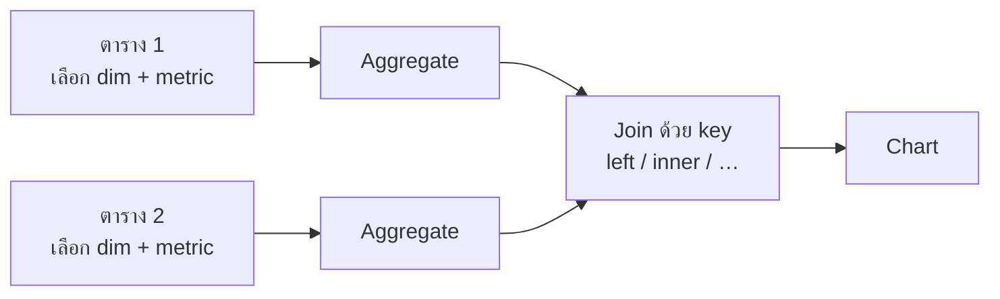

🌐 [ภาษาไทย](../th/07-blending.md) | [English](../en/07-blending.md)

# 07 · Data Blending และ Join

> ⏱ **เวลาโดยประมาณ:** 60 นาที · 📅 **วันตาม Roadmap:** สัปดาห์ 3 · วันที่ 12–13 (อ. 22 – พ. 23 ก.ย. 2569) · 🎯 **ระดับ:** Intermediate

**ในบทนี้**
- [Blend คืออะไร (และไม่ใช่อะไร)](#1-blend-คืออะไร-และไม่ใช่อะไร)
- [การสร้าง blend](#2-การสร้าง-blend)
- [ชนิดของ join](#3-ชนิดของ-join)
- [Pattern 1: เติมข้อมูล lookup (fact + dimension)](#4-pattern-1-เติมข้อมูล-lookup-fact--dimension)
- [Pattern 2: ตาราง fact สองตารางที่ grain เดียวกัน](#5-pattern-2-ตาราง-fact-สองตารางที่-grain-เดียวกัน)
- [Pattern 3: self-blend เพื่อทำค่ารวมแบบ "LOD"](#6-pattern-3-self-blend-เพื่อทำค่ารวมแบบ-lod)
- [Filter, control และ date range กับ blend](#7-filter-control-และ-date-range-กับ-blend)
- [ข้อจำกัด ประสิทธิภาพ และเมื่อไรควรใช้ SQL แทน](#8-ข้อจำกัด-ประสิทธิภาพ-และเมื่อไรควรใช้-sql-แทน)

## 1. Blend คืออะไร (และไม่ใช่อะไร)

**Blend** รวมตาราง (data source) ได้สูงสุด **5 ตาราง** เป็น source เสมือนหนึ่งตัวสำหรับ chart แต่ละตารางจะถูก **aggregate ตาม dimension ที่เลือก** ก่อน แล้วผลลัพธ์ที่รวมยอดแล้วจึงถูก **join** ด้วย key ที่กำหนด

ลำดับนี้สำคัญมาก

มัน **ไม่ใช่** join ระดับแถวแบบ database ถ้าเลือกแค่ `region` จาก `sales_orders` และ `region` + `target` จาก sheet เป้าหมาย blend จะ join *ยอดรวมรายภูมิภาค* กับ *เป้ารายภูมิภาค* — ตรงตามที่ต้องการ แต่ถ้าใส่ `order_id` เข้าไปด้วย grain จะเปลี่ยนทันที

> **🔁 มาจาก Tableau/Power BI?** Blend ≈ Tableau data blending (aggregate แล้ว join) ไม่ใช่ Tableau relationships หรือ Power BI model relationships และกำหนดต่อ chart (หรือบันทึกไว้ใช้ซ้ำ) ไม่ใช่ครั้งเดียวทั้ง report

## 2. การสร้าง blend

1. เลือก chart → Setup → ใต้ Data source คลิก **Blend data** หรือ **Resource → Manage blends → Add a blend**
2. Blend editor แสดง **Table 1** ทางซ้าย เพิ่ม **dimension** และ **metric** ที่ต้องการจากตารางนี้ เปลี่ยนชื่อตารางได้
3. คลิก **Join another table** → เลือก data source ที่สอง → เลือก dimension/metric
4. คลิก **ไอคอน join** ระหว่างตาราง → เลือก **join type** และ **join condition** (field ซ้าย = field ขวา) หลายเงื่อนไขจะเชื่อมด้วย AND
5. ทำซ้ำได้ถึง 5 ตาราง แต่ละตาราง join กับตารางที่อยู่ติดกันทางซ้าย
6. ตั้งชื่อ blend (มุมซ้ายบน) แล้ว **Save** จะเห็นใน data source picker ของ chart และใน Manage blends

ตัวเลือกต่อตาราง
- **Date range dimension** — ต้องตั้ง เพื่อให้ date control กรองตารางนี้ได้
- **Filters** — editor filter เฉพาะตารางภายใน blend

## 3. ชนิดของ join

| ชนิด | เก็บ | ใช้เมื่อ |
|---|---|---|
| **Left outer** | ทุกแถวจากซ้าย; แถวที่ตรงจากขวา | Fact ทางซ้าย, lookup ทางขวา (ค่าเริ่มต้นที่ควรเลือก) |
| **Right outer** | ทุกแถวจากขวา | แทบไม่ใช้; สลับตารางแทน |
| **Inner** | เฉพาะที่ตรงกัน | อยากตัดแถวที่ไม่ match เช่น เฉพาะสินค้าที่ active |
| **Full outer** | ทุกแถวจากทั้งสองฝั่ง | ตาราง fact สองตารางที่ฝั่งใดฝั่งหนึ่งอาจไม่มีข้อมูล (ยอดขาย vs เป้ารายเดือน) |
| **Cross** | ผลคูณคาร์ทีเซียน ไม่มี key | รวมตาราง parameter/target ที่มีแถวเดียวเข้ากับทุกอย่าง |

> **⚠️ Warning** Full outer join ให้ key เป็น NULL ฝั่งหนึ่ง ใช้ `COALESCE(table1.month, table2.month)` ใน calculated field เพื่อให้ได้ dimension ที่สะอาด

## 4. Pattern 1: เติมข้อมูล lookup (fact + dimension)

เป้าหมาย: ยอดขายตาม **segment ลูกค้า** และ **category สินค้า** — field ที่อยู่ใน `customers` และ `products` ไม่ใช่ใน `sales_orders`

- ตาราง 1 `sales_orders`: dim `customer_id`, `product_id`, `order_date`; metric `sales_amount`, `profit`, `Record Count`
- ตาราง 2 `customers`: dim `customer_id`, `segment`, `region` join **left outer** ด้วย `customer_id`
- ตาราง 3 `products`: dim `product_id`, `category`, `brand` join **left outer** ด้วย `product_id` (เลือก key ที่มีอยู่ฝั่งซ้าย — `product_id` จากตาราง 1 จะถูกส่งผ่านมา)

Chart: bar ของ `SUM(sales_amount)` ตาม `segment` breakdown ด้วย `category`

> **💡 Tip** เพราะ aggregate เกิดก่อน join ให้เลือกเฉพาะ dim ที่จะแสดงบวก key เท่านั้น dim เกินจากตาราง fact จะทำให้ grain ละเอียดขึ้นและ blend ช้าลง

## 5. Pattern 2: ตาราง fact สองตารางที่ grain เดียวกัน

เป้าหมาย: **Marketing ROI** — ยอดขายรายเดือน vs งบการตลาดรายเดือน

- ตาราง 1 `sales_orders`: dim `order_date` → ตั้ง granularity **Month** (สร้าง field `DATETIME_TRUNC(order_date, MONTH)` ชื่อ `month`); metric `sales_amount`
- ตาราง 2 `marketing_campaigns`: dim `start_date` ตัดเป็นเดือนชื่อ `month`; metric `spend`, `leads`, `conversions`
- join **full outer** ด้วย `month = month`
- Blend metric: `SUM(sales_amount) / SUM(spend)` = รายได้ต่อ 1 บาทที่ใช้จ่าย

## 6. Pattern 3: self-blend เพื่อทำค่ารวมแบบ "LOD"

เป้าหมาย: ส่วนแบ่งยอดขายของแต่ละภูมิภาคเทียบยอดรวมทั้งหมด หรือยอดต่อออเดอร์เทียบค่าเฉลี่ยของภูมิภาค

- ตาราง 1 `sales_orders`: dim `region` (ผ่าน customers หรือเพิ่ม `region` ก่อน), metric `sales_amount`
- ตาราง 2 `sales_orders` **อีกครั้ง**: ไม่ใส่ dimension, metric `sales_amount` → ได้แถวยอดรวมทั้งหมด 1 แถว
- join **cross** (ไม่มี key)
- Field: `SUM(Table1.sales_amount) / SUM(Table2.sales_amount)` → ส่วนแบ่งของยอดรวม

ใช้เทคนิคเดียวกันโดยใส่ dim `region` ที่ตาราง 2 และ `province` ที่ตาราง 1 จะได้ยอดจังหวัดเทียบยอดภูมิภาค — เทียบเท่า FIXED LOD

## 7. Filter, control และ date range กับ blend

- **Control** จะกรอง chart ที่เป็น blend ได้ก็ต่อเมื่อ field ของ control มาจากตารางใน blend **และ** data source ของ control คือตารางนั้น (หรือ field ชื่อเดียวกันและตั้ง control ให้ชี้ที่ blend)
- **Date range control** มีผลต่อตารางผ่าน *Date range dimension* ของแต่ละตาราง ลืมตั้งที่ตารางหนึ่งจะได้ "ยอดขาย 30 วันล่าสุด vs งบการตลาดตลอดกาล" — ความผิดพลาดคลาสสิก
- Editor filter ที่ chart มีผล **หลัง** join; filter ภายใน blend มีผล **ก่อน** ถ้าอยากเก็บแถว NULL จาก left join ให้กรองภายใน blend ที่ตารางขวา

## 8. ข้อจำกัด ประสิทธิภาพ และเมื่อไรควรใช้ SQL แทน

| ข้อจำกัด | ค่า |
|---|---|
| ตารางต่อ blend | 5 |
| Join condition | หลายเงื่อนไขต่อ join |
| Calculated field ใน blend | ได้ บนผลลัพธ์ของ blend |
| ความสดของข้อมูล | ตาม source แต่ละตัว |

Blend คำนวณ **ต่อ chart** ดังนั้นหน้าที่มี blended chart 8 ตัวจะยิง query 8 × N ครั้ง ถ้าเริ่มช้า หรือต้องใช้เกิน 5 ตาราง, join ระดับแถว, หรือ window function

- **BigQuery**: เขียน view หรือ scheduled query ที่ join ทุกอย่าง แล้วต่อ Looker Studio กับ view นั้น เร็วกว่า ถูกกว่า (ถ้า partition) และใช้ซ้ำได้
- **Google Sheets**: ใช้ `=VLOOKUP` / `=QUERY` pre-join ใน sheet สำหรับข้อมูลเล็ก
- **Looker**: กำหนด join ครั้งเดียวใน LookML (บทที่ 13)

> **💡 Tip** หลักง่าย ๆ: ต้นแบบด้วย blend, ขึ้น production ด้วย SQL

---
**Lab:** [Lab 07 — เติมยอดขายด้วย customers/products และสร้าง blend Marketing ROI](../../labs/lab07-blending/README.md)

← [ก่อนหน้า: 06 · Calculated Field](06-calculated-fields.md) | [ถัดไป: 08 · Parameter และรายงานแบบ Dynamic →](08-parameters.md)

Made by **The Narit Lab** · [MIT License](../../LICENSE) · [กลับสารบัญ](00-toc.md)
