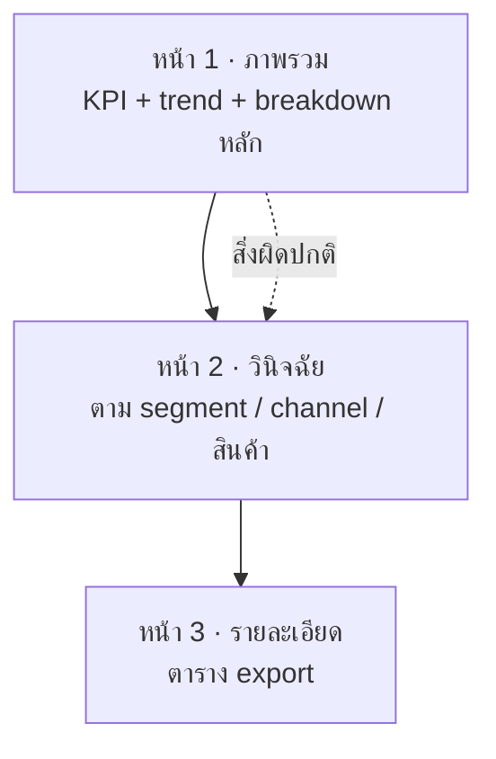

🌐 [ภาษาไทย](../th/09-dashboard-design.md) | [English](../en/09-dashboard-design.md)

# 09 · หลักการออกแบบ Dashboard (Layout, สี, Storytelling)

> ⏱ **เวลาโดยประมาณ:** 60 นาที · 📅 **วันตาม Roadmap:** สัปดาห์ 4 · วันที่ 16–17 · 🎯 **ระดับ:** Intermediate

**ในบทนี้**
- [เริ่มจากผู้ใช้และการตัดสินใจ](#1-เริ่มจากผู้ใช้และการตัดสินใจ)
- [ลำดับความสำคัญของข้อมูลและ Z-pattern](#2-ลำดับความสำคัญของข้อมูลและ-z-pattern)
- [Layout grid ใน Looker Studio](#3-layout-grid-ใน-looker-studio)
- [สี: เพื่อสื่อสาร ไม่ใช่ตกแต่ง](#4-สี-เพื่อสื่อสาร-ไม่ใช่ตกแต่ง)
- [ตัวอักษรและ text component](#5-ตัวอักษรและ-text-component)
- [Checklist สุขอนามัยของ chart](#6-checklist-สุขอนามัยของ-chart)
- [Storytelling: จากภาพรวมสู่รายละเอียด](#7-storytelling-จากภาพรวมสู่รายละเอียด)
- [Layout สำหรับมือถือและจอ TV](#8-layout-สำหรับมือถือและจอ-tv)
- [ตัวอย่างก่อน / หลัง](#9-ตัวอย่างก่อน--หลัง)

## 1. เริ่มจากผู้ใช้และการตัดสินใจ

ก่อนใส่ chart ใด ๆ เขียนประโยคเดียว: *"หน้านี้ช่วยให้ **[ใคร]** ตัดสินใจ **[อะไร]** ทุก **[บ่อยแค่ไหน]**"*

| ผู้ใช้ | ความถี่ | ต้องการ | สไตล์หน้า |
|---|---|---|---|
| CEO / ผู้บริหาร | รายสัปดาห์ | KPI 5 ตัว แนวโน้ม สิ่งผิดปกติ | จอเดียว ไม่เลื่อน ตัวเลขใหญ่ |
| ผู้จัดการ | รายวัน | ทีมตัวเองเทียบเป้า เจาะรายละเอียดได้ | แถบ KPI + breakdown + ตาราง |
| นักวิเคราะห์ | ตามต้องการ | ทุกอย่าง filter export | หนาแน่น control เยอะ ตารางข้อมูล |
| ลูกค้า / ภายนอก | รายเดือน | หลักฐานคุณค่า ภาษาเข้าใจง่าย | มีแบรนด์ ข้อความเล่าเรื่อง chart น้อย |

ทุก chart ต้องตอบคำถามที่ผู้ใช้กลุ่มนั้นถามจริง ถ้าบอกคำถามไม่ได้ ให้เอา chart ออก

## 2. ลำดับความสำคัญของข้อมูลและ Z-pattern

ผู้อ่านกวาดตา บนซ้าย → บนขวา → ล่างซ้าย → ล่างขวา

```
┌──────────────────────────────────────────────┐
│ ชื่อเรื่อง · ช่วงวันที่ · filter          [logo] │  ← บริบท
├────────┬────────┬────────┬────────┬──────────┤
│  KPI 1 │  KPI 2 │  KPI 3 │  KPI 4 │  KPI 5   │  ← คำตอบ
├────────┴────────┴────────┴────────┴──────────┤
│  แนวโน้มตามเวลา (กว้าง)      │ Breakdown A   │  ← ทำไม
├──────────────────────────────┼───────────────┤
│  Breakdown B                 │ ตารางรายละเอียด │  ← แล้วไง / เจาะลึก
└──────────────────────────────┴───────────────┘
```

กติกา
1. ตัวเลขสำคัญที่สุดอยู่บนซ้าย ใหญ่ที่สุด
2. หนึ่งหน้ามี trend chart หนึ่งตัวที่เล่าเรื่องหลัก
3. ตารางรายละเอียดอยู่ท้ายสุด (ล่างสุดหรือหน้าแยก)
4. Filter อยู่บนขวาหรือแถบซ้าย ไม่กระจัดกระจาย

## 3. Layout grid ใน Looker Studio

- **Theme and layout → Layout → Grid settings**: เปิด snap to grid, grid size **10 px** (หรือ 12 px), canvas **1200 × 900** สำหรับแล็ปท็อป, **1600 × 900** สำหรับจอผนัง
- ใช้ **12 คอลัมน์**: บน canvas 1200 px ขอบ 20 px แต่ละคอลัมน์ ≈ 96 px KPI tile = 2 คอลัมน์ต่ออัน (5 อัน + ช่องว่าง), chart = 6/6 หรือ 8/4
- จัดแนวด้วย **คลิกขวา → Align → Left/Top** และ **Distribute → Horizontally** เลือกหลาย component แล้วตั้ง **width/height** เท่ากันที่ Style → Position and size
- รักษา **ระยะห่างสม่ำเสมอ** (เช่น 20 px ระหว่าง component, 40 px ระหว่างส่วน)
- ใช้ **สี่เหลี่ยมพื้นหลังจาง ๆ** จัดกลุ่ม chart ที่เกี่ยวกัน แทนเส้นขอบหนา

> **💡 Tip** สร้าง KPI tile ที่สมบูรณ์หนึ่งอัน แล้ว Ctrl/⌘+D ทำสำเนา 4 ครั้ง เปลี่ยนแค่ metric ได้ความสม่ำเสมอฟรี ๆ

## 4. สี: เพื่อสื่อสาร ไม่ใช่ตกแต่ง

| ใช้สีเพื่อ | ควร | ไม่ควร |
|---|---|---|
| ความหมาย | เขียวดี / แดงแย่ *เสมอต้นเสมอปลาย*; เทาสำหรับ "อื่น ๆ" | เขียวเป็นหมวดหมู่ใน chart หนึ่ง แต่เป็น "ดี" ในอีก chart |
| การเน้น | สี accent หนึ่งสี ที่เหลือจืด | พาเลตสายรุ้ง |
| แบรนด์ | ดึง theme จาก logo แล้วลดความอิ่มตัวสำหรับ chart | สีสดของ logo บนทุกแท่ง |
| การเข้าถึง | ทดสอบด้วยตัวจำลองตาบอดสี; เพิ่ม label/icon ไม่ใช้สีอย่างเดียว | แดง vs เขียวเป็นความต่างเดียว |

ตั้งค่าจริง: Theme → Customize → ตั้ง **Chart palette** เป็น 4–6 สี: น้ำเงินแบรนด์, teal, เทา, เทาอ่อน แล้วเขียวบวก/แดงลบที่ใช้เฉพาะใน conditional formatting เปิด **Dimension value color** เพื่อให้ `Bangkok` เป็นสีเดียวกันทุก chart (Resource → Manage dimension value colors)

## 5. ตัวอักษรและ text component

- ตัวเลขใช้ 2 ขนาด (KPI 28–36 px, ตาราง 12–13 px) ข้อความ 2 ขนาด (หัวเรื่อง 16–18 px, เนื้อหา 12–13 px)
- ข้อความชิดซ้าย ตัวเลขชิดขวา จัดกลางเฉพาะหัวเรื่อง
- ใช้ **Text** component เป็นชื่อส่วน และ *insight* บรรทัดเดียวใต้ chart สำคัญ ("Marketplace โต 22% YoY จากช่วง พ.ย.–ธ.ค.") ผู้อ่านจำประโยคได้ ไม่ใช่แกน
- เพิ่ม **footer**: แหล่งข้อมูล ความถี่ refresh เจ้าของ "Made by …"

## 6. Checklist สุขอนามัยของ chart

- [ ] ชื่อบอก *อะไร* และ *หน่วย*: "ยอดขายรายเดือน (THB)"
- [ ] แกน bar เริ่มที่ศูนย์; line ซูมได้ถ้าระบุชัด
- [ ] เรียง bar (มากไปน้อย) เว้นแต่มีลำดับธรรมชาติ (เวลา ช่วงอายุ)
- [ ] ≤ 7 หมวดต่อ chart; รวมที่เหลือเป็น "Other" ด้วย CASE
- [ ] Gridline เทาอ่อนหรือปิด; เอาเส้นขอบ/เงาออก
- [ ] Data label เฉพาะที่เพิ่มความแม่นยำ; เปิด compact number
- [ ] Legend อยู่บนหรือเอาออกเมื่อมี series เดียว
- [ ] เห็น date range และ filter ชัด ตัวเลขจะไม่กำกวม
- [ ] เปิด tooltip / **Show data** ไว้ให้เจาะดู
- [ ] จัดการ empty state (ไม่มีกล่อง "No data" ตอนเปิดครั้งแรก)

## 7. Storytelling: จากภาพรวมสู่รายละเอียด

จัดรายงานหลายหน้าเป็น funnel



- ใช้ **navigation** (ซ้ายหรือแท็บ) ชื่อหน้าสั้น: *Overview · Marketing · Customers · Data*
- เพิ่ม **Button** "ดูรายละเอียด" ข้าง chart และ **drill-down** สำหรับสำรวจในที่
- ทำแถบ KPI ซ้ำทุกหน้าด้วย KPI ของหน้านั้น บริบทจะไม่หาย
- ปิดท้ายด้วยหน้าหรือกล่องข้อความ **"วิธีอ่านรายงานนี้"** — component ที่ดูธรรมดาที่สุดแต่คนขอบคุณมากที่สุด

## 8. Layout สำหรับมือถือและจอ TV

- Looker Studio **ไม่มี responsive layout**; หน้าจะ render ตามขนาด canvas สำหรับผู้ดูบนมือถือ ให้เพิ่ม **หน้าแยก** ขนาด 400 × 1400 px วาง scorecard ซ้อนกันและหนึ่ง chart ต่อแถว แล้วลิงก์ด้วย button
- Dashboard บน TV: canvas 1920 × 1080, ขนาดตัวอักษร ×1.5, dark theme, ไม่มี control, **auto-refresh** ผ่าน browser extension หรือตัวเลือก mobile/kiosk ของ Looker Studio Pro

## 9. ตัวอย่างก่อน / หลัง

"ก่อน" แบบที่เจอบ่อย: 14 chart, pie 4 อัน, 3 พาเลต, filter อยู่ 3 มุม, ไม่มีชื่อ "หลัง": แถบ KPI, trend หนึ่งตัว, sorted bar 2 ตัว, ตาราง 1 ตาราง, พาเลตเดียว, filter บนขวา, ข้อความ insight

> **🧪 Lab** Lab 09 ให้หน้า "ก่อน" มาและให้คุณสร้างใหม่

---
**Lab:** [Lab 09 — ออกแบบหน้าผู้บริหารใหม่](../../labs/lab09-dashboard-design/README.md)

← [ก่อนหน้า: 08 · Parameter](08-parameters.md) | [ถัดไป: 10 · ประสิทธิภาพและ BigQuery →](10-performance.md)

<sub>Made by **The Narit Lab** · [MIT License](../../LICENSE) · [กลับสารบัญ](00-toc.md)</sub>
