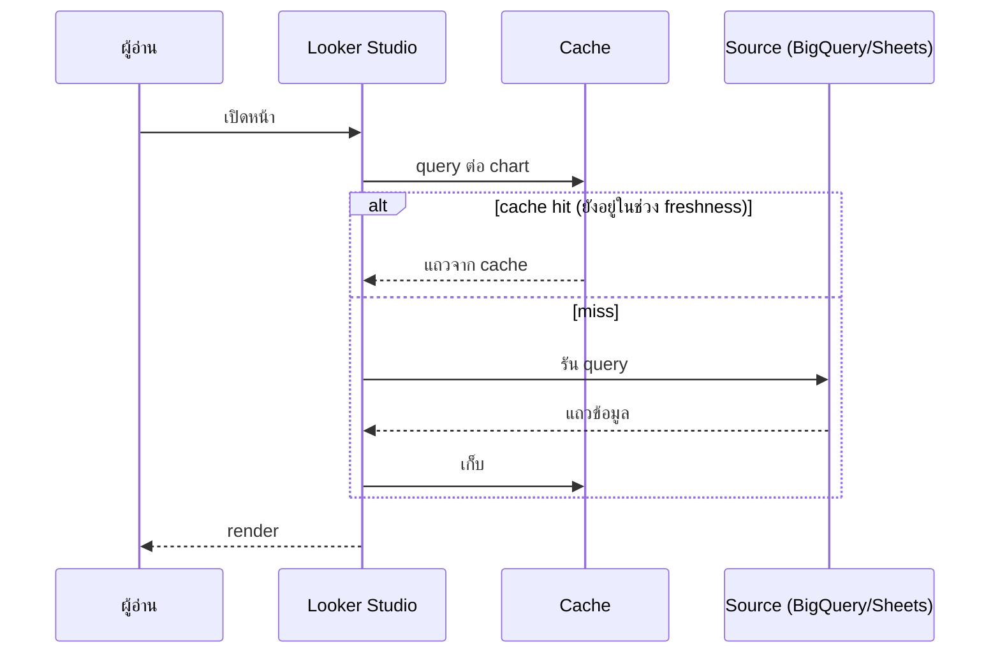

🌐 [ภาษาไทย](../th/10-performance.md) | [English](../en/10-performance.md)

# 10 · ประสิทธิภาพ, Extract Data และ Best Practice ของ BigQuery

> ⏱ **เวลาโดยประมาณ:** 60 นาที · 📅 **วันตาม Roadmap:** สัปดาห์ 4 · วันที่ 18–19 · 🎯 **ระดับ:** Advanced

**ในบทนี้**
- [Looker Studio รัน query อย่างไร](#1-looker-studio-รัน-query-อย่างไร)
- [วัดผล: เวลาหายไปไหน](#2-วัดผล-เวลาหายไปไหน)
- [Extract Data connector](#3-extract-data-connector)
- [BigQuery: partition, cluster และค่าใช้จ่าย](#4-bigquery-partition-cluster-และค่าใช้จ่าย)
- [BigQuery: ตาราง aggregate และ BI Engine](#5-bigquery-ตาราง-aggregate-และ-bi-engine)
- [การปรับแต่งระดับ report](#6-การปรับแต่งระดับ-report)
- [ข้อจำกัดของ Google Sheets และไฟล์](#7-ข้อจำกัดของ-google-sheets-และไฟล์)
- [Checklist ประสิทธิภาพ](#8-checklist-ประสิทธิภาพ)

## 1. Looker Studio รัน query อย่างไร

ทุก chart = **หนึ่ง query** ไปยัง data source (blend = หนึ่งต่อตาราง แล้ว join) หน้าที่มี 12 chart และ 3 control ส่ง ~15 query ตอนโหลด และส่งใหม่ทุกครั้งที่ control เปลี่ยน ผลลัพธ์ถูก **cache** ต่อ (query, credential) ตามช่วง data freshness



นัยสำคัญ
- chart ต่อหน้าน้อย = query น้อย
- chart ที่มี dim/metric/filter เหมือนกันใช้ cache entry ร่วมกัน
- data freshness ยาว = cache hit มากขึ้น ค่าใช้จ่ายต่ำลง

## 2. วัดผล: เวลาหายไปไหน

- ใน view mode chart ที่ช้าจะแสดง spinner; หลังโหลดเสร็จเอาเมาส์ชี้ **ⓘ** ที่ header ของ chart เพื่อดูเวลา query (เมื่อมีให้)
- สำหรับ BigQuery เปิด **BigQuery → Job history** (หรือ `INFORMATION_SCHEMA.JOBS`) แล้วกรองด้วย label `requestor:looker_studio` เพื่อดูแต่ละ query ระยะเวลา และ **bytes billed**
- ทำ benchmark เร็ว ๆ: chart เดียวกันบน Sheets vs Extract vs BigQuery ตารางดิบ vs BigQuery ตาราง aggregate — Lab 10 ทำสิ่งนี้พอดี


## 3. Extract Data connector

**Add data → Extract Data** ถ่ายภาพส่วนหนึ่งของ data source ที่มีอยู่ไปเก็บใน storage ของ Looker Studio เอง

1. เลือก source เลือก **dimension** และ **metric** ที่จะเก็บ (เฉพาะที่จำเป็น) ใส่ **filter** และ **date range** ได้
2. ตั้ง **Auto update** (รายวัน/สัปดาห์/เดือน ตามเวลาที่เลือก)
3. Save chart ที่ใช้ extract อ่านจาก memory — เร็วมาก

| ข้อดี | ข้อเสีย |
|---|---|
| เร็ว ไม่มีค่าใช้จ่ายต่อ query | จำกัด 100 MB ต่อ extract |
| ลดโหลดบน Sheets/API (quota GA4!) | ข้อมูลสดเท่าการอัปเดตล่าสุด |
| Pre-aggregate ที่ grain ของ extract | field ใหม่ต้อง extract ใหม่ |

เหมาะกับ: dashboard บน GA4/Ads/Sheets ที่ไม่ต้อง real time; สรุปผู้บริหาร; อะไรก็ตามที่มี API quota


## 4. BigQuery: partition, cluster และค่าใช้จ่าย

BigQuery แบบ on-demand คิดเงินตาม **byte ที่สแกน** Looker Studio ยิง query เล็ก ๆ ใส่ตารางได้หลายร้อยครั้งต่อวัน

**Partition** ตาราง fact ตามวันที่ และทำให้ Looker Studio ใช้มัน

```sql
CREATE OR REPLACE TABLE `looker_guide.sales_orders_p`
PARTITION BY order_date
CLUSTER BY sales_channel, product_id
AS SELECT * FROM `looker_guide.sales_orders`;
```

- ใน data source ตั้ง `order_date` เป็น date range dimension → ทุก chart ที่กรองวันที่จะตัด partition
- **Cluster** ตามคอลัมน์ที่กรอง/จัดกลุ่มบ่อยที่สุด (channel, region)
- ใช้ **SELECT เฉพาะคอลัมน์**; data source ขอเฉพาะ field ที่ chart ใช้ แต่ custom query ที่ `SELECT *` จะทำลายข้อดีนั้น
- **Require partition filter** บนตาราง production เพื่อกัน full scan จาก chart ที่ date range เป็น "Auto" และไม่มี control

คำนวณค่าใช้จ่าย: 19,637 แถว × 14 คอลัมน์ ≈ 2 MB → จิ๊บจ๊อยในที่นี้ แต่ตาราง event 200 GB ที่ถูก query 500 ครั้ง/วัน ที่ $6.25/TB ≈ $625/วันถ้าไม่ partition เทียบกับไม่กี่ดอลลาร์ถ้า partition

## 5. BigQuery: ตาราง aggregate และ BI Engine

**ตาราง aggregate (rollup)** — คำนวณล่วงหน้าที่ grain ที่ dashboard แสดง

```sql
CREATE OR REPLACE TABLE `looker_guide.sales_daily_channel`
PARTITION BY order_date AS
SELECT order_date, sales_channel, payment_method,
       SUM(sales_amount) sales, SUM(profit) profit, COUNT(*) orders
FROM `looker_guide.sales_orders`
GROUP BY 1,2,3;
```

ตั้งเวลาด้วย **BigQuery scheduled queries** (รายชั่วโมง/รายวัน) ชี้หน้า overview ไปที่ rollup หน้า detail ไปที่ตารางดิบ หรือใช้ **materialized view** ให้ refresh อัตโนมัติเมื่อ aggregation ไม่ซับซ้อน

**BI Engine**: ชั้นเร่งความเร็วแบบ in-memory ของ BigQuery จอง capacity (GB) ใน BigQuery console → **BI Engine**; query จาก Looker Studio บนตารางที่ cache ไว้จะกลับมาในระดับมิลลิวินาทีและไม่คิดเงินต่อ byte คุ้มเมื่อ report มีผู้อ่านพร้อมกันจำนวนมาก

## 6. การปรับแต่งระดับ report

| เทคนิค | ผล |
|---|---|
| แยกหน้า: overview vs detail | query ต่อการโหลดน้อยลง |
| ตั้ง **data freshness** ให้นานที่สุดที่ยอมรับได้ (เช่น 4–12 ชม.) | cache hit มากขึ้น |
| หลีกเลี่ยง dimension ที่มีค่าไม่ซ้ำมากใน chart และ drop-down | ผลลัพธ์เล็กลง |
| แทน chart คล้ายกัน 5 ตัวด้วย 1 chart + **optional metrics** / dimension control | 1 query แทน 5 |
| กรองที่ data source (SQL WHERE / partition) แทน editor filter | ย้ายข้อมูลน้อยลง |
| ลด blend; ย้าย join ไป SQL | query น้อยลง join ครั้งเดียว |
| ปิด **Show summary row** บนตารางใหญ่ | ตัด aggregate เพิ่มออก |
| จำกัดแถวต่อหน้า (50–100) และจุดใน time series (รายเดือนแทนรายวันสำหรับ 3 ปี) | render เร็วขึ้น |
| ใช้ **Owner's credentials** หรือ service account | cache ใช้ร่วมกันข้ามผู้อ่าน |

## 7. ข้อจำกัดของ Google Sheets และไฟล์

- Sheets connector อ่านทั้งแท็บ; ประสิทธิภาพตกเมื่อเกิน ~50–100k cell ต่อ query และ Sheets เองจำกัด 10 ล้าน cell
- File upload: 100 MB/ไฟล์, รวม 2 GB ต่อผู้ใช้; เร็วเพราะ Looker Studio เก็บเอง แต่เป็นข้อมูลนิ่ง
- ถ้า Sheets เป็นทางเลือกเดียว: หนึ่งแท็บต่อ data source เอาสูตรออก (paste values) เลี่ยงฟังก์ชัน volatile (`NOW`, ห่วงโซ่ `IMPORTRANGE`) และใช้ **Extract Data** ครอบอีกชั้น

## 8. Checklist ประสิทธิภาพ

- [ ] ตาราง fact ใน BigQuery partition ตามวันที่และ cluster แล้ว; ตั้ง date range dimension แล้ว
- [ ] หน้า overview อ่านจากตาราง aggregate หรือ extract
- [ ] Data freshness ≥ 1 ชม. เว้นแต่ระบุว่าต้อง real time
- [ ] ≤ 10 chart ต่อหน้า; blend ≤ 3 ต่อหน้า
- [ ] ไม่มี custom query แบบ `SELECT *`; ไม่มี drop-down ค่าเยอะที่ไม่กรอง
- [ ] ตรวจ job history แล้ว: 5 query ที่ bytes billed สูงสุดถูกปรับแล้ว
- [ ] พิจารณา BI Engine สำหรับ report ที่มีผู้อ่านพร้อมกัน >20 คน

---
**Lab:** [Lab 10 — Benchmark Sheets vs Extract vs BigQuery และลด byte ที่สแกน](../../labs/lab10-performance/README.md)

← [ก่อนหน้า: 09 · การออกแบบ Dashboard](09-dashboard-design.md) | [ถัดไป: 11 · การแชร์ ตั้งเวลาส่ง Embed และ Pro →](11-sharing-pro.md)

<sub>Made by **The Narit Lab** · [MIT License](../../LICENSE) · [กลับสารบัญ](00-toc.md)</sub>
