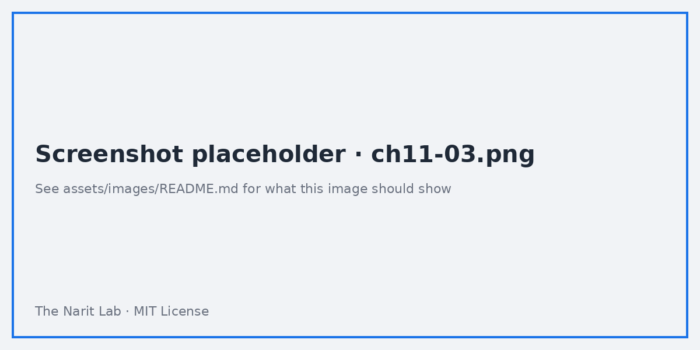

🌐 [ภาษาไทย](../th/11-sharing-pro.md) | [English](../en/11-sharing-pro.md)

# 11 · การแชร์, ตั้งเวลาส่ง, Embed, การควบคุมสิทธิ์ และ Looker Studio Pro

> ⏱ **เวลาโดยประมาณ:** 60 นาที · 📅 **วันตาม Roadmap:** สัปดาห์ 4 · วันที่ 20 + Lab สัปดาห์ 5 · วันที่ 21 · 🎯 **ระดับ:** Advanced

**ในบทนี้**
- [การแชร์รายงาน](#1-การแชร์รายงาน)
- [การแชร์ data source และผลของ credential](#2-การแชร์-data-source-และผลของ-credential)
- [ตัวเลือก row-level security](#3-ตัวเลือก-row-level-security)
- [ตั้งเวลาส่ง (Scheduled delivery)](#4-ตั้งเวลาส่ง-scheduled-delivery)
- [Embedding](#5-embedding)
- [Download, export และลิงก์รายงาน](#6-download-export-และลิงก์รายงาน)
- [Looker Studio Pro](#7-looker-studio-pro)
- [Workflow Dev → Prod และ governance](#8-workflow-dev--prod-และ-governance)

## 1. การแชร์รายงาน

คลิก **Share** (มุมขวาบน)

| การตั้งค่า | ความหมาย |
|---|---|
| **Add people and groups** | Viewer หรือ Editor ต่ออีเมล / Google Group |
| **Link settings** | *Restricted* (เฉพาะคนที่เพิ่ม), *Anyone in your organisation*, *Anyone with the link* (สาธารณะ — ห้ามใช้กับข้อมูลภายใน) |
| แท็บ **Manage access** | เจ้าของสั่ง *prevent editors from changing access*, *disable downloading, printing and copying for viewers* ได้ |
| **Transfer ownership** | ย้ายให้ service/shared account ก่อนที่คนจะลาออก |

ผู้อ่านต้องมี **สองอย่าง**: สิทธิ์เข้าถึง *รายงาน* และ (ขึ้นกับ credential) สิทธิ์เข้าถึง *ข้อมูล* ticket ส่วนใหญ่มาจากอย่างที่สอง

## 2. การแชร์ data source และผลของ credential

- ด้วย **Owner's credentials** ผู้อ่านเห็นข้อมูลผ่านเจ้าของ — แชร์แค่รายงาน
- ด้วย **Viewer's credentials** ต้องแชร์รายงาน *และ* ให้สิทธิ์ผู้อ่านแต่ละคนเข้าถึง Sheet/BigQuery dataset (ไม่งั้นจะเจอ "You don't have access to the underlying data")
- แชร์ **reusable data source** เป็น *Editor* ให้คนอื่นสร้างรายงานใหม่บนมันได้; *Viewer* ให้ใช้แบบอ่านอย่างเดียว
- **Transfer ownership** ทั้งรายงานและ data source เมื่อเจ้าของลาออก ไม่งั้นรายงานจะตายไปพร้อมบัญชี

> **⚠️ Warning** ลิงก์สาธารณะ + owner's credentials หมายความว่าคนทั้งอินเทอร์เน็ตเห็นตาราง BigQuery ของคุณ ตรวจ link settings ให้ดีก่อนส่ง

## 3. ตัวเลือก row-level security

| วิธี | ทำอย่างไร | หมายเหตุ |
|---|---|---|
| **Email filter** (data source) | Data source → **Filter by email** → เลือก field ที่มีอีเมลผู้อ่าน | ฟรี ง่าย; ต้องมีคอลัมน์อีเมลในข้อมูล (หรือ blend ตาราง mapping เข้ามา) |
| **BigQuery RLS policy** + viewer credentials | `CREATE ROW ACCESS POLICY … GRANT TO ('user:…')` | บังคับใช้ที่ database แข็งแรงที่สุด |
| **Authorized view** + viewer credentials | View กรองด้วย `SESSION_USER()` | รูปแบบคลาสสิก |
| **Custom query กับ `@DS_USER_EMAIL`** | `WHERE owner_email = @DS_USER_EMAIL` | ใช้กับ owner's credentials ได้ด้วย |
| **แยกรายงานตามกลุ่มผู้อ่าน** | copy รายงาน ใส่ filter ตายตัว | ง่ายแต่มีสำเนาเยอะ |

## 4. ตั้งเวลาส่ง (Scheduled delivery)

**Share → Schedule delivery** (ไอคอนอีเมล)
- ผู้รับ (อีเมล), หน้าที่จะรวม, **repeat** (รายวัน/สัปดาห์/เดือน เวลาและ time zone), วันเริ่ม, หัวเรื่อง/ข้อความกำหนดเอง
- ส่งเป็น **PDF** (พร้อมลิงก์) จับสถานะ filter/control ได้: ตั้ง control ก่อน แล้วตั้งเวลา → *include current filter state*
- Free tier: อีเมลเท่านั้น **🔒 Pro เท่านั้น:** ส่งไป **Google Chat space**, จำนวน schedule ต่อรายงานมากขึ้น, schedule เป็นของ workspace (อยู่รอดแม้พนักงานลาออก)

## 5. Embedding

**File → Embed report** (หรือ Share → Embed)
1. เปิดใช้ embedding
2. คัดลอก snippet `<iframe>` หรือ embed URL; ตั้ง width/height
3. วางในเว็บไซต์ Google Sites, Notion, Confluence หรือพอร์ทัล

กติกาสิทธิ์ยังใช้อยู่: ผู้อ่านต้องล็อกอิน Google account ที่มีสิทธิ์ เว้นแต่ลิงก์เป็น *Anyone with the link* ส่ง filter/parameter ใน embed URL (บทที่ 08 §8) เพื่อปรับเฉพาะหน้า

> **🔁 มาจาก Tableau/Power BI?** Looker Studio ไม่มี embed SDK หรือ JS API สำหรับ filter/event; embedding คือ iframe + URL parameter ถ้าต้องการ embedding ระดับแอปให้ใช้ Looker (บทที่ 13)

## 6. Download, export และลิงก์รายงาน

- **File → Download → PDF**: เลือกหน้า พื้นหลังกำหนดเอง รหัสผ่าน ลิงก์หมดอายุ
- Header ของ chart → **Export** → CSV / Google Sheets (ตาม filter ปัจจุบัน) เจ้าของปิดสำหรับ viewer ได้
- **Share → Get report link → Link to current report state** ให้ URL พร้อมค่า control ที่ผู้อ่านเลือก
- **File → Report and page settings → Google Analytics** เพื่อติดตามการใช้รายงานใน GA4

## 7. Looker Studio Pro

Pro เป็น subscription แบบจ่ายต่อผู้ใช้ต่อ Google Cloud project (เรียกเก็บผ่าน Google Cloud) สิ่งที่ได้

| ฟีเจอร์ | Free | Pro |
|---|---|---|
| Team workspace (เจ้าของร่วม โฟลเดอร์ role) | — | ✔ |
| Google Cloud technical support + SLA | — | ✔ |
| ตั้งเวลาส่งไป Google Chat; schedule มากขึ้น | อีเมลเท่านั้น | ✔ |
| Personal report link สำหรับรายงานที่ต่อกับ Looker | — | ✔ |
| **แอปมือถือ** Looker Studio | — | ✔ |
| **Gemini in Looker Studio** (สร้าง chart ช่วยเขียน calculated field สร้าง slide/summary) | จำกัด/ทยอยเปิด | ✔ |
| Admin control: audit log ปิดการแชร์สาธารณะระดับองค์กร | พื้นฐาน | ✔ |
| Data governance ระดับ enterprise ผ่าน Looker | — | ✔ |

ควรซื้อเมื่อ: ทีม >5 คนดูแลรายงาน เอเจนซีที่ทำงานให้ลูกค้า หรือองค์กรที่เคยเจอ "เจ้าของลาออกแล้วรายงานพัง" สักครั้ง ไม่ต้องซื้อเมื่อ: นักวิเคราะห์คนเดียวและธุรกิจเล็กที่ใช้ Sheets

เปิดใช้: Google Cloud console → **Looker Studio Pro** → เลือก project → มอบ licence ตามผู้ใช้/กลุ่ม; จากนั้นใน Looker Studio สร้าง **Team workspace** แล้วย้ายรายงาน/data source เข้าไป

## 8. Workflow Dev → Prod และ governance

1. **การตั้งชื่อ**: `[DEV] Sales Overview`, `Sales Overview` (prod) data source ก็เช่นกัน
2. **พัฒนาบนสำเนา**: File → Make a copy → DEV เปลี่ยน data source เป็นตาราง DEV ถ้ามี
3. **Promote**: เมื่อ DEV ผ่านแล้ว (a) copy component เข้า prod (Ctrl/⌘+C/V ข้ามรายงาน) หรือ (b) ทำ prod เป็นสำเนาของ DEV แล้วสลับลิงก์ — วิธีที่สองสะอาดกว่าแต่ bookmark เดิมจะเสีย; Pro team workspace ช่วยลดความเจ็บปวด
4. **Version history**: ตั้งชื่อ version ก่อน promote ทุกครั้ง ("v1.3 – added ROI page")
5. **Ownership**: รายงานและ data source เป็นของ service account หรือ team workspace ไม่ใช่บัญชีส่วนตัว
6. **เอกสาร**: หน้า "About this report" ที่มีแหล่งข้อมูล เจ้าของ เวลา refresh คำนิยาม
7. **ตรวจสิทธิ์** ทุกไตรมาส: Share → Manage access; เอาคนลาออกออก แทนบุคคลด้วย Google Group

---
**Lab:** [Lab 11 — แชร์ ตั้งเวลา embed และตั้ง row-level security](../../labs/lab11-sharing-pro/README.md)

← [ก่อนหน้า: 10 · ประสิทธิภาพ](10-performance.md) | [ถัดไป: 12 · Community Visualization →](12-community-viz.md)

Made by **The Narit Lab** · [MIT License](../../LICENSE) · [กลับสารบัญ](00-toc.md)
