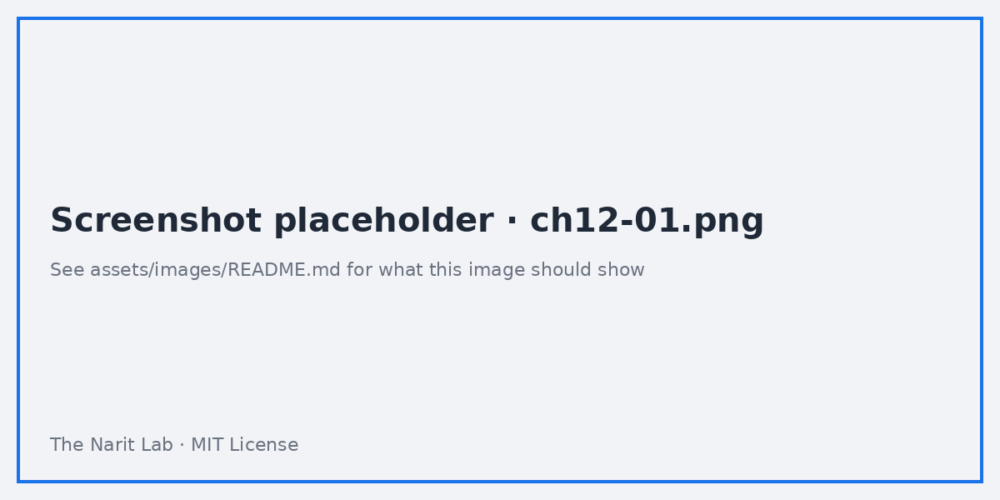
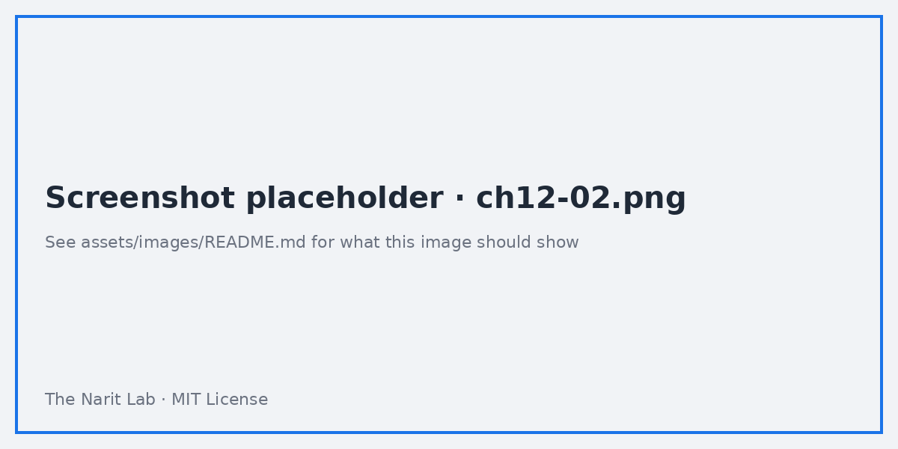

🌐 [ภาษาไทย](../th/12-community-viz.md) | [English](../en/12-community-viz.md)

# 12 · Community Visualization และการปรับแต่งขั้นสูง

> ⏱ **เวลาโดยประมาณ:** 60 นาที · 📅 **วันตาม Roadmap:** สัปดาห์ 5 · วันที่ 22–23 (อ. 6 – พ. 7 ต.ค. 2569) · 🎯 **ระดับ:** Advanced

**ในบทนี้**
- [Community visualization คืออะไร](#1-community-visualization-คืออะไร)
- [ใช้จาก gallery](#2-ใช้จาก-gallery)
- [ความปลอดภัยและการตั้งค่าสิทธิ์](#3-ความปลอดภัยและการตั้งค่าสิทธิ์)
- [สร้างเอง: โครงสร้าง](#4-สร้างเอง-โครงสร้าง)
- [สร้างเอง: ทีละขั้นตอน](#5-สร้างเอง-ทีละขั้นตอน)
- [Community connector (Apps Script)](#6-community-connector-apps-script)
- [การปรับแต่งอื่น ๆ: theme เป็น JSON, รูป, ลิงก์, tooltip](#7-การปรับแต่งอื่น-ๆ-theme-เป็น-json-รูป-ลิงก์-tooltip)
- [เมื่อไรควรใช้ เมื่อไรควรเลี่ยง](#8-เมื่อไรควรใช้-เมื่อไรควรเลี่ยง)

## 1. Community visualization คืออะไร

**Community visualization** คือ chart ที่เขียนด้วย JavaScript (D3, Chart.js, Vega, SVG ล้วน…) ที่รันใน Looker Studio รับข้อมูลและการตั้งค่า style ของ chart แล้ว render ใน iframe มันเติมช่องว่างของ chart ที่มีมาให้: Sankey, radar, calendar heatmap, gauge แบบต่าง ๆ, waterfall, network graph, KPI card แบบกำหนดเอง, แผนที่แบบเคลื่อนไหว

มี 2 แบบ
- **Gallery** — เผยแพร่โดยพาร์ทเนอร์ของ Google และชุมชน คลิกเดียวใช้ได้
- **Custom** — โฮสต์ใน Google Cloud Storage bucket ของคุณเอง ส่วนตัวสำหรับองค์กร



## 2. ใช้จาก gallery

1. **Add a chart → Community visualizations and components → Explore more**
2. เลือกดูใน gallery (เช่น *Sankey*, *Gantt*, *Radar*, *Funnel*, *Sunburst*, *Animated bar race*) คลิกแล้ว → **Add**
3. ตั้งค่าเหมือน chart ทั่วไป: dimension, metric, ตัวเลือก style ที่ผู้พัฒนาเปิดให้
4. ครั้งแรกของแต่ละ report จะถามให้ **อนุญาต community visualization access** ของ data source (ดู §3)

ตัวเลือกยอดนิยมสำหรับ dataset ของเรา: Sankey (`sales_channel → payment_method`), Calendar heatmap (`web_traffic.sessions` รายวัน), Waterfall (สะพานกำไรตาม category)

## 3. ความปลอดภัยและการตั้งค่าสิทธิ์

Community visualization ได้รับ **ข้อมูลของ chart** และรันโค้ดของบุคคลที่สาม ดังนั้น

- แต่ละ **data source** มีสวิตช์ **Community visualizations access → On/Off** (data source editor แถบบน) หลายองค์กรปิดเป็นค่าเริ่มต้นสำหรับ source ใหม่
- Admin ของ workspace จำกัดได้ว่าอนุญาต visualization ไหนบ้าง
- สำหรับข้อมูลอ่อนไหว ใช้เฉพาะที่โฮสต์เอง (custom) หรือจาก vendor ที่ไว้ใจ; ตรวจ source code (ส่วนใหญ่เปิดบน GitHub)

> **⚠️ Warning** Visualization ที่ประสงค์ร้ายอาจดูดแถวข้อมูลที่ได้รับออกไป มองการเปิดสิทธิ์เหมือนการติดตั้ง browser extension

## 4. สร้างเอง: โครงสร้าง

Custom visualization = ไฟล์ 3–4 ไฟล์ใน **Google Cloud Storage** bucket

| ไฟล์ | หน้าที่ |
|---|---|
| `manifest.json` | ชื่อ คำอธิบาย logo รายการ component พาธไปยัง JS/CSS/config |
| `viz-config.json` (ชื่อตั้งเอง) | ผู้ใช้จะเห็น **data field** (dimension/metric, กี่ตัว) และ **style** control อะไรบ้าง |
| `viz.js` | โค้ด render; subscribe ข้อมูลผ่านไลบรารี `dscc` (Data Studio Community Component) |
| `viz.css` | style เสริม (ไม่บังคับ) |

ไลบรารี `dscc` มี `subscribeToData(callback, {transform: dscc.objectTransform})` ให้แถวใน `data.tables.DEFAULT`, `data.fields`, `data.style` และ `data.theme`

## 5. สร้างเอง: ทีละขั้นตอน

1. **ตั้งค่า**
```bash
npm install -g @google/dscc-gen
dscc-gen viz          # scaffold; ตอบคำถาม (ชื่อ project, GCS bucket สำหรับ dev/prod)
```
   จะได้ project ที่มี `src/index.js`, `src/index.json` (config), `src/manifest.json` พร้อม `npm run start` (dev server ในเครื่อง) และ `npm run build:dev / build:prod`

2. **กำหนด field** ใน `index.json`
```json
{
  "data": [{"id": "concepts", "label": "Data", "elements": [
    {"id": "dim", "label": "Category", "type": "DIMENSION", "options": {"min": 1, "max": 1}},
    {"id": "met", "label": "Value", "type": "METRIC", "options": {"min": 1, "max": 1}}
  ]}],
  "style": [{"id": "look", "label": "Look", "elements": [
    {"id": "barColor", "label": "Bar color", "type": "FILL_COLOR", "defaultValue": {"color": "#1A73E8"}}
  ]}]
}
```

3. **Render** ใน `index.js` (bar chart อย่างง่ายด้วย SVG)
```javascript
const dscc = require('@google/dscc');
function draw(data) {
  const rows = data.tables.DEFAULT;                     // [{dim:[...], met:[...]}]
  const color = data.style.barColor.value.color;
  const max = Math.max(...rows.map(r => r.met[0]));
  const w = dscc.getWidth(), h = dscc.getHeight(), bh = h / rows.length;
  document.body.innerHTML = `<svg width="${w}" height="${h}">` +
    rows.map((r, i) => `<rect x="0" y="${i*bh}" width="${r.met[0]/max*w}" height="${bh-4}" fill="${color}"/>
       <text x="4" y="${i*bh+bh/2}" font-size="12" fill="#fff" dominant-baseline="middle">${r.dim[0]}</text>`).join('') +
    `</svg>`;
}
dscc.subscribeToData(draw, {transform: dscc.objectTransform});
```

4. **ทดสอบในเครื่อง**: `npm run start` เปิดหน้าพร้อมข้อมูลตัวอย่าง จากนั้น `npm run build:dev` และ `npm run push:dev` อัปโหลดไป dev bucket

5. **ใช้ใน Looker Studio**: Add a chart → Community visualizations → **Build your own** → วางพาธ manifest `gs://your-bucket/dev` → **Submit** → เพิ่ม component

6. **เผยแพร่** (ไม่บังคับ): `npm run build:prod && npm run push:prod`; ตั้ง object ใน bucket ให้อ่านได้สาธารณะถ้าเพื่อนร่วมงานนอก project ต้องใช้; ส่งเข้า gallery ถ้าอยากให้เป็นสาธารณะ



> **💡 Tip** รองรับสี **theme** (`data.theme`) และ **interaction** (`dscc.sendInteraction` สำหรับ cross-filtering) เพื่อให้ viz ดูเหมือนของแท้

## 6. Community connector (Apps Script)

ถ้าไม่มี connector สำหรับ API ของคุณ (เช่น ระบบ HR ภายใน, API ธนาคารไทย, LINE OA insights) เขียน **community connector** ด้วย Google Apps Script ได้

- implement `getAuthType()`, `getConfig()`, `getSchema()`, `getData()`
- Deploy → คัดลอก deployment ID → ใน Looker Studio connector gallery → **Build your own** → วาง ID
- ข้อควรระวังเรื่องสิทธิ์เหมือน visualization; connector ตั้งเป็นส่วนตัวใน Workspace ได้

แนวคิด parameter จากบทที่ 08 ใช้ได้: `getConfig()` เปิด parameter ที่ไหลเข้า `getData(request)` ได้

## 7. การปรับแต่งอื่น ๆ: theme เป็น JSON, รูป, ลิงก์, tooltip

- **Theme**: Theme → Customize ครอบคลุมส่วนใหญ่; **Extract theme from image** สร้างพาเลตจาก logo
- **รูปภาพ**: `IMAGE(url)` ใน calculated field แสดง logo/รูปสินค้าในตาราง; **Image** component สำหรับแบรนด์แบบนิ่ง
- **Hyperlink**: `HYPERLINK(url, label)` ในตารางเพื่อกระโดดไป record ใน CRM หรือหน้า Looker Studio อื่นพร้อม filter parameter
- **Rich text / รูปทรง**: วางสี่เหลี่ยมไว้หลังกลุ่ม chart; ใช้ **Order → Send to back**
- **Component ระดับ report**: คลิกขวา → Make report-level สำหรับ header/footer/logo
- **Custom tooltip**: ไม่รองรับในตัว; community visualization ทำได้

## 8. เมื่อไรควรใช้ เมื่อไรควรเลี่ยง

| ใช้ community viz เมื่อ | เลี่ยงเมื่อ |
|---|---|
| chart ที่มีมาให้ไม่มีชนิดนั้นจริง ๆ (Sankey, waterfall, radar) | sorted bar chart เล่าเรื่องเดียวกันได้ |
| คุณควบคุมโค้ด (custom) หรือไว้ใจ vendor | ข้อมูลอยู่ภายใต้กฎระเบียบและ viz เป็นของบุคคลที่สาม |
| ต้องการ tooltip/animation แบบกำหนดเองสำหรับรายงานสาธารณะ | รายงานต้องพิมพ์/PDF (บาง viz render ไม่ดี) |
| ต้องการ KPI card ตามดีไซน์องค์กร | ประสิทธิภาพสำคัญ — แต่ละ viz โหลด iframe และ JS bundle |

---
**Lab:** [Lab 12 — ใช้ viz จาก gallery และ deploy viz ของตัวเอง](../../labs/lab12-community-viz/README.md)

← [ก่อนหน้า: 11 · การแชร์และ Pro](11-sharing-pro.md) | [ถัดไป: 13 · ภาพรวม Looker (Enterprise) →](13-looker-overview.md)

<sub>Made by **The Narit Lab** · [MIT License](../../LICENSE) · [กลับสารบัญ](00-toc.md)</sub>
