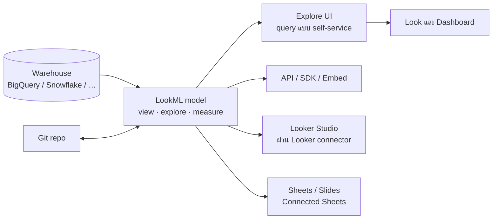

🌐 [ภาษาไทย](../th/13-looker-overview.md) | [English](../en/13-looker-overview.md)

# 13 · ภาพรวม Looker (Enterprise): LookML, Semantic Layer และเส้นทาง Migration

> ⏱ **เวลาโดยประมาณ:** 60 นาที · 📅 **วันตาม Roadmap:** สัปดาห์ 5 · วันที่ 24–25 · 🎯 **ระดับ:** Advanced

**ในบทนี้**
- [Looker ในภาพเดียว](#1-looker-ในภาพเดียว)
- [Object หลัก](#2-object-หลัก)
- [LookML ผ่านตัวอย่าง](#3-lookml-ผ่านตัวอย่าง)
- [Explore, Look, dashboard และ board](#4-explore-look-dashboard-และ-board)
- [ฟีเจอร์ governance ที่ Looker Studio ไม่มี](#5-ฟีเจอร์-governance-ที่-looker-studio-ไม่มี)
- [ใช้ Looker + Looker Studio ร่วมกัน](#6-ใช้-looker--looker-studio-ร่วมกัน)
- [เลือกอย่างไร: Looker Studio → Pro → Looker](#7-เลือกอย่างไร-looker-studio--pro--looker)
- [เส้นทาง migration และแรงที่ต้องใช้](#8-เส้นทาง-migration-และแรงที่ต้องใช้)

## 1. Looker ในภาพเดียว



Looker **ไม่** เก็บข้อมูล มันสร้าง SQL จาก model **LookML** รันสดใน warehouse ของคุณ และควบคุม *คำนิยาม* (คำว่า "revenue" หมายถึงอะไร) จากศูนย์กลาง ชื่อ SKU ของ Google คือ *Looker (Google Cloud core)*; คนทั่วไปเรียกสั้น ๆ ว่า Looker

## 2. Object หลัก

| Object | คืออะไร | เทียบเท่าใน Looker Studio |
|---|---|---|
| **Connection** | credential ของ warehouse | การเชื่อมต่อ data source |
| **Project** | Git repo ของไฟล์ LookML | — |
| **Model** | ไฟล์ประกาศ connection + explore | — |
| **View** | ตาราง (หรือ derived table) ที่มี **dimension** และ **measure** | รายการ field ของ data source |
| **Explore** | view บวก join; จุดเริ่มที่ผู้ใช้ query | Blend (แต่กำหนดครั้งเดียว ใช้ซ้ำได้ join ระดับแถว) |
| **Look** | query/visual ที่บันทึกไว้ | chart |
| **Dashboard** | tile ของ Look/query พร้อม filter | หน้า report |
| **Board** | หน้ารวม dashboard ที่คัดสรร | โฟลเดอร์หน้า Home |
| **User attribute** | ค่าต่อผู้ใช้สำหรับ RLS, ค่าเริ่มต้น | `@DS_USER_EMAIL` / email filter |
| **PDT / aggregate awareness** | derived table ที่ persist และการเลือก rollup อัตโนมัติ | ตาราง aggregate (ทำมือ) |

## 3. LookML ผ่านตัวอย่าง

`sales_orders.view.lkml`

```lookml
view: sales_orders {
  sql_table_name: `looker_guide.sales_orders` ;;

  dimension: order_id   { primary_key: yes  type: string  sql: ${TABLE}.order_id ;; }
  dimension_group: order {
    type: time
    timeframes: [date, week, month, quarter, year]
    sql: ${TABLE}.order_date ;;
  }
  dimension: sales_channel { type: string sql: ${TABLE}.sales_channel ;; }
  dimension: customer_id   { type: string sql: ${TABLE}.customer_id ;; hidden: yes }
  dimension: sales_amount  { type: number sql: ${TABLE}.sales_amount ;; hidden: yes }

  measure: total_sales  { type: sum  sql: ${sales_amount} ;;  value_format_name: decimal_0 }
  measure: total_profit { type: sum  sql: ${TABLE}.profit ;; }
  measure: margin_pct   { type: number sql: 1.0 * ${total_profit} / NULLIF(${total_sales},0) ;; value_format_name: percent_1 }
  measure: order_count  { type: count_distinct sql: ${order_id} ;; }
}
```

`sales.model.lkml`

```lookml
connection: "bigquery_prod"
include: "/views/*.view.lkml"

explore: sales_orders {
  label: "Sales"
  join: customers { type: left_outer  relationship: many_to_one
                    sql_on: ${sales_orders.customer_id} = ${customers.customer_id} ;; }
  join: products  { type: left_outer  relationship: many_to_one
                    sql_on: ${sales_orders.product_id} = ${products.product_id} ;; }
  access_filter: { field: customers.region  user_attribute: region }   # row-level security
}
```

สังเกตว่าได้อะไรเทียบกับ blend ในบทที่ 07: join ประกาศครั้งเดียวพร้อม cardinality (`relationship`) Looker จึงเลี่ยงการนับซ้ำจาก fan-out ได้, symmetric aggregate, measure ที่ใช้ซ้ำได้พร้อม format, และ RLS ในบรรทัดเดียว

## 4. Explore, Look, dashboard และ board

- **Explore**: เลือก dimension/measure จาก field picker → Looker เขียน SQL → ตาราง + visualization มี filter, pivot, table calculation (ใช่ Looker มี) และ **drill** ไปรายละเอียดแถวที่กำหนดใน LookML
- **Look**: บันทึก query จาก Explore **Dashboard**: tile, cross-filtering, dashboard filter ที่ map กับ field, scheduling และ alert (`when total_sales < 1M`)
- **Board** รวบรวม dashboard สำหรับทีม
- **Gemini in Looker**: Explore ด้วยภาษาธรรมชาติ ช่วยเขียนสูตร/LookML สรุป dashboard

## 5. ฟีเจอร์ governance ที่ Looker Studio ไม่มี

| ความสามารถ | Looker | Looker Studio |
|---|---|---|
| คำนิยาม metric เดียวใช้ซ้ำทุกที่ | LookML measure | copy-paste calculated field |
| Version control, code review, CI | Git + LookML validator | Version history เท่านั้น |
| Row-level security | `access_filter`, user attribute | Email filter / BigQuery RLS |
| นโยบาย cache ต่อ model, datagroup | มี | Data freshness ต่อ source |
| Aggregate awareness | อัตโนมัติ | สลับตารางเอง |
| Alert | มี | ไม่มี (ฟีเจอร์คล้าย Pulse ทยอยมาผ่าน Pro/Gemini) |
| Embedded analytics พร้อม SSO | Signed embed, API | iframe |
| ตรวจ content ที่พัง (field หาย) | Content Validator | ทำมือ |
| Usage analytics | System Activity explore | ติดตามผ่าน GA4 |

## 6. ใช้ Looker + Looker Studio ร่วมกัน

**Looker connector** ใน Looker Studio ให้สร้างรายงาน Looker Studio บน **Looker Explore** ได้: measure ที่ถูก govern เหมือนกัน RLS เหมือนกัน (ด้วย *personal report link* ของ Pro ผู้อ่านแต่ละคน query ในนามตัวเอง) และเครื่องมือจัด layout ที่ง่ายกว่าของ Looker Studio หลายองค์กรแบ่งงานแบบนี้

- **Looker**: modelling, governance, embedded analytics, alert
- **Looker Studio (Pro)**: รายงาน self-service ที่รวดเร็วสำหรับผู้ใช้ธุรกิจและการแชร์ภายนอก

## 7. เลือกอย่างไร: Looker Studio → Pro → Looker

| สัญญาณ | คำแนะนำ |
|---|---|
| ผู้สร้างรายงาน ≤ 5 คน ข้อมูลอยู่ใน Sheets/GA4/BigQuery ไม่ต้อง RLS | **Looker Studio** |
| ทีมเป็นเจ้าของร่วม ส่งงานลูกค้า ต้องการ support/SLA, Gemini | **Looker Studio Pro** |
| ทีมเถียงกันเรื่อง metric ("revenue ของใครถูก?") | **Looker** |
| Embed analytics ในผลิตภัณฑ์ ความปลอดภัยต่อลูกค้า | **Looker** |
| ผู้อ่านหลายร้อยคน บิล BigQuery หนัก | **Looker** (cache, aggregate awareness) หรือ Studio + BI Engine |
| นักวิเคราะห์ต้องการควบคุมระดับ SQL ด้วย Git | **Looker** |
| งบต่ำกว่าไม่กี่พัน USD/ปี | อยู่กับ Looker Studio / Pro |

กลับไปดูคำตอบ decision tree ในบทที่ 01 ของคุณตอนนี้ — เปลี่ยนไปไหม?

## 8. เส้นทาง migration และแรงที่ต้องใช้

การย้ายจาก Looker Studio ไป Looker คือ **การสร้าง model ใหม่** ไม่ใช่การแปลงไฟล์

1. **สำรวจ** รายงาน: ใช้ data source อะไร calculated field อะไร blend อะไร blend และ calculated field จะกลายเป็น LookML view และ measure
2. **Model** warehouse: หนึ่ง view ต่อตาราง explore ต่อ business process (Sales, Marketing, Web) ใส่ `relationship` ให้ทุก join
3. **สร้าง dashboard ใหม่** ใน Looker (หรือคงไว้ใน Looker Studio บน Looker connector — มักเป็นทางเลือกที่ปฏิบัติได้จริง)
4. **รักษาความปลอดภัย**: user attribute และ `access_filter` แทน email filter
5. **Govern**: Git workflow, branch dev/prod, content validator ใน CI

ประมาณแรง: รายงาน Looker Studio 3 หน้า 5 data source ≈ 2–4 วันนักพัฒนาสำหรับ model LookML บวก 1–2 วันต่อ dashboard ผลตอบแทนจะมาเมื่อรายงานที่ 6 และ 7 ใช้ model เดิมซ้ำ

---
**Lab:** [Lab 13 — เขียน LookML สำหรับ sales model (บนกระดาษหรือ trial)](../../labs/lab13-looker-overview/README.md)

← [ก่อนหน้า: 12 · Community Visualization](12-community-viz.md) | [ถัดไป: 14 · Capstone →](14-capstone.md)

<sub>Made by **The Narit Lab** · [MIT License](../../LICENSE) · [กลับสารบัญ](00-toc.md)</sub>
