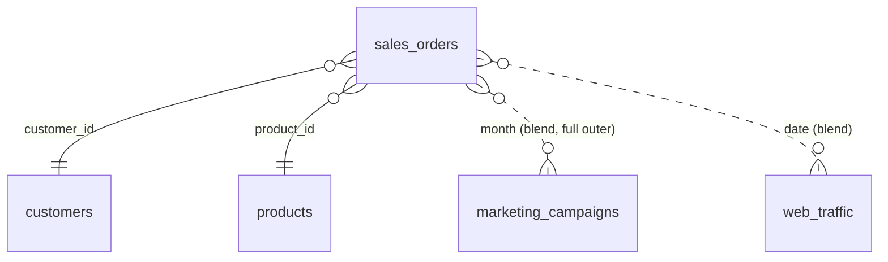

🌐 [ภาษาไทย](../th/14-capstone.md) | [English](../en/14-capstone.md)

# 14 · โปรเจกต์ Capstone: Dashboard ยอดขายและการตลาดครบวงจร

> ⏱ **เวลาโดยประมาณ:** 4 × 60 นาที · 📅 **วันตาม Roadmap:** สัปดาห์ 6 · วันที่ 26–29 · 🎯 **ระดับ:** Capstone

> [!NOTE]
> "Siam Goods Co." เป็น**บริษัทสมมติ** และข้อมูลทั้งหมดเป็น mock-up ที่สุ่มสร้างขึ้นเพื่อการเรียนรู้เท่านั้น


**ในบทนี้**
- [โจทย์](#1-โจทย์)
- [ความต้องการและคำนิยาม KPI](#2-ความต้องการและคำนิยาม-kpi)
- [Data model](#3-data-model)
- [Wireframe ของแต่ละหน้า](#4-wireframe-ของแต่ละหน้า)
- [แผนสร้าง (4 session)](#5-แผนสร้าง-4-session)
- [Checklist ตรวจรับ](#6-checklist-ตรวจรับ)
- [เกณฑ์ให้คะแนน](#7-เกณฑ์ให้คะแนน)
- [การนำเสนอผลงาน](#8-การนำเสนอผลงาน)

## 1. โจทย์

คุณเป็นนักวิเคราะห์ของ *Siam Goods Co.* ผู้ค้าปลีกไทยขนาดกลางที่ขายผ่านออนไลน์ marketplace หน้าร้าน และพนักงานขาย ทีมผู้บริหารต้องการ **รายงานเดียว** ที่เปิดทุกวันจันทร์เพื่อตอบ

1. ยอดขายและกำไรมีแนวโน้มอย่างไร และเราถึงเป้าโต +15% หรือไม่
2. ช่องทางการตลาดไหนให้ผลตอบแทนดีที่สุด และงบไหนสูญเปล่า
3. segment ลูกค้าและ category สินค้าไหนขับเคลื่อนการเติบโต และการคืนสินค้าสูงที่ไหน

สิ่งที่ต้องส่ง: **รายงาน Looker Studio 3 หน้า** บน dataset ของคู่มือนี้ (แนะนำ BigQuery, Sheets ก็รับได้) แชร์ให้ผู้สอน/เพื่อน พร้อม **สรุป insight หนึ่งย่อหน้า** ต่อหน้า

## 2. ความต้องการและคำนิยาม KPI

| KPI | คำนิยาม | Field / สูตร |
|---|---|---|
| Net Sales | เฉพาะออเดอร์ที่ Completed | `SUM(IF(order_status="Completed", sales_amount, 0))` |
| Gross Profit | ออเดอร์ที่ Completed | `SUM(IF(order_status="Completed", profit, 0))` |
| Margin % | Gross Profit / Net Sales | ratio field, Percent |
| Orders | จำนวนออเดอร์ Completed ไม่ซ้ำ | `COUNT_DISTINCT(IF(order_status="Completed", order_id, NULL))` |
| AOV | Net Sales / Orders | ratio field |
| Return Rate | ออเดอร์ที่คืน / ออเดอร์ทั้งหมด | `COUNT_DISTINCT(IF(order_status="Returned", order_id, NULL)) / COUNT_DISTINCT(order_id)` |
| Growth vs target | จริงเทียบ `ปีก่อน × (1 + growth_rate)` | parameter `growth_rate` ค่าเริ่มต้น 0.15 |
| Marketing Spend | `SUM(spend)` | — |
| ROAS | รายได้ที่ attribute / spend | `SUM(revenue)/SUM(spend)` |
| CPL | Spend / leads | `SUM(spend)/SUM(leads)` |
| Conversion Rate | conversions / clicks | ratio |
| New Customers | ลูกค้าที่ออเดอร์แรกอยู่ในช่วง | pre-aggregate ใน SQL (first_order_date) หรือประมาณด้วย `signup_date` |

คำนิยามต้องเขียนไว้ในหน้า **About** ของรายงาน

## 3. Data model



View ใน BigQuery ที่แนะนำสำหรับหน้า 1 และ 3 (เลี่ยง blend 3 ตารางในทุก chart)

```sql
CREATE OR REPLACE VIEW `looker_guide.v_sales_enriched` AS
SELECT s.*, c.segment, c.region, c.province, c.age_group, c.loyalty_member, c.signup_date,
       p.category, p.sub_category, p.brand, p.status AS product_status,
       DATE_TRUNC(s.order_date, MONTH) AS order_month
FROM `looker_guide.sales_orders` s
LEFT JOIN `looker_guide.customers` c USING (customer_id)
LEFT JOIN `looker_guide.products`  p USING (product_id);
```

ทางเลือก Sheets: ใช้ blend (Lab 07 pattern 1) และยอมรับว่า chart ช้ากว่า

## 4. Wireframe ของแต่ละหน้า

**หน้า 1 — Executive Summary (1200 × 900)**
```
[ชื่อ: Siam Goods · Weekly Business Review]  [Date range: Last 12 months] [Region ▾]
[Net Sales ▲%] [Gross Profit ▲%] [Margin %] [Orders ▲%] [AOV] [Return Rate]
[Net Sales รายเดือน vs Target (+15%) — combo: bar จริง, line เป้า]      [ยอดขายตาม Channel — bar]
[ยอดขายตาม Region — filled map หรือ bar]        [Top 10 สินค้า — ตารางพร้อม bar] [ข้อความ insight]
```

**หน้า 2 — Marketing**
```
[Spend] [Attributed Revenue] [ROAS] [Leads] [CPL] [Conv. Rate]
[Spend รายเดือน vs Net Sales — full-outer blend, dual axis]
[ROAS ตาม Channel — sorted bar, สีเงื่อนไข < 1.0]  [Funnel: Impressions → Clicks → Leads → Conversions]
[Web session ตาม channel × device — stacked bar]  [ตาราง campaign — optional metrics]
```

**หน้า 3 — Customers & Products**
```
[ลูกค้าที่สั่งซื้อ] [ลูกค้าใหม่] [สัดส่วนสมาชิก loyalty] [Return Rate]
[ยอดขายตาม Segment × Category — pivot heatmap]   [Return rate ตาม Category — bar]
[Age group × Channel — 100% stacked]              [รายละเอียดสินค้า — ตาราง drill Category→Sub-category→Product]
```

**หน้า 4 — About**: คำนิยาม แหล่งข้อมูล การ refresh เจ้าของ วิธีใช้ filter

## 5. แผนสร้าง (4 session)

| Session | วันที่ | ทำอะไร | บทที่ใช้ |
|---|---|---|---|
| 1 | จ. 12 ต.ค. | โหลดข้อมูลเข้า BigQuery (หรือ Sheets) สร้าง view สร้าง reusable data source กำหนด calculated field ทั้งหมด + parameter `growth_rate` ตั้ง theme สร้างโครงหน้าด้วย grid | 03, 06, 08, 09 |
| 2 | อ. 13 ต.ค. | หน้า 1: แถบ KPI พร้อมการเปรียบเทียบ combo chart เป้าหมาย chart channel/region/สินค้า control cross-filtering | 04, 05, 08 |
| 3 | พ. 14 ต.ค. | หน้า 2: blend การตลาด ROAS bar พร้อม conditional formatting funnel web traffic ตาราง campaign แบบ optional metrics | 07, 04 |
| 4 | พฤ. 15 ต.ค. | หน้า 3 + หน้า About; รอบปรับประสิทธิภาพ (freshness, extract ถ้าใช้ Sheets) การแชร์ ตั้งเวลาส่งจันทร์ 08:00 เขียน insight | 10, 11, 09 |

## 6. Checklist ตรวจรับ

- [ ] KPI ทุกตัวตรงตารางคำนิยาม (สุ่มตรวจ 2 ตัวเลขกับ query ใน BigQuery)
- [ ] Date range control ขับทุก chart ในหน้า 1–3 (ทุกตารางใน blend มี date dimension)
- [ ] Region control เป็น report-level และกรอง blend ถูกต้อง
- [ ] เส้นเป้าตอบสนองต่อ slider `growth_rate`
- [ ] ไม่มี chart แสดง "Configuration incomplete" หรือ "No data" ตอนเปิดครั้งแรก
- [ ] Theme สม่ำเสมอ; KPI tile ขนาดเท่ากัน; จัดตาม grid
- [ ] ทุก chart มีชื่อพร้อมหน่วย; ≤ 7 หมวดต่อ chart
- [ ] หน้า About ครบ; footer มีเจ้าของและเวลา refresh
- [ ] แชร์ให้ผู้ตรวจอย่างน้อย 1 คนเป็น Viewer; ตั้งอีเมลตามเวลาจันทร์ 08:00 Asia/Bangkok
- [ ] ย่อหน้า insight ต่อหน้าเขียนด้วยภาษาเข้าใจง่าย

## 7. เกณฑ์ให้คะแนน

| เกณฑ์ | น้ำหนัก | ดีเยี่ยม (คะแนนเต็ม) |
|---|---|---|
| ความถูกต้องของ KPI | 30% | ทำครบทุกคำนิยาม ตรวจสอบกับ SQL แล้ว |
| การโต้ตอบ | 15% | Control, cross-filter, drill, parameter ทำงานทั้งหมด |
| การออกแบบ | 20% | ลำดับชัด พาเลตสม่ำเสมอ อ่านได้ในจอเดียว |
| Data modelling และประสิทธิภาพ | 15% | ใช้ view/rollup, blend น้อยที่สุด, โหลด < 5 วินาที |
| Storytelling | 10% | Insight เจาะจง มีตัวเลข นำไปทำได้ |
| การแชร์และเอกสาร | 10% | ตั้งสิทธิ์ถูก มี schedule มีหน้า About |

## 8. การนำเสนอผลงาน

บันทึกวิดีโอเดินชม 3 นาที (Loom/บันทึกหน้าจอ): เริ่มจากการตัดสินใจที่รายงานสนับสนุน แสดง insight หนึ่งข้อต่อหน้า จบด้วยขั้นตอนถัดไป ใส่ลิงก์และภาพหน้าจอใน README ของ GitHub repo (บทที่ 99) นั่นคือผลงาน portfolio ของคุณ

---
**Lab:** [Lab 14 — คู่มือสร้าง Capstone พร้อม checkpoint ทีละขั้น](../../labs/lab14-capstone/README.md)

← [ก่อนหน้า: 13 · ภาพรวม Looker](13-looker-overview.md) | [ถัดไป: 99 · เผยแพร่ขึ้น GitHub →](99-publish-to-github.md)

<sub>Made by **The Narit Lab** · [MIT License](../../LICENSE) · [กลับสารบัญ](00-toc.md)</sub>
